[📥 Click here to download this document and any associated data and images](/downloads/canadian-census-data.zip)

 

National censuses, like the Canadian and U.S. censuses, are very common data sources analyzing demographic and socio-economic data pertaining to specific places.

[Statistics Canada](https://www12.statcan.gc.ca/census-recensement/index-eng.cfm) conducts a national census of the population every five years, asking a range of demographic and socio-economic questions. The results paint a demographic portrait of the country at the time period the census was conducted.

The most recent census at the time of writing was in 2021. Lots of census data are publicly available for download, across the following topics:

- Age
- Commuting to work
- Education
- Ethnocultural and religious diversity
- Families, households, and marital status
- Housing
- Immigration, place of birth, and citizenship
- Income
- Indigenous peoples
- Labour
- Language and language of work
- Mobility and migration
- Population and dwelling counts
- Types of dwellings

Most data are pre-aggregated to a variety of geographic boundaries (e.g. provinces, cities, neighbourhoods, blocks, etc.), which allow for finding a variety of demographic and socio-economic statistics for specific places as well as for making a range of maps.

For example, here's a map of population density in the Greater Toronto Area (GTA) and the census block level, clearly showing where people are clustered throughout the region.

This notebook covers:

- an overview of Canadian Census data
- where to find census data on the Statistics Canada website
- how to explore maps of census data using CensusMapper
- how to download census data to use in your own projects

## Overview of the Canadian census

There are two parts to the census, the short-form survey and the long-form survey. The short-form survey asks a set of basic household and demographic questions (e.g. address, age, marital status, etc.) and is sent to all households in Canada. The long-from survey is sent to 25% of households in Canada. It asks additional questions pertaining to a broader range of demographic, social, and economic topics (e.g. religion, education, journey to work, etc.). Statistics Canada also augments collected census survey data by joining in data from other administrative sources, including income data collected by the Canadian Revenue Agency (CRA).

Census data are collected primarily on a household-by-household basis (one adult member in each household usually fills out the census on behalf of everyone in the household). Data of individual responses from the census are often called census "micro-data". Because of personal identification concerns, this data is only accessible by accredited researchers. (However, note that a public use microdata file called the PUMF is available. It is a random sample of the overall population, with several of the identifying variables removed, such as home addresses and postal code).

## Finding census data

Summaries (i.e. aggregations) of census data to a range of geographic areas are publicly available to view online or download. These are super useful for understanding the demographics of a place. For example, the total population in a province, the number of people who speak Spanish in Toronto, or the average income in a specific neighbourhood. 

The [Census Profile](https://www12.statcan.gc.ca/census-recensement/2021/dp-pd/prof/index.cfm?Lang=E) tables on Statistics Canada's website allow for searching for census data for specific variables and geographic areas. For example, here's an output of "Knowledge of Official Languages" in Ontario.

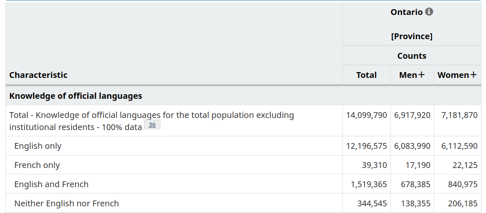

When working with census data, it's often advisable to use the [Census Dictionary](https://www12.statcan.gc.ca/census-recensement/2021/ref/dict/index-eng.cfm), the main reference guidebook, to understand what different data variables and geographies in the census represent. For example, here's the entry for [Knowledge of official languages](https://www12.statcan.gc.ca/census-recensement/2021/ref/dict/az/Definition-eng.cfm?ID=pop055).

Census profile data is typically limited to single categories totals (e.g. number of people who speak French by gender), as shown in the table above. However, if you are interested in cross-tabulations, that is, summaries across multiple categories (e.g. number of people who have knowledge of French who also speak French at work, e.g. total number low-income residents who live in different types of housing), then there are a variety of [Data Tables](https://www12.statcan.gc.ca/census-recensement/2021/dp-pd/dt-td/index-eng.cfm) available for this purpose.

If neither the Census Profile or Data Tables fit your purpose, there is also a [Public Use Microdata File (PUMF)](https://www150.statcan.gc.ca/n1/pub/98m0001x/index-eng.htm). This is a non-aggregated (i.e. each row is a disaggregated individual-level response) dataset covering a sample of the Canadian population. This data can be queried and cross-tabulated across any number of categories included. For privacy reasons, the data only include larger geographic linkages (e.g. provinces, large metro areas), and are only a sample of the overall census.

## Census geography

There are a number of [geographic boundaries](https://www12.statcan.gc.ca/census-recensement/2021/geo/ref/index-eng.cfm) available with associated census data, ranging in scale from city blocks to the entire country. Below is an example of commonly used boundaries for urban-scale maps and analysis.

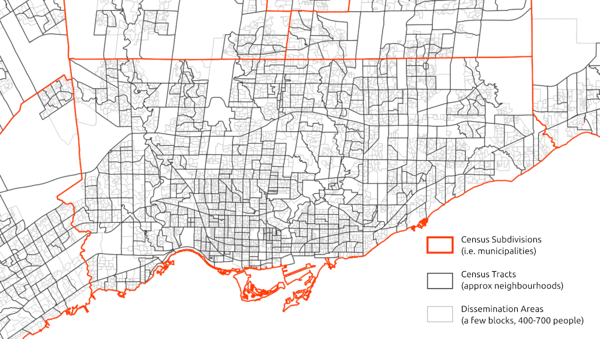

Each polygon on this map has associated publicly available summary census data. Joining this tabular data to these spatial boundaries allows for making a wide range of maps showing the distribution of demographics and socio-economic variables

You can [bulk download census data](https://www12.statcan.gc.ca/census-recensement/2021/dp-pd/prof/details/download-telecharger.cfm?Lang=E) for a number of geographic levels and formats from the Statistics Canada website. These downloads are essentially copies of the Census Profile data, but for all regions noted in each row.

One issue to be aware of is that census boundaries can change over time each time a census is conducted. Doing a longitudinal analysis of spatial census data often requires using a technique like areal interpolation, in which data are joined to a common set of spatial units prior to analyses.

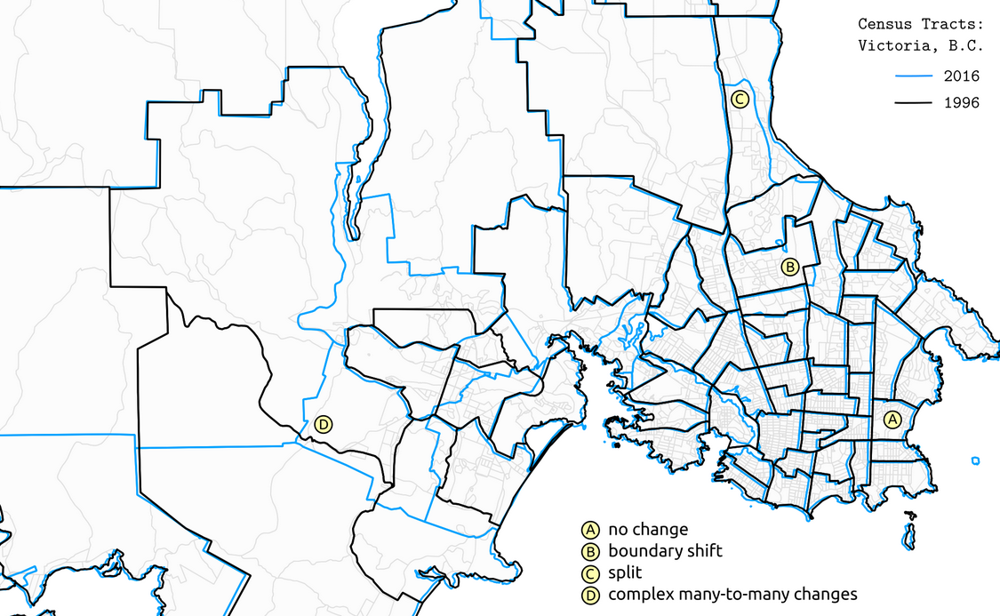

## Making maps with CensusMapper

[CensusMapper](https://censusmapper.ca/) is a website for exploring and downloading census data across Canada. When we first land on the website, it defaults to a map of population density in Vancouver and shares a number of preset options for making maps.

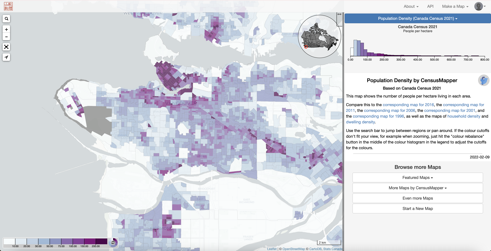

### Make a quick map

If we want to search for a specific census variable, we can click **Make a Map** at the top right of the screen, and then select the year (e.g. 2021):

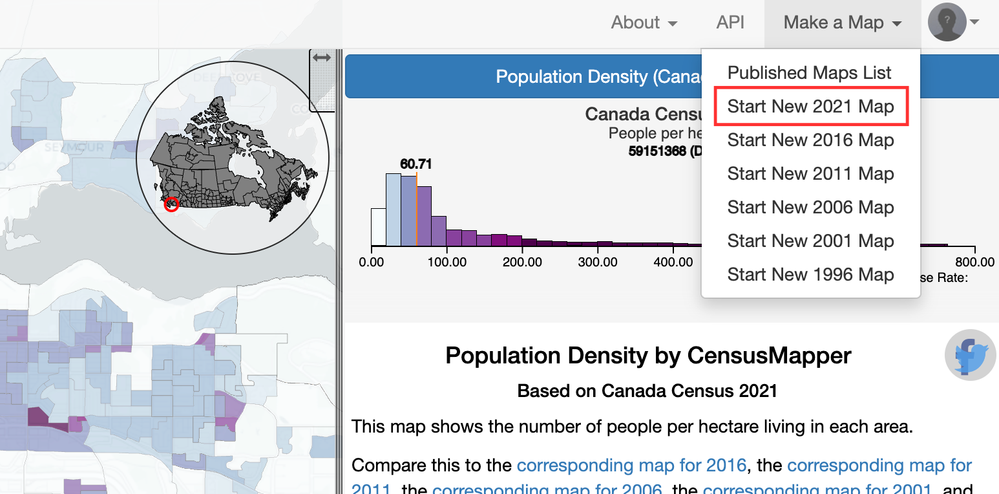

Here we can search and explore all available data. By using the search icon at the top-left to search for a specific geography, or by clicking the inset Canada map (top right of the map), we can navigate elsewhere in the country. For example, let's type "Toronto" in the search bar to change from Vancouver to Toronto:

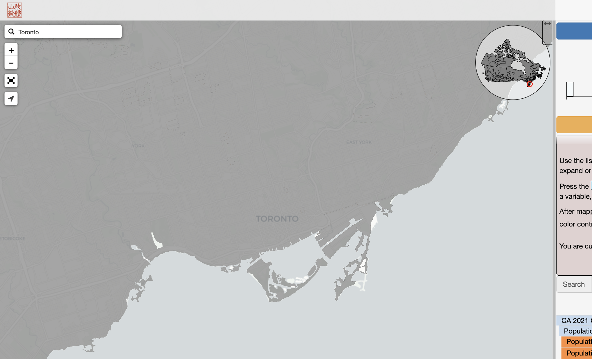{width=80%}

Now let's pick a variable from the "Available Data" list to map. Here we'll select "Average age", but click around to see which other variables are available.

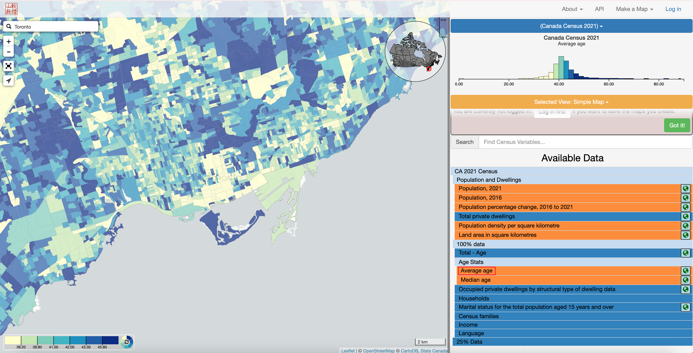

To determine what geographic scale of aggregation is being mapped, click on one of the polygons in the map and see what the pop-up says:

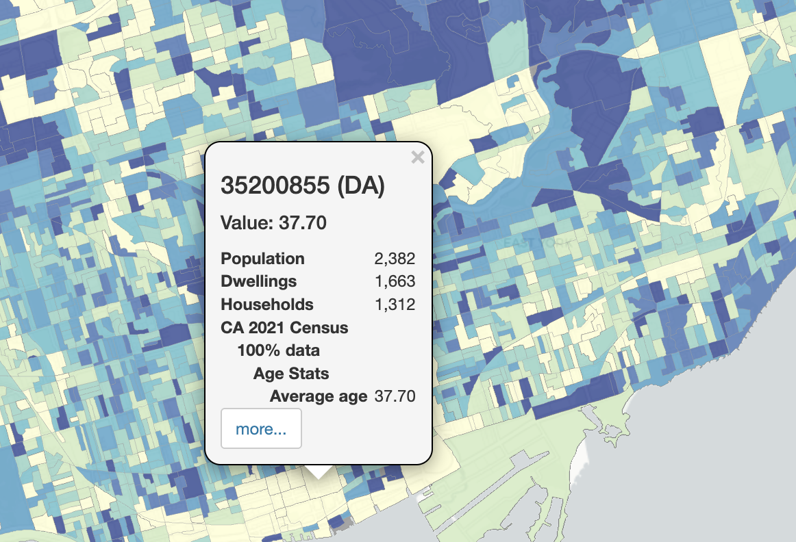{width=60%}

This pop-up lists the identification number of the "DA", which is a dissemination area. The dissemination area is one of the smallest levels of geographic aggregation available through the Census. See this Census [hierarchy](https://www150.statcan.gc.ca/n1/pub/92-195-x/2011001/other-autre/hierarch/h-eng.htm) of geographic units to understand how they relate to each other.

### Download Census data

We can also use CensusMapper to download census data for specified geographic boundaries. To do so, click on **API** at the top right. An [API](https://en.wikipedia.org/wiki/API), or "application programming interface", is a connection between computers or programs and is often used to download data from online sources. To use the API, you'll need to create a (free) account and log in. Do this by clicking "Log in" at the top right.

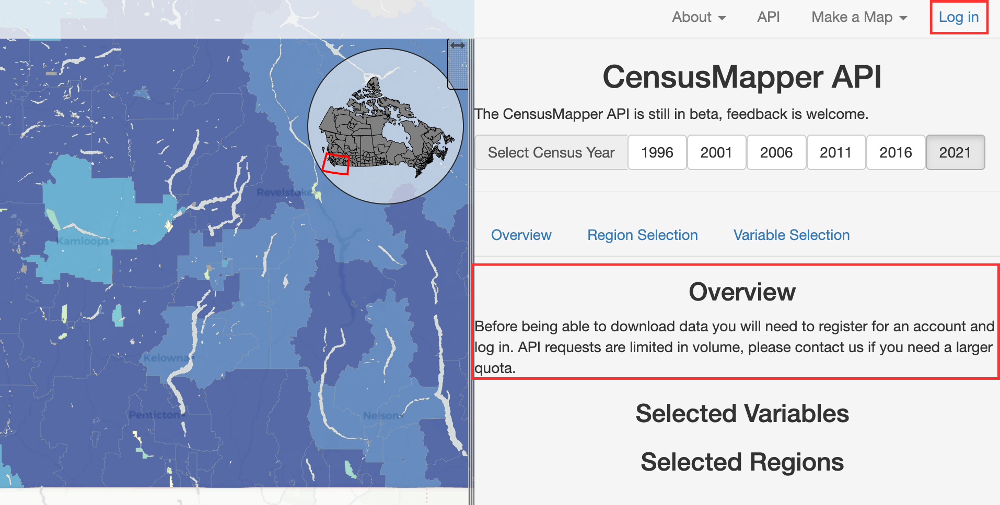{width=80%}

After logging into your account, select a year you want to download data for and click on the "Overview" tab. It should look like this:

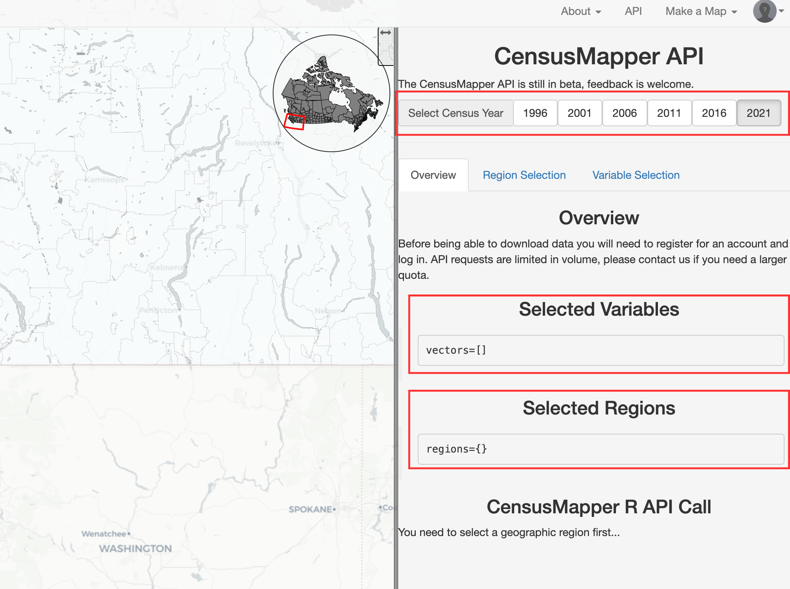{width=80%}

To select the variable(s) you want to download, click on the "Variable Selection" tab. Navigate to the variable(s) of interest and click on the variable code, which is typically a green, blue or pink box. For example, let's select "Population percentage change, 2016 to 2021" (v_CA21_3) and "Total - Age (Male)" (v_CA21_9). Note the "21" in the variable codes, which represents the data year. This would change to "v_CA16_" for 2016 data.

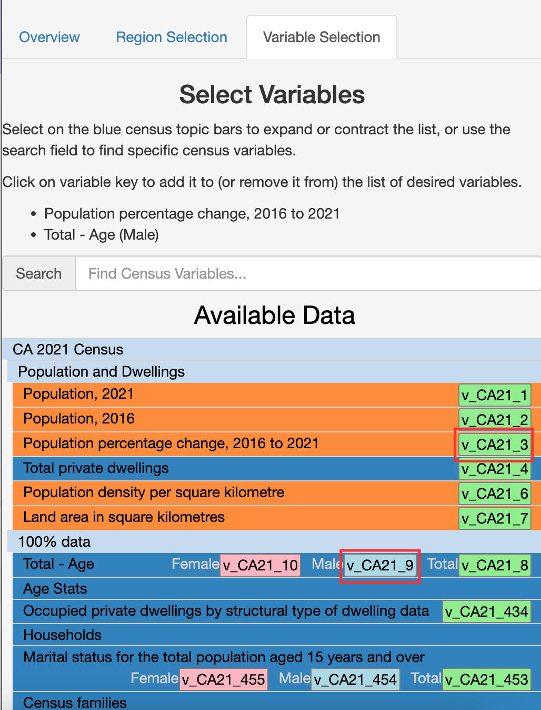{width=60%}

To select the region you want to download data for, zoom to the appropriate geographic level on the map using the "+" and "-" buttons at the top left of the map and click on the region. For example, to download data for the entire city of Toronto, zoom out until the outline of the city boundary is visible and click on it.

To see our selections of region and variable(s), go back to the "Overview" tab. The variable(s) you selected should be listed in the "Selected Variables" section, and the region you selected (the city of Toronto) should still be highlighted on the map as well as listed in the "Selected Regions" section. Take note of the year that's selected at the top right of the screen; this is the year you will download the data for.

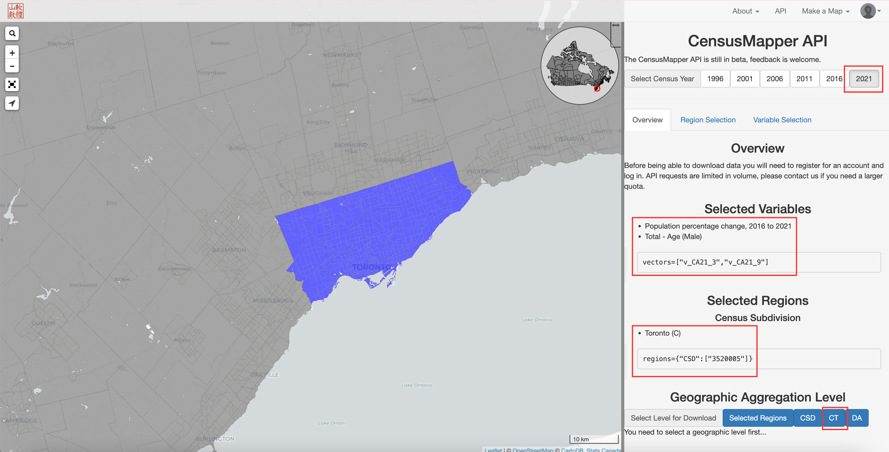

When you're ready to download the data, click on the geographic unit you want (again, see this explanation of the Census [hierarchy](https://www150.statcan.gc.ca/n1/pub/92-195-x/2011001/other-autre/hierarch/h-eng.htm)). If you want to download data at the census tract level, for example, click on the "CT" button and then either click on "Download Variables Data" (for non-spatial data, formatted as a CSV file) or "Download Geographic Data" (for spatial data, formatted as a geojson file).

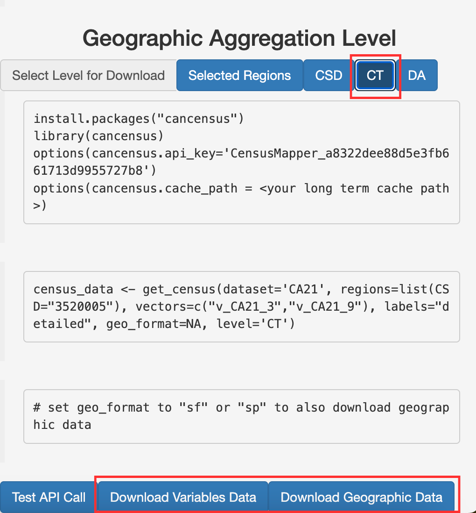{width=50%}

CensusMapper is partly built on an`R` library for downloading census data called [cancensus](https://github.com/mountainMath/cancensus). If you work with `R`, it is definitely worth checking out!

## Further analysis and visualization of census data

While CensusMapper (and other online tools like it) are great for exploring and downloading data, we often want to make more customized maps (e.g. for a report, a paper, a website, etc.) or analyze census data in conjunction with other data sources (e.g. comparing demographic data to the location of libraries, public transit, or grocery stores, etc.).

To do so, the general process is to first download census data directly from the Statistics Canada website above or from CensusMapper and then load it into whatever software or library that you are working with.

Check out our other notebooks if you want to learn how to use census data to make a [choropleth map](../../urban-data-visualization/choropleth-maps/choropleth-maps.md) or [proportional symbol maps](../../urban-data-visualization/proportional-symbol-maps/proportional-symbol-maps.md) in QGIS or Python.