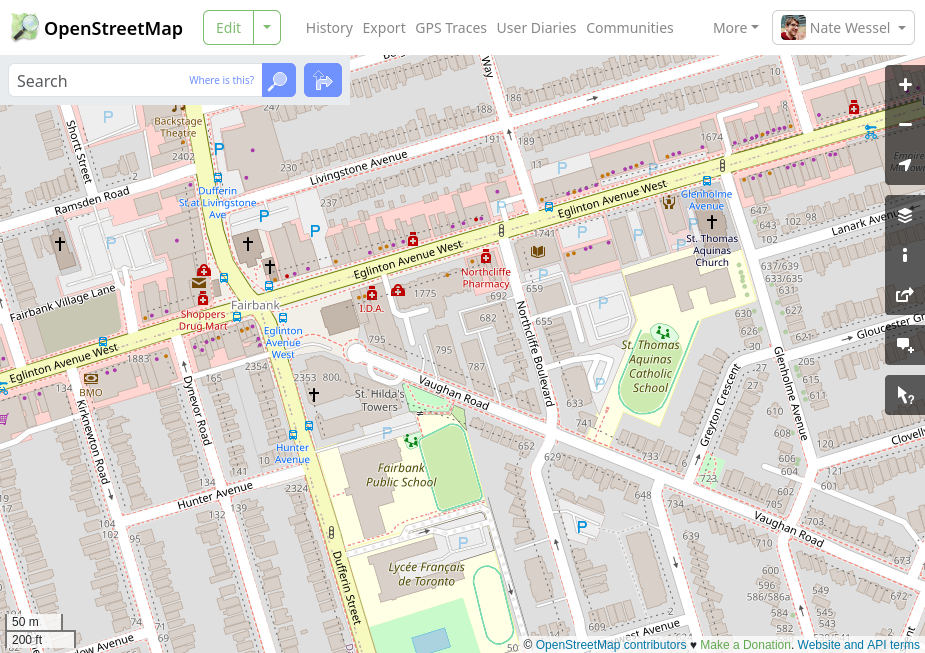
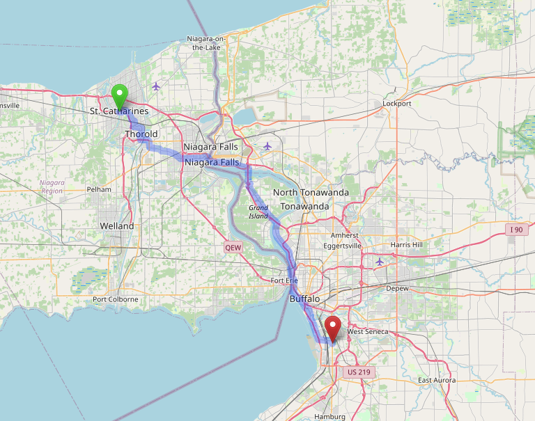
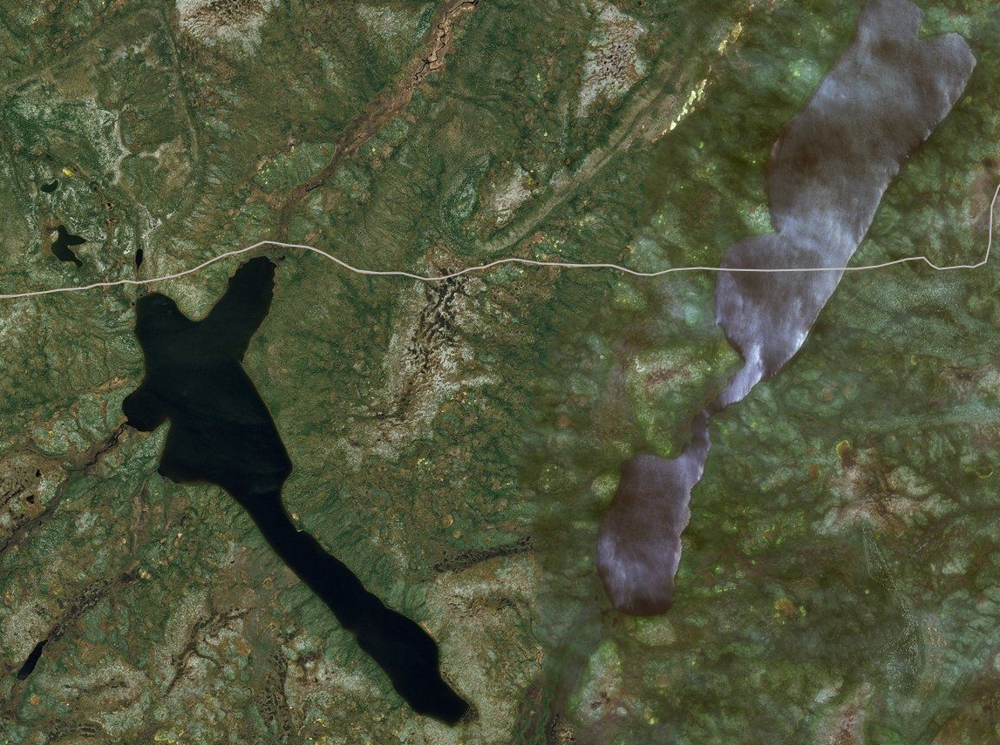
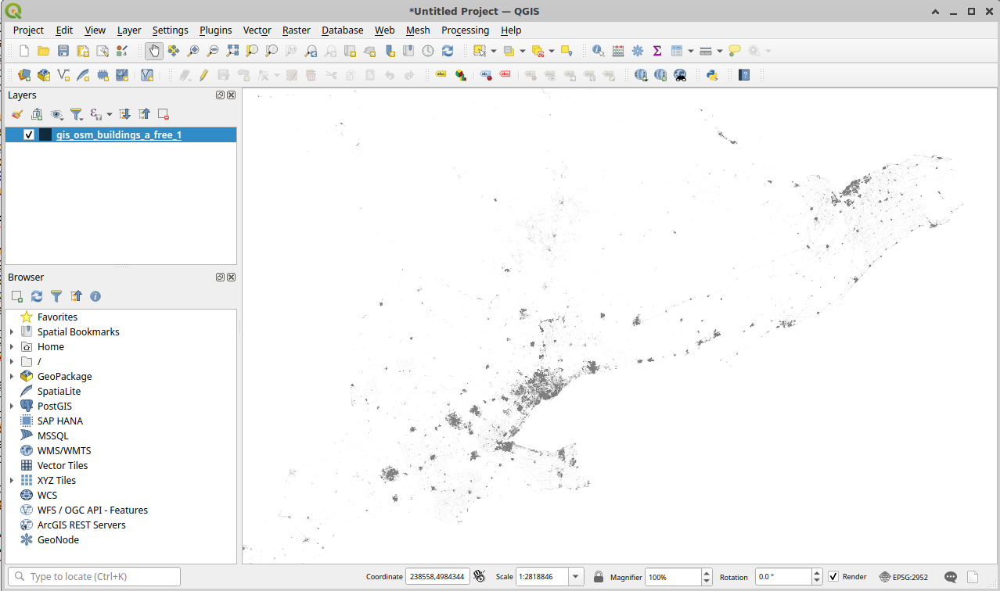
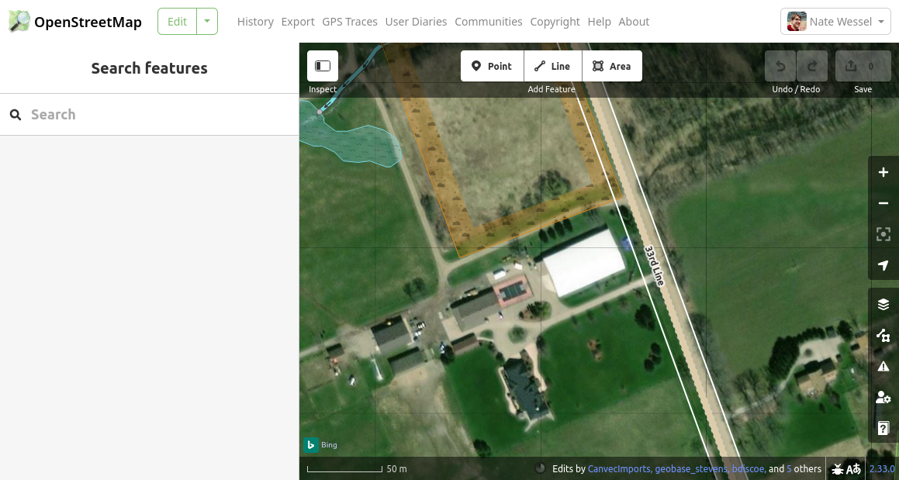
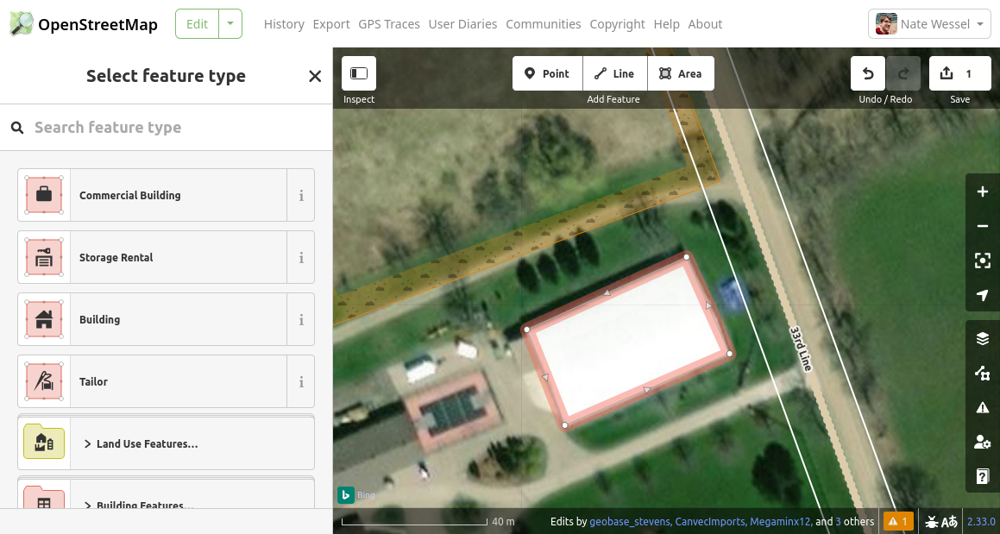
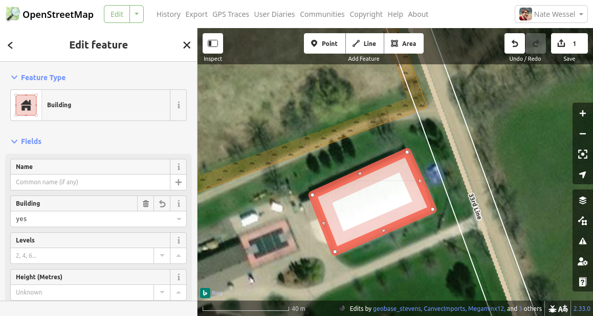
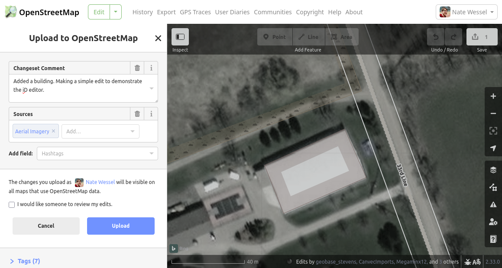
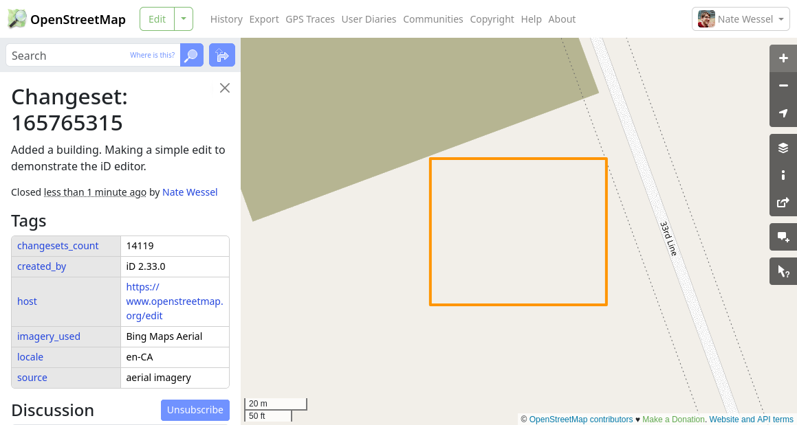
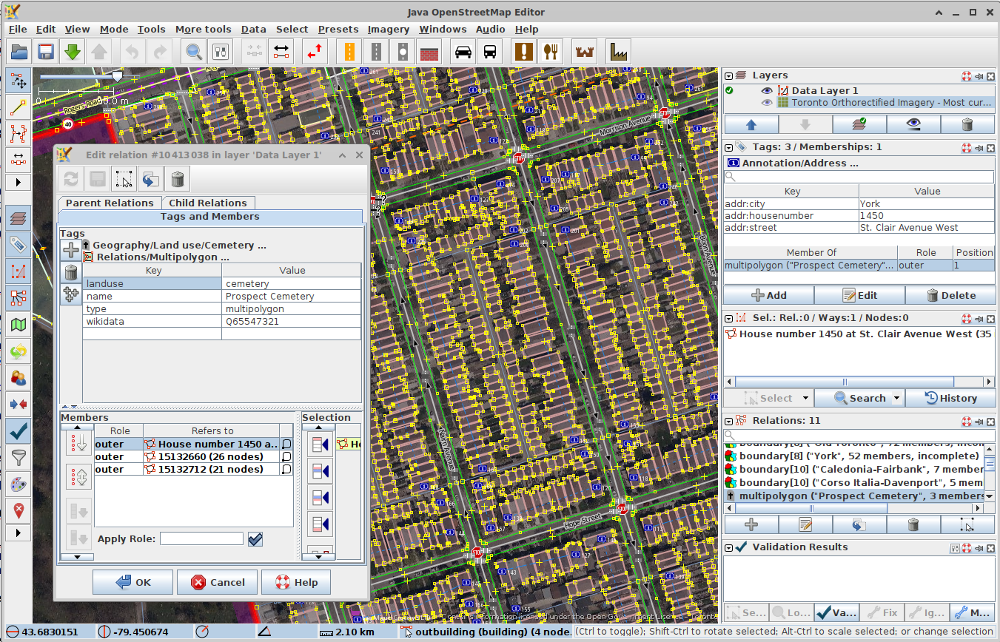

[📥 Click here to download this document and any associated data and images](/downloads/openstreetmap.zip)

<br>


This notebook is meant to introduce the reader to OpenStreetMap - what it is, how to use it, and when and why you might want to. This is written for an audience that has some familiarity with spatial data and its applications.


## What is OpenStreetMap?

OpenStreetMap (OSM) is a world-wide, collaborative mapping project spanning a huge range of subjects.



You might think of it as Wikipedia, if Wikipedia were a map instead of a written body of text. Anyone with a computer can contribute edits and can also download and use that data, along with the contributions of millions of others, for a wide range of uses. [Specifically](https://www.openstreetmap.org/copyright):

> You are free to copy, distribute, transmit and adapt our data, as long as you credit OpenStreetMap and its contributors. If you alter or build upon our data, you may distribute the result only under the same licence. The full [legal code](https://opendatacommons.org/licenses/odbl/1.0/) explains your rights and responsibilities.

This openness has led to a huge number of applications based on OSM, ranging from large companies offering maps or navigation services, to many thousands of smaller projects started by software developers, activists, academics, and hobbyists.

At the technical level, OSM is just a big spatial database run by the OpenStreetMap Foundation. It sits on a server somewhere and people access it over the web to make edits and download data. But OSM is also a community and a practice. Decisions about how it runs and what gets mapped are largely decentralized, and often local.


## What's on the map?

The types of things included on the map range widely, from the [glaciers](https://wiki.openstreetmap.org/wiki/Tag:natural%3Dglacier) of Greenland to the [cafe](https://wiki.openstreetmap.org/wiki/Tag:amenity%3Dcafe) around the corner from you. [Train routes](https://wiki.openstreetmap.org/wiki/Tag:route%3Dtrain) are on there, as are [buildings](https://wiki.openstreetmap.org/wiki/Buildings), hundreds of millions of them, all the way down to your [apartment](https://wiki.openstreetmap.org/wiki/Tag:building%3Dapartments) or your mom's garden [shed](https://wiki.openstreetmap.org/wiki/Tag:building%3Dshed). However OpenStreetMap does not cover all subject matter. The basic rule is that data should be, in some sense, [verifiable](https://wiki.openstreetmap.org/wiki/Verifiability) by a person on the ground in a real tangible way. This allows us to map sidewalks if they're there, but not the fact that a census tract contains people 37.8% of whom spoke French at home in the year 2021. It's [not a map of everything](https://wiki.openstreetmap.org/wiki/Scope).

To give another example, you could map that a [restaurant](https://wiki.openstreetmap.org/wiki/Tag:amenity%3Drestaurant) exists and serves [Tibetan food](https://wiki.openstreetmap.org/wiki/Key:cuisine) (that's probably spelled out on their menu, along with their hours and address), but it would be impossible to indicate that the neighbourhood contains many people from Tibet, because... I guess you'd have to ask them all? What would be meant by "many" or even "neighbourhood"? People will come to very different conclusions on that one. That's not independently _verifiable_.

Whether there is or is not a [bus stop](https://wiki.openstreetmap.org/wiki/Tag:highway%3Dbus_stop) in a given spot is much more verifiable. In a given context at least, we can probably all agree what counts as a bus stop. This verifiability requirement leads OSM to a sort of discreteness that not all mapping efforts share. Something does or does not exist, is this type of thing or that type of thing. OSM doesn't allow things to kind of exist or exist to a degree. It doesn't allow us to have competing versions of reality.

One important exception to the verifiability rule is [political](https://wiki.openstreetmap.org/wiki/Tag:boundary%3Dpolitical) or [administrative boundaries](https://wiki.openstreetmap.org/wiki/Tag:boundary%3Dadministrative), which often have no tangible existence in the real world. These are included for completeness, and because they rarely change, but should generally not be considered as authoritative. OSM also doesn't include private or identifiable information. You can map a house, but not say who lives there, and you also won't find any property lines in OSM, unless they just so happen to be marked by some physical boundary like a [fence](https://wiki.openstreetmap.org/wiki/Tag:barrier%3Dfence).

## How is the data structured?

There are two aspects to pretty much any spatial dataset: the geometries and the attributes. 

### Spatial data

OSM uses a _vector_ data model, not a _raster_ model. Rasters are pixels covering an area with a gradation of values. Vectors are discrete points and lines in space. In OSM, the fundamental types of spatial data are *nodes*, *ways*, and *relations*.

* **Nodes**: Nodes or points have a single coordinate location. They may exist on their own or be members of the other types. You might map a smallish object like a [post box](https://wiki.openstreetmap.org/wiki/Tag:amenity%3Dpost_box) as a node.
* **Ways**: Ways consist of an ordered series of two or more nodes. A way that starts and ends at different nodes is a line while one that starts and ends at the same node is often (but not always)  considered a closed polygon. You would probably map a [street](https://wiki.openstreetmap.org/wiki/Key:highway) as an open way (line), and a [cemetery](https://wiki.openstreetmap.org/wiki/Tag:landuse%3Dcemetery) as a closed way (polygon).
* **Relations**: Relations are grouped collections of any of these data types, including, reflexively, relations. These are the most complex type. A tram route for example would be a relation. It has a route (the tracks it follows) and also some stops or platforms which could be represented as points or polygons along the route. Relations can also used be used to break up very large features like the [Great Lakes](https://wiki.openstreetmap.org/wiki/Great_Lakes), which might otherwise cause your computer to overheat. Or they can be used to describe multipolygon or multiline geometry types.

### Attributes (tags)

The way OSM handles attributes, "[tags](https://wiki.openstreetmap.org/wiki/Tags)" in OSM parlance, is different from many other datasets you may be familiar with, especially those from government sources. Tags are associated with nodes, ways, and/or relations, though many nodes and ways may also have no tags at all if they belong to one of the other types (ways or relations) which has its own tags to describe the whole feature.

Tags take the form of `key=value` pairs, such as `building=residential` or `amenity=restaurant`. Usually, like these examples, their meaning is intuitively obvious, at least to an anglophone. In other cases, a more complex pattern has become the norm. For example, an address could be indicated with a set of tags like:

* `addr:housenumber=123`
* `addr:unit=B`
* `addr:street=Example Street`
* `addr:postcode=A1B2C3`
* `addr:city=London`

This approach breaks the address down into its parts to make the result more machine readable.

Tags, or at least their _keys_ are always in English, and specifically British English since that's where OSM originated. For names however (the tag for this is [`name=*`](https://wiki.openstreetmap.org/wiki/Key:name)), the practice is to always use the local language, for example `name=臺灣`, while the English name can be given like `name:en=Taiwan`.

At this point, you may be noticing that I'm describing tagging with words like "could", "may", "the practice is"... This is because there's no single authority on what tags are valid or how they need to be constructed except for the technical constraint that both the keys and values are text strings. Instead, the OSM community has established and documented a wide range of norms for tagging common, and not so common, features. The best way to find these is by searching the [OSM wiki](https://wiki.openstreetmap.org/), or perhaps by looking at what's on the map in an area you're familiar with. Tags that stray too far outside the norms are allowed but in practice are of little value. Applications that ingest OSM data may not support them and other mappers likely won't know what to do with them either. Because of this, it can be important to know that a restaurant is `amenity=restaurant`, while a laundromat is `shop=laundry`. Why is it a [shop](https://wiki.openstreetmap.org/wiki/Key:shop) and not also an [amenity](https://wiki.openstreetmap.org/wiki/Key:amenity)? Well, for the same reason that you have a tailbone: because it started out that way and now it's pretty baked in and it's not causing any harm. There are a lot of little idiosyncrasies like that but they're not too hard to remember after a while.

Another important difference from many spatial datasets is that there's no real concept of completeness for tagging. What tags would exhaustively describe a restaurant for example? OSM is always a work in progress. Often the first person to add something to the map does something very simple: saying, "there's a restaurant here" (`amenity=restaurant`) and then a month later someone comes by and adds the tag `cuisine=tibetan`, telling us that it serves Tibetan food. Later on, someone may add the name and a web address for the restaurant, a phone number, a list of payment methods accepted, whether they serve vegetarian dishes, how accessible the place is, the hours... any combination of any of these tags may be found together. Just when you think you've tagged every conceivable attribute, someone will come along and point out that the building has a grey, slate, Mansard style roof ([`roof:colour=gray`](https://wiki.openstreetmap.org/wiki/Key:roof:colour), [`roof:material=slate`](https://wiki.openstreetmap.org/wiki/Key:roof:material), [`roof:shape=mansard`](https://wiki.openstreetmap.org/wiki/Tag:roof:shape%3Dmansard)). It's truly never done.

### Spatial Data + Tags

Tags can be applied to nodes, ways, or relations, and there's not always a prescribed spatial type needed to define a given feature. To take up the restaurant example again, in many dense areas, restaurants are mostly mapped as nodes, especially if they share a building with other uses. But if a restaurant has its own building, then the `amenity=restaurant` tag might go on the way (polygon) representing the building. If that building happened to have an interior courtyard, it would need to be mapped as a relation (because the polygon's inner ring would make it a multi-geometry) and the restaurant tags would go on the relation.

As I indicated before, tagging is also somewhat optional. Most nodes in the database have no tags at all and simply serve to help define the shapes and positions of the tagged lines or polygons that reference them.

As you can see, OSM's data structure is enormously flexible. This is a huge strength, given the enormous variety of real things out there in the world that we want to describe, but it can in equal measure be a liability for those who want to use OSM to answer "simple" questions like "How many Tibetan restaurants are there in Toronto?"

## Strengths and Weaknesses of OSM as a dataset

OSM seems like the kind of thing you might either love or hate, but are unlikely to have ambivalent feelings about, at least if you're a geospatial nerd like me. Its great for some applications and for others might just drive you insane.

### Strengths

#### Flexibility in describing the world

As described in the previous section, OSM has great flexibility for describing things in the real world. The structure of tagging means we can add information as it becomes available, add detail to entities that are already in the database, and also describe things at various levels of detail, both spatially and in terms of attributes.

#### OSM spans boundaries

For much of my life, most of the world's geospatial data was collected and administered by government agencies. These agencies did great work, right up to the edge of their jurisdiction and then beyond that was a vast, blank _terra incognita_. OpenStreetMap may include boundaries, but they sit inside of a global dataset and aren't fundamental to how the map gets made. This means you can use OSM to analyse X or Y in North America, or within 500km of some point, without worrying about administrative differences in data collection.



#### Implicit topology

The topological (and cross-border) nature of OSM data makes it particularly well suited to transportation applications like finding walking or cycling directions from A to B. Indeed, this is the aspect of OSM to date that's been the most widely commercialized, but it's also available to you for free thanks to a wide range of open-source routing applications.

#### Version control

OSM is intended to represent the current state of the world, but it also maintains a history of past changes. While much of the history of OSM to-date has been a story of adding more and more detailed data, there's also a vast store of real history slowly accumulating in the database. There's the potential to rewind the clock and see that that Tibetan restaurant used to be a dispensary, and before that a church.

#### It accepts your edits

One of the biggest benefits of working with OSM data for a project may be a the simple fact that you can make edits. Inevitably, the data you need for your analysis will be incomplete. But you can use what's in OSM already as a starting point and add the bits that are missing, allowing you to complete your analysis (without having to collect _all_ the data) while at the same time leaving the map better than you found it. I've done this myself many times. When working with typical spatial datasets, where you download everything from some organization, it can be very hard to make edits _and then also_ synchronize those edits with any updates from the authoritative source.

### Weaknesses

#### Inconsistency

OSM data can be wildly inconsistent in quality, detail, and scale. In many parts of central Europe, you'd be hard pressed to add any more to the map, where even individual street trees can appear with their [genus](https://wiki.openstreetmap.org/wiki/Key:genus), [species](https://wiki.openstreetmap.org/wiki/Key:species), and [trunk circumference](https://wiki.openstreetmap.org/wiki/Key:circumference). On the flip side, much of rural Africa and South America can look like it was hastily sketched on a napkin with even major features like roadways or rivers totally absent or misaligned by dozens of meters. Even within a city like Toronto the difference in quality and completeness between downtown and the suburbs is pretty noticeable if you're paying attention.



#### Strong selection biases in the data coverage

Even the inconsistency of OSM data is inconsistent. That is to say, the inconsistency is very much not random and subject to the interests and biases of the contributors. One example that stands out to me is the recent rise of paid map editors (yes, by the way, those exist!) working for big international navigation and logistics companies. These companies use OSM as their primary data source and are very interested in doing quality control on features that could lead to errors for in-vehicle navigation systems. This can mean that tagging errors in, say, major North American roadways are very quickly identified and fixed, while infrastructure for pedestrians just does not get the same scrutiny. A comparative analysis of those features would very much need to consider that one of those features has a lot of money behind it.

#### OSM is always changing

Even setting aside the issues around consistency and bias, the nature of OSM as a community driven project means that it's always growing and evolving. This can be frustrating for data consumers. Let me give an example. I wanted to make a map of cycling infrastructure - bike lanes and the like - and had written code to look for three of the common tags for that:  

* `cycleway=lane`
* `cycleway:left=lane`
* `cycleway:right=lane`

These indicate respectively that a bike lane is on both sides of a street or just on the left or right side, depending which way the line is drawn. All was going well, until(!) at some point it started to become common to see the first tag supplanted by `cycleway:both=lane`, a tag that I didn't even know to look for until I was deep into trying to figure out why some major lanes were missing from my map. The software I was using still doesn't actually support this tagging out of the box, and it's far too common in practice now for me to try to edit things back to the older tagging style. To keep my project up to date I must find ways to adapt my code.

#### It accepts your edits

Just as it's a strength that the wise cartographer can add their wisdom to the map, so is it a detriment that any fool can add their foolishness too. Almost all edits to OSM are made in good faith but it's the nature of a growing project that there will always be beginners making simple mistakes or failing to fully understand the norms of the community. If you're reading this, it's likely you'll make some mistakes too and perhaps you'll get a polite message from me or some other local mapper one day pointing out a better way of doing things. I've found OSM to be a supportive community that happily welcomes and develops newcomers, but the truth is that the map at any given moment is likely full of small mistakes that haven't been fixed yet.


One example that comes to mind is the border between India and China. It's a very large and complex boundary that neither country actually agrees on. OSM has a nuanced way of tagging [disputed political boundaries](https://wiki.openstreetmap.org/wiki/Disputed_territories), but I found that in practice the boundary relations for each country would often break down (i.e. fail to be a closed polygon) because novice editors didn't understand this complexity. It was a pain to have to fix China and re-download the data every once in a while when I was regularly making maps of the region.

## Access the data and contribute edits

OSM is just a big online database and you can connect to it to both read (download) data and edit (contribute) data. I'll start by describing the download process, but you'll want to make sure you give editing a try too. Even if you think you'll only ever download data, I've found that, first of all, whatever you're doing you're going to find some data that just needs to be fixed and who better to do it than you? Second, editing puts you in the shoes of the people who make all the data in the first place. There's just no better way to understand what you're working with than to be part of the process of making it.

### Downloading data

OpenStreetMap itself, that is, [openstreetmap.org](https://openstreetmap.org) offers fairly limited ways of downloading data; you can download either all the data within a fairly small bounding box as an XML file, or you can download a compressed version (`.pbf`) of the entire planet. Unless you're a professional database administrator with some time to kill (and disk space!), I wouldn't recommend the later option. But let's talk briefly about that XML file format. For a very simple example, it looks something like this:

```xml
<?xml version="1.0" encoding="UTF-8"?>
<osm version="0.6" generator="openstreetmap-cgimap 2.0.1 (3529599 spike-06.openstreetmap.org)" copyright="OpenStreetMap and contributors" attribution="http://www.openstreetmap.org/copyright" license="http://opendatacommons.org/licenses/odbl/1-0/">
    <bounds minlat="43.8697990" minlon="-79.7034210" maxlat="43.8708900" maxlon="-79.7012510"/>
    <node id="11278892239" visible="true" version="1" changeset="142909966" timestamp="2023-10-21T06:56:10Z" user="nitemoon" uid="15815701" lat="43.8707980" lon="-79.7028380"/>
    <node id="11278892240" visible="true" version="1" changeset="142909966" timestamp="2023-10-21T06:56:10Z" user="nitemoon" uid="15815701" lat="43.8707710" lon="-79.7029400"/>
    <node id="11278892241" visible="true" version="1" changeset="142909966" timestamp="2023-10-21T06:56:10Z" user="nitemoon" uid="15815701" lat="43.8706280" lon="-79.7028670"/>
    <node id="11278892242" visible="true" version="1" changeset="142909966" timestamp="2023-10-21T06:56:10Z" user="nitemoon" uid="15815701" lat="43.8706550" lon="-79.7027640"/>
    <way id="1217260361" visible="true" version="1" changeset="142909966" timestamp="2023-10-21T06:56:10Z" user="nitemoon" uid="15815701">
        <nd ref="11278892239"/>
        <nd ref="11278892240"/>
        <nd ref="11278892241"/>
        <nd ref="11278892242"/>
        <nd ref="11278892239"/>
        <tag k="building" v="yes"/>
        <tag k="source" v="microsoft/BuildingFootprints"/>
    </way>
</osm>
```

Look closely and you can see that the file structure directly mirrors the structure of the OSM database described above. There are four nodes, each with a unique numeric ID and a set of coordinates. There's also a single way which contains an ordered list of references to each of those four nodes, and some tags describing what the way is. Take a close look and you should be able to tell from the XML that we're looking at a single rectangular building mapped as a closed polygon. Note that while there are four nodes, there are actually five references to them, with the first and last reference being to the same node ID. This is what tells us this is a closed polygon and not an open line. There's also a lot of extra metadata in this file which tells us who created these elements and when. The nodes themselves in this case don't have any tags.

But as I said, what OSM itself can give you is limited. OSM wants to conserve resources on their servers to ensure that contributors get the freshest data at the scale they need it to make edits.

Fortunately, OSM as a community has a variety of resources to fill the gaps for data consumers. These kind Internet strangers have downloaded that whole planet file and set up their copies to stay synchronized with the main database. They then offer additional ways of downloading larger chunks of data from their cloned databases, though often with some lag, ranging from minutes to days, from the main database.

#### The Overpass API

Perhaps the most versatile of these community sources is the [Overpass API](https://overpass-turbo.eu/). Overpass allows you to query the database in a great variety of ways using its own [OSM-specific query language](https://wiki.openstreetmap.org/wiki/Overpass_API/Overpass_QL). To be honest this can quickly get really complicated outside of some relatively simple use-cases, but it's a really powerful tool if you're willing to learn it. Here's a really simple example to give you a flavour of it.

```overpass
[out:json][timeout:5][bbox:{{bbox}}];
(node[shop=wool];way[shop=wool];)->.elements;
.elements out geom;
```

Pretty easy to read, right? Here's the same example with some explanatory comments.

```overpass
[out:json][timeout:5][bbox:{{bbox}}];
// This is a comment. The lines above tell overpass to
// 1. output results as JSON
// 2. give up after 5 seconds if the query hasn't finished (lets the server plan better)
// 3. search only within the current map view

// gather results and store in .elements variable
(
    // the parentheses union nodes and ways together
    node[shop=wool]; // collects any ways with these tags
    way[shop=wool]; // collects any nodes...
) -> .elements;
// output resulting geometries (and tags)
.elements out geom;
```

Go to the [Overpass API](https://overpass-turbo.eu/) and pop that query text in the sidebar. Zoom out until you can see your whole country and hit "run". You should see a few scattered nodes show up on the map. Congrats! You just efficiently searched the many gigabytes of data within your map view for all the shops that sell yarn. Brits, by the way, call all sorts of yarn "wool", which can be quite confusing for people trying to knit with alpaca or acrylic fibres. This is a good example of the rule I mentioned earlier of tags always being in British English.

Now click the "export" tab to download the data in a variety of formats. If you wanted to quickly make a map with this in a standard desktop GIS, GeoJSON would be a good, straightforward choice. You could just drag this straight into QGIS and begin styling the layers.

Personally, I often use Overpass to download fresh (delayed by just a minute or two) city or metro level data. There's actually a link for this directly on [openstreetmap.org](https://openstreetmap.org), which will download everything within the current (rectangular) map view as an XML file. Give it a try! Zoom to your city or neighborhood, go to the "export" option, and select "Overpass API" in the sidebar to download. If you go too big (e.g. country level), the API will timeout and throw an error.

Did you download a file? Good! Now you may be asking:
> What on Earth will I do with this 600MB XML file? I tried to open it with a text editor and my computer crashed!

Indeed. It's a big file, and you'll probably want to use some kind of program to parse the file in some way before working with it. When making a map, I typically use a program called [`osm2pgsql`](https://osm2pgsql.org/) to import the XML data into a PostgreSQL database on my computer. Many other tools exist though. I'll just point to a few and let you explore their documentation on your own.

* [`osmium`](https://osmcode.org/osmium-tool/): extract and filter data, or convert between OSM formats like PBF, XML, and JSON
* [`ogr2ogr`](https://wiki.openstreetmap.org/wiki/OGR): convert between OSM and many other spatal formats like GeoJSON or shapefile
* [Open Source Routing Machine (ORSM)](https://project-osrm.org/): parse the street network and set up an efficient and customizable routing engine

#### GeoFabrik Regional downloads

Another handy resource offers downloads in a format that might be more familiar to the typical GISer. [GeoFabrik](https://www.geofabrik.de/) is a German geospatial company which offers OSM [downloads](https://download.geofabrik.de/) in both compressed XLM (`.osm.pbf`) and _shapefile_ format, packaged into chunks split up by major regional and political boundaries. For example you could download data within [North America](https://download.geofabrik.de/north-america.html), [Canada](https://download.geofabrik.de/north-america/canada.html) or [Ontario](https://download.geofabrik.de/north-america/canada/ontario.html).

Shapefiles are a very common format for spatial data which, like Ginko trees and horseshoe crabs, are a surprisingly ancient thing somehow still living among us. They're tabular file format (that is, data in the form of a _table_), where each tagged entity (node, way, relation) is a row and each tag is a column. Because there are many, many tags, and most entities have only a few of them not all tags can be accommodated. Thus, the Geofabrik shapefiles can only include the most common tags, and are split into just a few thematic groups like buildings, landuse, natural features, place names, points of interest, etc. Shapefiles also must keep different geometry types separate, meaning there will be separate files for point, line, and polygon geometries.

These downloads can be a good entry point into OSM data if you're already comfortable working with shapefiles but the file format limits what you can do with the data. If you want to make a quick map of common features without worrying too much about the nuances of the data structure, this is probably what you want.



### Contributing edits

To make edits, you'll need to create an OSM account. You can sign up or log in using the buttons on the top right of the page at [openstreetmap.org](https://www.openstreetmap.org).

Once you have an account, there are a few different ways of making edits. The most accessible and beginner friendly is the *iD editor*, which is built right into [openstreetmap.org](https://www.openstreetmap.org). It has a lot of useful features that help you find good descriptive tags for whatever you're adding, but it can be pretty limited in its ability to make larger or more complex edits. It's definitely the best place to start.

I'll also talk briefly about the *JOSM editor*, which is my usual go-to. It's a much more powerful desktop GIS software that will let you do just about anything, but without a lot of the guardrails provided for newer uses by *iD*. 

These aren't the only editors though. Just as there are many ways to download data, contributed by the OSM community, there are many ways to edit it.

#### The ID editor

The iD editor is the beginner-friendly editor built right into the page at [openstreetmap.org](https://www.openstreetmap.org). Just click "edit" in the top menu and you'll be able to edit the contents of your current map view.

For your first edit (you're following along, right?) I recommend starting in a rural or suburban area that you're at least somewhat familiar with. Unless the area you're in is very densely mapped already, you should able to find some features which aren't mapped yet. Once you're in editing mode, you'll see OSM's vector map data overlaid on top of some recent aerial imagery.



Pan the map until you find some clear features in the imagery that aren't yet mapped. In the example above, I found some large buildings around what looks like a rural homestead (with a private basketball court??). To add the large building with the white roof as a polygon, I'll click on the "Area" button at the top, then click on each of the four corners of the building, double-clicking on the last one to close out the polygon.



I've now drawn the way, but not yet added any tags. On the left-hand panel, you can see iD suggesting some things this feature might be. I can tell this is a building, but not what kind of building it is. Maybe it's full of cows? Or it could be their private indoor hockey rink. Who knows. Scrolling through the options, I see "Building Features", click that, then select just "Building". I also could have used the search feature to get to the same result.



I can now see the tag I've added to this way (`building=yes`), along with some blanks for suggested tags that often accompany the `building=*` tag. For more information on any of these, you can click the "i" button to get a detailed description of each tag. It's OK to leave these tags blank.

For now, I'm happy with this edit and want to save it. I hit the "Save" button in the top right. Changes to the map are made in "changesets" and each one needs some description. I'll add a brief description for this simple edit, and also add a source for the information I've added, selected from the drop-down selector. Adding a description and a source helps future editors understand something about the context of my edit.



Once you click the "Upload" button, your edit will be saved for all time in the OSM database. Be sure you haven't done anything too silly, or added your banking information to the changeset comment. Here's the edit I just made: [https://www.openstreetmap.org/changeset/165765315](https://www.openstreetmap.org/changeset/165765315).



You can see there's a bit of extra information added by the editor, such as the actual source of the aerial imagery I was looking at. Notice that right after my edit, the building I added doesn't actually show up on the main page's map yet. My edit has made it into the OSM database, but it takes a while for changes to be reflected across the OSM ecosystem, such as on the rendered map or in data downloaded from other sources like those discussed above. By the time you're reading this, you'll see the building at the link above, assuming it hasn't been converted into a go-kart track by then.

As for your edit, if you wanted to confirm that your changes were saved, you could edit the map again in the same spot and you should see your modified data there since the editors all pull data, hot and fresh, from the main OSM database.

#### JOSM

While iD is the most popular OSM editor, and the best for beginners, you should also be aware that editors like [JOSM](https://josm.openstreetmap.de/) are out there too. JOSM is basically a fully-featured desktop GIS specific to OSM. It has numerous plugins and a range of powerful (and potentially dangerous) features, like allowing the editing of many features at once. It you want to do some specific thing, but iD doesn't seem to have a feature to support that, JOSM probably has three different ways of doing it.



For confident and experienced editors JOSM is a great tool but it can also be overwhelming and it counts on the user to know what they're doing to a pretty large degree. While most individual OSM editors use iD, most actual map edits are made in JOSM.

To give an example, one important way of using JOSM is for [data imports](https://wiki.openstreetmap.org/wiki/Import). Now first of all, one does not simply import data into OSM from other sources. Imports are a long, arduous journey of a process involving much discussion with the community, whose consensus and approval is required, and a very thorough review of data licensing and permissions. But once an import process is underway, JOSM could be used to bring in hundreds or even thousands of features at a time, while checking for conflicts with preexisting data.

## Concluding thoughts

OSM is a whole world unto itself, I guess quite literally. Over the last decade or so its millions of users around the world, spanning many languages and cultures have developed a shared representation of the entire world. Like that world, it's big and complex and messy and still very much a work in progress. But it's also filled to the brim with useful, and indeed fascinating information. OSM can take a while to familiarize yourself with, and indeed you'll never know everything about it. It's just too big and it's always changing. But I hope I've enticed you here to look a little more into it and consider OSM data as a potentially valuable resource in your various endeavors.

Welcome to the OSM community!