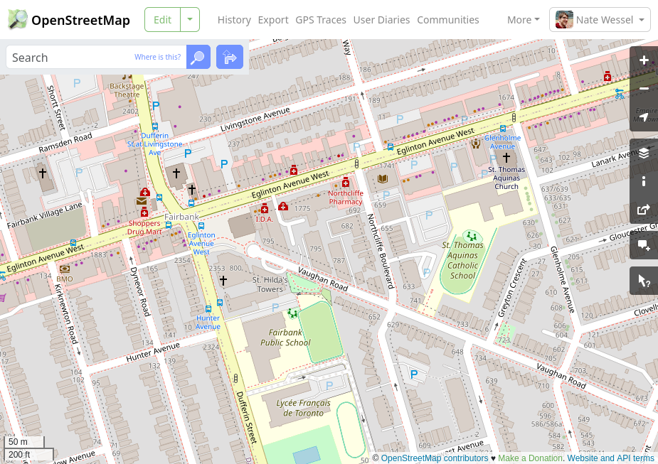
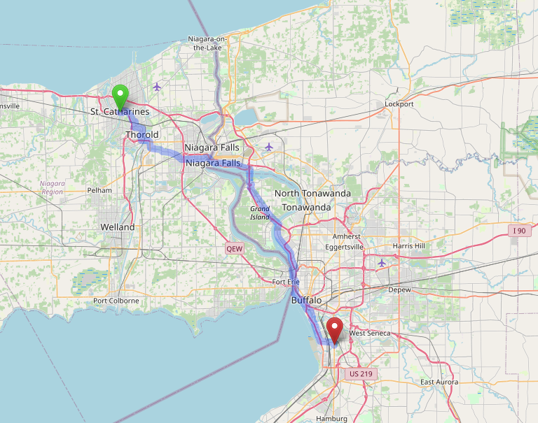
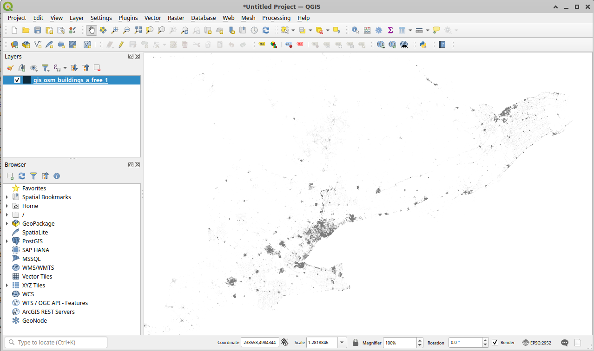
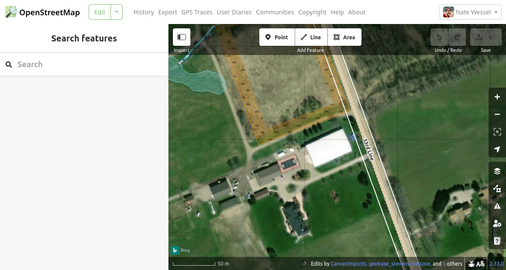
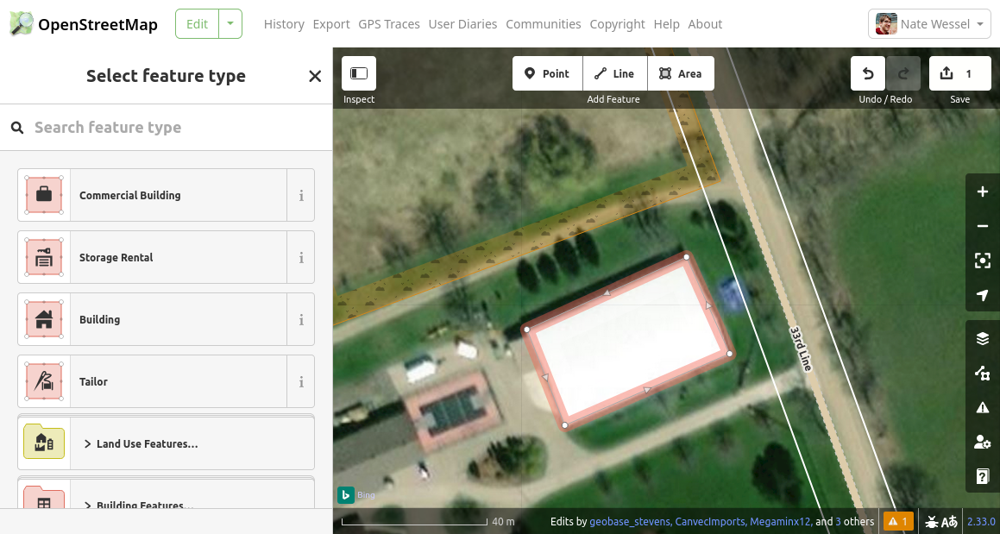
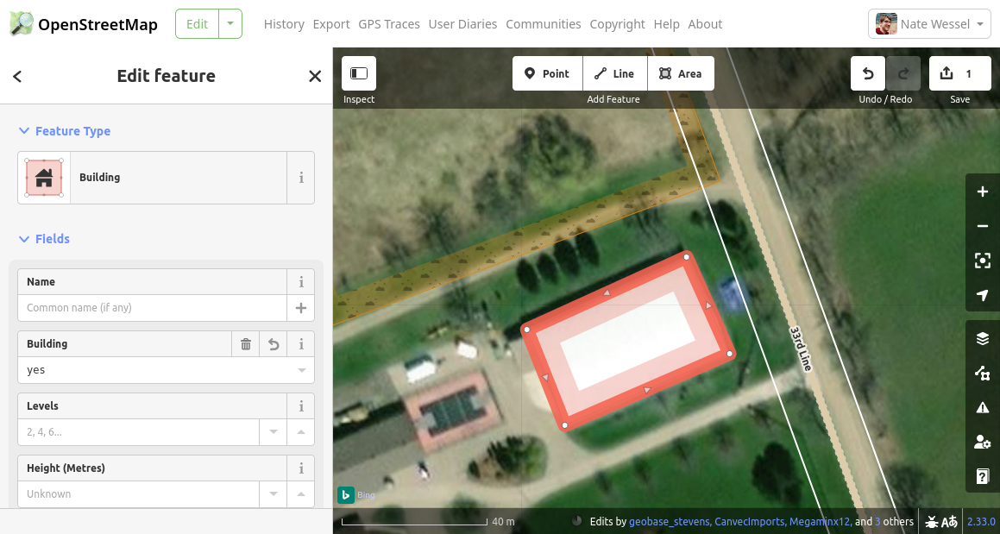
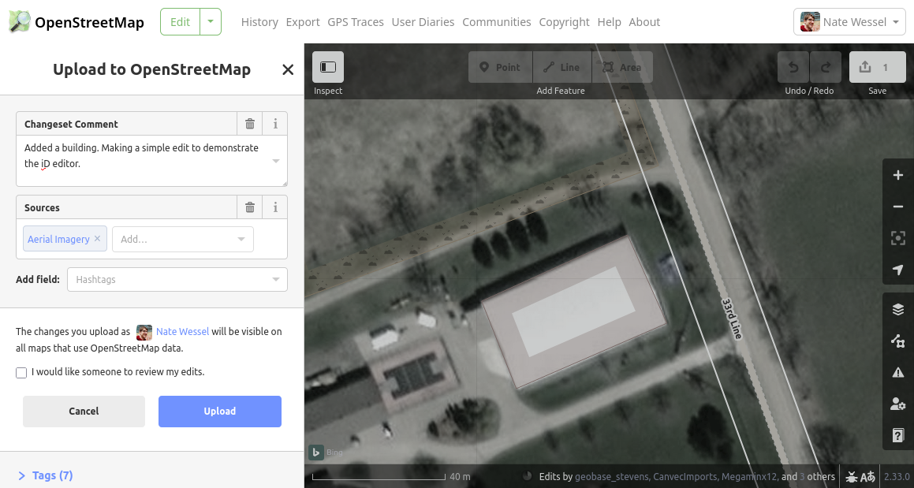
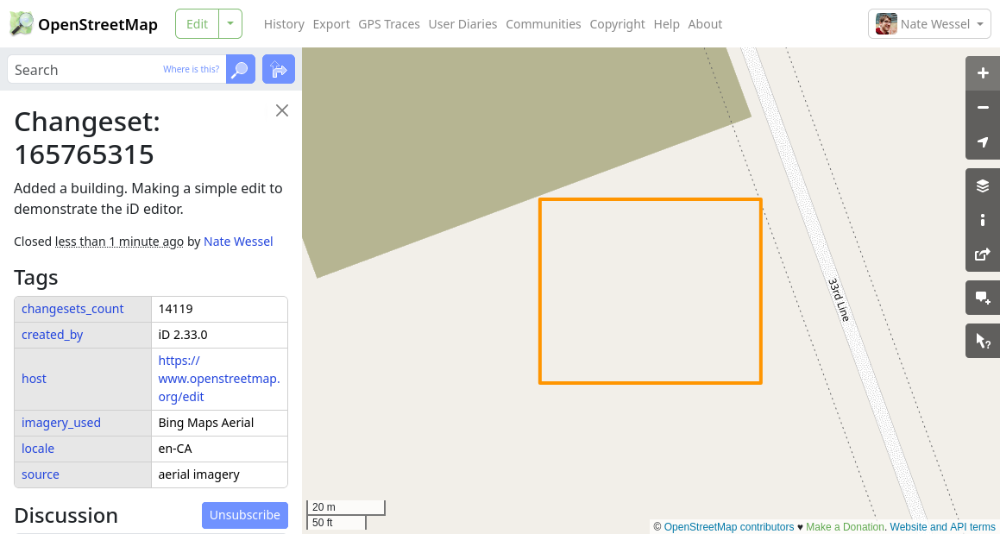
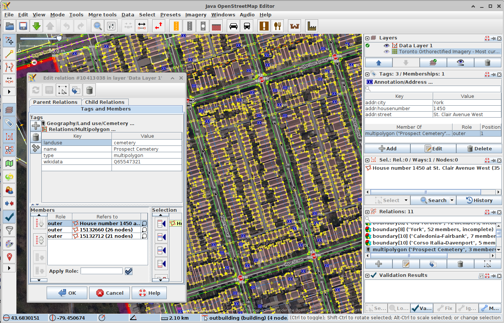

[📥 Click here to download this document and any associated data and images](/downloads/openstreetmap.zip)

This section will cover:

- what OpenStreetMap is, how to use it, and when and why you might want to
- the strengths and weaknesses of OpenStreetMap

This is written for an audience that has some familiarity with spatial data and its applications.


## What is OpenStreetMap?

OpenStreetMap (OSM) is a world-wide, collaborative mapping project spanning a huge range of subjects.



At the technical level, OSM is a big spatial database. You might think of it as Wikipedia, if Wikipedia were a map instead of a written body of text. Anyone with a computer can contribute edits and can also download and use that data, along with the contributions of millions of others, for a wide range of uses. [Specifically](https://www.openstreetmap.org/copyright):

> You are free to copy, distribute, transmit and adapt our data, as long as you credit OpenStreetMap and its contributors. If you alter or build upon our data, you may distribute the result only under the same licence. The full [legal code](https://opendatacommons.org/licenses/odbl/1.0/) explains your rights and responsibilities.

This openness has led to a huge number of applications based on OSM, ranging from large companies offering maps or navigation services, to many thousands of smaller projects started by software developers, activists, academics, and hobbyists.


## What's on the map?

The types of things included on the map range widely, from the [glaciers](https://wiki.openstreetmap.org/wiki/Tag:natural%3Dglacier) of Greenland to the [cafe](https://wiki.openstreetmap.org/wiki/Tag:amenity%3Dcafe) around the corner from you. [Train routes](https://wiki.openstreetmap.org/wiki/Tag:route%3Dtrain) are on there, as are [buildings](https://wiki.openstreetmap.org/wiki/Buildings), hundreds of millions of them, all the way down to your [apartment](https://wiki.openstreetmap.org/wiki/Tag:building%3Dapartments) or your mom's garden [shed](https://wiki.openstreetmap.org/wiki/Tag:building%3Dshed). You could map that a [restaurant](https://wiki.openstreetmap.org/wiki/Tag:amenity%3Drestaurant) exists and serves [Tibetan food](https://wiki.openstreetmap.org/wiki/Key:cuisine) (that's probably spelled out on their menu, along with their hours and address), or whether there is or is not a [bus stop](https://wiki.openstreetmap.org/wiki/Tag:highway%3Dbus_stop) in a given spot. 

However OpenStreetMap does not cover all subject matter - the basic rule is that data should be, in some sense, [verifiable](https://wiki.openstreetmap.org/wiki/Verifiability) by a person on the ground in a real tangible way. This verifiability requirement leads OSM to a sort of discreteness that not all mapping efforts share. Something does or does not exist, is this type of thing or that type of thing - OSM doesn't allow things to kind of exist or exist to a degree, and it doesn't allow us to have competing versions of reality. You can map sidewalks if they're there, but not census data about language spoken at home, because the latter isn't independently verifiable. One important exception to the verifiability rule is [political](https://wiki.openstreetmap.org/wiki/Tag:boundary%3Dpolitical) or [administrative boundaries](https://wiki.openstreetmap.org/wiki/Tag:boundary%3Dadministrative), which often have no tangible existence in the real world but are included for completeness. OSM also doesn't include private or identifiable information - you can map a house, but not say who lives there, and you won't find property lines unless they're marked by some physical boundary like a [fence](https://wiki.openstreetmap.org/wiki/Tag:barrier%3Dfence). It's [not a map of everything](https://wiki.openstreetmap.org/wiki/Scope).


## How is the data structured?

There are two aspects to pretty much any spatial dataset: the geometries and the attributes. 

### Spatial data

OSM uses a *vector* data model, not a *raster* model. Rasters are pixels covering an area with a gradation of values. Vectors are discrete points and lines in space. In OSM, the fundamental types of spatial data are *nodes*, *ways*, and *relations*.

| Data Type | Definition | Example |
|-----------|------------|---------|
| **Nodes** | Points with a single coordinate location. They may exist on their own or be members of other types. | A [post box](https://wiki.openstreetmap.org/wiki/Tag:amenity%3Dpost_box) mapped as a single point |
| **Ways** | An ordered series of two or more nodes. Open ways (different start/end nodes) form lines, while closed ways (same start/end node) typically form polygons. | A [street](https://wiki.openstreetmap.org/wiki/Key:highway) as an open way (line), or a [cemetery](https://wiki.openstreetmap.org/wiki/Tag:landuse%3Dcemetery) as a closed way (polygon) |
| **Relations** | Grouped collections of any data types, including other relations. The most complex type for describing multi-part features. | A tram route with tracks (ways) and stops/platforms (nodes or polygons), or breaking up large features like the [Great Lakes](https://wiki.openstreetmap.org/wiki/Great_Lakes) |

### Attributes (tags)

The way OSM handles attributes, "[tags](https://wiki.openstreetmap.org/wiki/Tags)" in OSM parlance, is different from many other datasets you may be familiar with. Tags take the form of `key=value` pairs like `building=residential` or `amenity=restaurant`, with meaning usually intuitively obvious to anglophones. More complex patterns have emerged - addresses use tags like `addr:housenumber=123` and `addr:street=Example Street`, breaking information into machine-readable parts. Tags (or at least their _keys_) are always in British English, though names use local languages: `name=臺灣` with optional English versions like `name:en=Taiwan`. The OSM community has established norms documented in the [OSM wiki](https://wiki.openstreetmap.org/). 

OSM is always a work in progress - there's no real concept of completeness for tagging, and it's rife with idiosyncrasies. Often the first person to add something to the map does something very simple: saying "there's a restaurant here" (`amenity=restaurant`), then later someone adds `cuisine=tibetan`, then someone may add the name, web address, phone number, payment methods, accessibility info, hours... any combination of these tags may be found together. Just when you think you've tagged every conceivable attribute, someone will point out that the building has a grey, slate, Mansard style roof ([`roof:colour=gray`](https://wiki.openstreetmap.org/wiki/Key:roof:colour), [`roof:material=slate`](https://wiki.openstreetmap.org/wiki/Key:roof:material), [`roof:shape=mansard`](https://wiki.openstreetmap.org/wiki/Tag:roof:shape%3Dmansard)). It's truly never done.

### Spatial data + tags

Tags can be applied to nodes, ways, or relations, and there's not always a prescribed spatial type needed to define a given feature - a restaurant might be mapped as a node if it shares a building, as a way if it has its own building, or as a relation if that building has complex geometry like an interior courtyard. This enormous flexibility in OSM's data structure is both a huge strength for describing the variety of real things in the world and an equal liability for those wanting to answer "simple" questions like "How many Tibetan restaurants are there in Toronto?"


## Strengths and weaknesses of OSM as a dataset

| Strength | Explanation |
|----------|-------------|
| **Flexibility in describing the world** | OSM's tagging structure allows adding information as it becomes available and describing things at various levels of detail, both spatially and in terms of attributes. |
| **OSM spans boundaries** | Unlike government datasets that stop at jurisdictional edges, OSM provides a global dataset that lets you analyze across borders without worrying about administrative differences in data collection. |
| **Implicit topology** | The topological nature of OSM data makes it particularly well suited to transportation applications like finding walking or cycling directions from A to B, which has been widely commercialized but is also available for free through open-source applications. |
| **Version control** | OSM maintains a history of past changes, creating a vast store of real history that lets you rewind the clock to see how places have changed over time. |
| **It accepts your edits** | You can add missing data needed for your analysis while leaving the map better than you found it, unlike typical datasets where synchronizing edits with updates is very difficult. |



| Weakness | Explanation |
|----------|-------------|
| **Inconsistency** | OSM data quality varies wildly - from central European areas with detailed street tree data, to much of rural Africa and South America that look hastily sketched with major features like roadways or rivers missing or misaligned by dozens of meters. |
| **Strong selection biases in the data coverage** | The inconsistency follows contributor interests and biases, like paid editors from navigation companies who quickly fix road errors but ignore pedestrian infrastructure. |
| **OSM is always changing** | The nature of OSM as a community driven project means that it’s always growing and evolving. Tags change, for example, and to keep a project up to date, we sometimes need to update which tags to use to query. |
| **It accepts your edits** | Just as wise cartographers can add wisdom, any fool can add foolishness - the map is always full of small mistakes from beginners who haven't yet learned community norms. |


## Access the data

OSM is just a big online database and you can connect to it to both read (download) data and edit (contribute) data.

### Downloading data

The main [OpenStreetMap website](https://openstreetmap.org) offers fairly limited ways of downloading data: you can download all the data within a fairly small bounding box as an XML file, or download a compressed version (`.pbf`) of the entire planet. Unless you're a professional database administrator with some time to kill (and disk space!), I wouldn't recommend the latter option. The XML file format looks something like this:

```xml
<?xml version="1.0" encoding="UTF-8"?>
<osm version="0.6" generator="openstreetmap-cgimap 2.0.1 (3529599 spike-06.openstreetmap.org)" copyright="OpenStreetMap and contributors" attribution="http://www.openstreetmap.org/copyright" license="http://opendatacommons.org/licenses/odbl/1-0/">
    <bounds minlat="43.8697990" minlon="-79.7034210" maxlat="43.8708900" maxlon="-79.7012510"/>
    <node id="11278892239" visible="true" version="1" changeset="142909966" timestamp="2023-10-21T06:56:10Z" user="nitemoon" uid="15815701" lat="43.8707980" lon="-79.7028380"/>
    <node id="11278892240" visible="true" version="1" changeset="142909966" timestamp="2023-10-21T06:56:10Z" user="nitemoon" uid="15815701" lat="43.8707710" lon="-79.7029400"/>
    <node id="11278892241" visible="true" version="1" changeset="142909966" timestamp="2023-10-21T06:56:10Z" user="nitemoon" uid="15815701" lat="43.8706280" lon="-79.7028670"/>
    <node id="11278892242" visible="true" version="1" changeset="142909966" timestamp="2023-10-21T06:56:10Z" user="nitemoon" uid="15815701" lat="43.8706550" lon="-79.7027640"/>
    <way id="1217260361" visible="true" version="1" changeset="142909966" timestamp="2023-10-21T06:56:10Z" user="nitemoon" uid="15815701">
        <nd ref="11278892239"/>
        <nd ref="11278892240"/>
        <nd ref="11278892241"/>
        <nd ref="11278892242"/>
        <nd ref="11278892239"/>
        <tag k="building" v="yes"/>
        <tag k="source" v="microsoft/BuildingFootprints"/>
    </way>
</osm>
```

The file structure directly mirrors the OSM database structure described above. There are four nodes with unique IDs and coordinates, plus a way that references those nodes with tags describing what it is. You can see this is a rectangular building mapped as a closed polygon - note the five node references with the first and last being the same node ID, which tells us it's closed.

While OSM itself can give you is limited since they want to conserve server resources for contributors. Fortunately, the OSM community offers additional resources - kind Internet strangers who've downloaded the entire planet file, keep their copies synchronized with the main database, and offer additional ways of downloading larger chunks of data with some lag from the main database.


### The Overpass API

Perhaps the most versatile of these community sources is the [Overpass API](https://overpass-turbo.eu/). Overpass allows you to query the database using its own [OSM-specific query language](https://wiki.openstreetmap.org/wiki/Overpass_API/Overpass_QL). This can quickly get complicated, but it's powerful if you're willing to learn it. Here's a simple example:

```overpass
[out:json][timeout:5][bbox:{{bbox}}];
// This is a comment. The lines above tell overpass to
// 1. output results as JSON
// 2. give up after 5 seconds if the query hasn't finished (lets the server plan better)
// 3. search only within the current map view

// gather results and store in .elements variable
(
    // the parentheses union nodes and ways together
    node[shop=wool]; // collects any ways with these tags
    way[shop=wool]; // collects any nodes...
) -> .elements;
// output resulting geometries (and tags)
.elements out geom;
```

Go to the [Overpass API](https://overpass-turbo.eu/), pop that query in the sidebar, zoom out to see your whole country and hit "run". You should see scattered nodes for shops that sell yarn. Brits call all sorts of yarn "wool", which can confuse people knitting with alpaca or acrylic - a good example of tags being in British English.

Click "export" to download in various formats. GeoJSON works well for desktop GIS, just drag into QGIS and start styling. I often use Overpass for fresh city-level data via the link on [openstreetmap.org](https://openstreetmap.org) under "export" > "Overpass API". If you go too big (country level), it'll timeout.

Downloaded a big XML file? You'll need tools to parse it. I use [`osm2pgsql`](https://osm2pgsql.org/) for PostgreSQL, but many others exist: [`osmium`](https://osmcode.org/osmium-tool/) for format conversion, [`ogr2ogr`](https://wiki.openstreetmap.org/wiki/OGR) for other spatial formats, or [OSRM](https://project-osrm.org/) for routing.


### Querying with Python

The Overpass API website is great for one-off queries, but sometimes you need to run a set of repetitive queries across many locations or with different variables. In that case, we can use Python.

```python
import json
import geojson
import requests
from osm2geojson import json2geojson

QUERY_STATION = """[out:json];
nwr[railway=station]["construction:railway"!~"station"](around:50000.00,{lat},{lon});
out center;
"""
OVERPASS_URL = 'https://overpass-api.de/api/interpreter'

for lat, lon in [(43.7, -79.4), (51.5, -0.1)]:  # Toronto, London
    response = requests.get(OVERPASS_URL, params={'data': QUERY_STATION.format(lat=lat, lon=lon)})
    result = json2geojson(response.json())
```

Extending queries into Python is pretty straightforward: all you have to do is apply the OSM query language and fill in the blanks (like latitude and longitude). Before you write up your code in Python, it's a good idea to test your query in Overpass, and to think about what different variables you want to run multiple queries for. These could be locations, but they could also be different tags or kinds of geographic data.

Here, we select for railway stations within 50km of a list of points corresponding to the cities of Toronto and London - but we could do this for as many cities as we want. Once we retrieve those results, we use the Python library [`osm2geojson`](https://github.com/aspectumapp/osm2geojson) to convert the geometric data into the GeoJSON format.


### GeoFabrik Regional downloads

Another handy resource is [GeoFabrik](https://www.geofabrik.de/), a German geospatial company offering OSM [downloads](https://download.geofabrik.de/) in compressed XML (`.osm.pbf`) and _shapefile_ format, split by major regional boundaries like [North America](https://download.geofabrik.de/north-america.html), [Canada](https://download.geofabrik.de/north-america/canada.html) or [Ontario](https://download.geofabrik.de/north-america/canada/ontario.html).

Shapefiles are a common spatial data format which, like Ginkgo trees and horseshoe crabs, are surprisingly ancient things somehow still living among us. They're tabular (each entity is a row, each tag a column), but since there are many tags and most entities have only a few, not all tags can be accommodated. Thus, Geofabrik shapefiles include only the most common tags, split into thematic groups like buildings, landuse, natural features, etc., with separate files for point, line, and polygon geometries.

These downloads are a good entry point if you're comfortable with shapefiles, though the format limits what you can do. If you want a quick map of common features without worrying about OSM's data structure nuances, this is probably what you want.




### Other useful OSM tools

Here are a few other OSM tools that we've found useful for different projects and applications

- [BBBike extracts](https://extract.bbbike.org/): similar to GeoFabrick, but for smaller geographies by allowing you to select bounding boxes for querying data

- [`osm2pgsql`](https://osm2pgsql.org/): import OSM into a PostgresSQL database

- [`osmium`](https://osmcode.org/osmium-tool/): extract and filter data, or convert between OSM formats like PBF, XML, and JSON

- [`ogr2ogr`](https://wiki.openstreetmap.org/wiki/OGR): convert between OSM and many other spatial formats like GeoJSON or shapefile

- [Open Source Routing Machine (ORSM)](https://project-osrm.org/): parse the street network and set up an efficient and customizable routing engine

- [`osmnx`](https://osmnx.readthedocs.io/en/stable/): Python package to download, analyze, and visualize street networks and other geospatial features from OpenStreetMap

- [`pyrosm`](https://pyrosm.readthedocs.io/en/latest/): Python package for reading OSM data in PBF format into `geopandas` GeoDataFrames


## Concluding thoughts

OSM is a whole world unto itself, I guess quite literally. Over the last decade or so its millions of users around the world, spanning many languages and cultures have developed a shared representation of the entire world. Like that world, it's big and complex and messy and still very much a work in progress. But it's also filled to the brim with useful, and indeed fascinating information. OSM can take a while to familiarize yourself with, and indeed you'll never know everything about it. It's just too big and it's always changing. But I hope I've enticed you here to look a little more into it and consider OSM data as a potentially valuable resource in your various endeavors.

Welcome to the OSM community!


## Appendix: Contributing edits

To make edits to the OpenStreetMap database, you'll need to create an OSM account. You can sign up or log in using the buttons on the top right of the page at [openstreetmap.org](https://www.openstreetmap.org).

Once you have an account, there are a few different ways of making edits. The most accessible and beginner friendly is the *iD editor*, which is built right into [openstreetmap.org](https://www.openstreetmap.org). It has a lot of useful features that help you find good descriptive tags for whatever you're adding, but it can be pretty limited in its ability to make larger or more complex edits. It's definitely the best place to start.

I'll also talk briefly about the *JOSM editor*, which is my usual go-to. It's a much more powerful desktop GIS software that will let you do just about anything, but without a lot of the guardrails provided for newer uses by *iD*. 

These aren't the only editors though. Just as there are many ways to download data, contributed by the OSM community, there are many ways to edit it.

### The ID editor

The iD editor is the beginner-friendly editor built right into the page at [openstreetmap.org](https://www.openstreetmap.org). Just click "edit" in the top menu and you'll be able to edit the contents of your current map view.

For your first edit (you're following along, right?) I recommend starting in a rural or suburban area that you're at least somewhat familiar with. Unless the area you're in is very densely mapped already, you should able to find some features which aren't mapped yet. Once you're in editing mode, you'll see OSM's vector map data overlaid on top of some recent aerial imagery.



Pan the map until you find some clear features in the imagery that aren't yet mapped. In the example above, I found some large buildings around what looks like a rural homestead (with a private basketball court??). To add the large building with the white roof as a polygon, I'll click on the "Area" button at the top, then click on each of the four corners of the building, double-clicking on the last one to close out the polygon.



I've now drawn the way, but not yet added any tags. On the left-hand panel, you can see iD suggesting some things this feature might be. I can tell this is a building, but not what kind of building it is. Maybe it's full of cows? Or it could be their private indoor hockey rink. Who knows. Scrolling through the options, I see "Building Features", click that, then select just "Building". I also could have used the search feature to get to the same result.



I can now see the tag I've added to this way (`building=yes`), along with some blanks for suggested tags that often accompany the `building=*` tag. For more information on any of these, you can click the "i" button to get a detailed description of each tag. It's OK to leave these tags blank.

For now, I'm happy with this edit and want to save it. I hit the "Save" button in the top right. Changes to the map are made in "changesets" and each one needs some description. I'll add a brief description for this simple edit, and also add a source for the information I've added, selected from the drop-down selector. Adding a description and a source helps future editors understand something about the context of my edit.



Once you click the "Upload" button, your edit will be saved for all time in the OSM database. Be sure you haven't done anything too silly, or added your banking information to the changeset comment. Here's the edit I just made: [https://www.openstreetmap.org/changeset/165765315](https://www.openstreetmap.org/changeset/165765315).



You can see there's a bit of extra information added by the editor, such as the actual source of the aerial imagery I was looking at. Notice that right after my edit, the building I added doesn't actually show up on the main page's map yet. My edit has made it into the OSM database, but it takes a while for changes to be reflected across the OSM ecosystem, such as on the rendered map or in data downloaded from other sources like those discussed above. By the time you're reading this, you'll see the building at the link above, assuming it hasn't been converted into a go-kart track by then.

As for your edit, if you wanted to confirm that your changes were saved, you could edit the map again in the same spot and you should see your modified data there since the editors all pull data, hot and fresh, from the main OSM database.

### JOSM

While iD is the most popular OSM editor, and the best for beginners, you should also be aware that editors like [JOSM](https://josm.openstreetmap.de/) are out there too. JOSM is basically a fully-featured desktop GIS specific to OSM. It has numerous plugins and a range of powerful (and potentially dangerous) features, like allowing the editing of many features at once. It you want to do some specific thing, but iD doesn't seem to have a feature to support that, JOSM probably has three different ways of doing it.



For confident and experienced editors JOSM is a great tool but it can also be overwhelming and it counts on the user to know what they're doing to a pretty large degree. While most individual OSM editors use iD, most actual map edits are made in JOSM.

To give an example, one important way of using JOSM is for [data imports](https://wiki.openstreetmap.org/wiki/Import). Now first of all, one does not simply import data into OSM from other sources. Imports are a long, arduous journey of a process involving much discussion with the community, whose consensus and approval is required, and a very thorough review of data licensing and permissions. But once an import process is underway, JOSM could be used to bring in hundreds or even thousands of features at a time, while checking for conflicts with preexisting data.