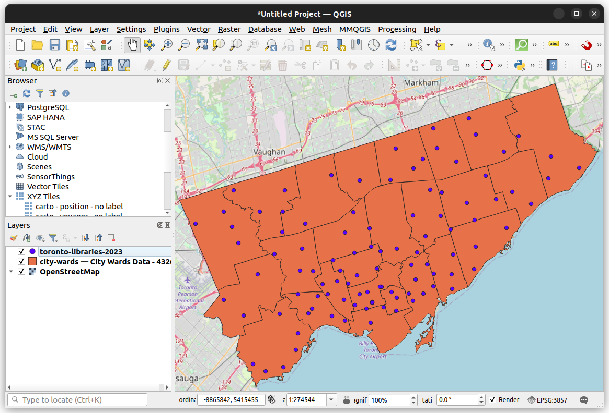

A lot of urban datasets are directly linked to specific places, e.g. addresses, streets, neighbourhoods, political or administrative boundaries, etc.

Data that include place-based information are often called *spatial*, *geographic*, or *geospatial* data *Geographic Information Systems (GIS)* are tools and software for analyzing, processing, and visualizing spatial data.

This page will cover the basics of spatial data and how we can view and interact with these data in the software [QGIS](https://qgis.org). You will need to download QGIS to work on the hands-on part of this tutorial. We recommend the Long-Term Release (LTR) version.


## Spatial data

A spatial dataset is a combination of...

- attribute data (the what)
- location data and spatial dimensions (the where)

Spatial data, this combination of attribute and location data, can be organized and represented in a number of different formats.

For example, a city can be represented on a map via a single point with a label (e.g. based on latitude and longitude coordinates). Or a city can be represented as a polygon, based on on it's administrative boundary

Importantly, there is always uncertainty about the level of accuracy, precision, and resolution of spatial data. Spatial data are abstractions of reality, and thus have some loss of information when used for visualization and analysis. Any analysis can only be as good as the available data.

The two most common forms of spatial data are vector data and raster data.


### Vector data

Vector data uses geographic coordinates, or a series of coordinates, to create points, lines, and polygons representing real-world features.

e.g. in the map below (a screenshot of OpenStreetMap), lines are used to represent roads and rail, points for retail, polygons for parks and buildings, etc.


Spatial data can be stored as columns in traditional table-based formats (e.g. .csv), but there are also a wide range of data formats specific to spatial data. These are some of the most common:

- [GeoJSON](https://en.wikipedia.org/wiki/GeoJSON) `.geojson`
- [GeoPacakge](https://en.wikipedia.org/wiki/GeoPackage) `.gpkg`
- [Shapefile](https://en.wikipedia.org/wiki/Shapefile) `.shp`
- [Geodatabase](https://en.wikipedia.org/wiki/Geodatabase_(Esri)) `.gdb`

Here is an example of a single point location of a city stored in a `.geojson` file. `.geojson` is a standardized data schema `.json` format for spatial data.

```json
{
  	"type": "FeatureCollection",
  	"features": [
		{
			"type": "Feature",
			"geometry": {
				"type": "Point",
				"coordinates": [-80.992, 46.490]
			},
			"properties": {
				"city_name": "Sudbury"
			}
		}
	]
}
```


### Raster data

Raster data represents space as a continuous grid with equal cell sizes. Each cell contains a value pertaining to the type of feature it represents. These values can be quantitative (e.g. elevation) or categorical (e.g. type of land use). Common examples of raster data include Digital Elevation Models (DEMs), satellite imagery, and scanned images like historical maps.

e.g. the map below shows a DEM for Toronto at two different scales.


## Geographic Information Systems (GIS)

We use Geographic Information Systems (GIS) to analyze, manipulate, and visualize spatial data.

Why is GIS useful?

- explore spatial patterns and relationships in data
- create maps for publications
- generate new data, either "by hand" or via spatial relationships from other data (e.g. through spatial queries)
- perform spatial analysis (i.e. statistical methods applied to spatial data)

GIS is often thought of as more than just a tool or piece of software. It can refer to all aspects of managing and analyzing digital spatially referenced data.

The power of GIS software and tools is the ability to work with data stored in different layers (e.g. a layer for roads, another for buildings, and so on) in conjunction with each other. These layers can be visualized and analyzed relative to each other based on their spatial relationships.


GIS software usually links to data stored elsewhere on a computer, rather than in a project file. If the source location of the data (i.e. which folder it's in) changes, then this will have to be updated in the GIS project. If data are edited in GIS, it will update the data in its source location.

The open-source QGIS and the proprietary ESRI ArcGIS are the two most used desktop GIS software. ESRI's suite of tools are often used by larger corporate and government organizations while QGIS is often used by small consultants and freelancers, non-profits, and academia. Many spatial data processing, visualization, and analyses steps also have equivalents in `Python`, `R`, `SQL` and other programming languages via specific libraries

We'll be working with QGIS and Python, because they free and work across multiple operating systems, and are commonly used across different areas of work and research. But pretty much everything we'll show can be accomplished across different software options, the buttons and steps will just be a bit different. 

Learning the core analytical and visualization concepts and ideas are much more important than exactly where to click or what specific functions to run.


## Coordinate Reference Systems (CRS) and map projections

A [CRS](https://en.wikipedia.org/wiki/Spatial_reference_system) is a framework for describing the geographic position of location-based data. It tells your GIS software where your data are located on the Earth. Without a CRS, your data would just be a bunch of numbers without an ability to place them on a map and relate them to other data.

There are thousands of CRSs. Each CRS has specific attributes about its position and one main set of spatial units (e.g. a CRS will measure location in degrees longitude/latitude, metres, miles, etc.). 

Probably the most common CRS is WGS84, which uses longitude/latitude to link data to the Earth's surface.

When doing spatial analyses and processing where we are comparing two or more datasets to each other, it is important that they are in the same CRS.


### Map projections

CRS are often paired with map projections. This is sometimes called a *Projected CRS*.

The earth is a 3D globe, but most maps are represented on 2D surfaces (e.g. on a screen, piece of paper). Map projections are mathematical models to flatten the earth to create a 2D view.

Every projection distorts shape, area, distance, or direction in some way or another. Different map projections distort the Earth in different ways. Here are some examples! For more check out this [projection transition tool](https://www.jasondavies.com/maps/transition/)


For doing analysis at an urban scale, it is important that we choose a map projection that conserves area and distances in both X and Y directions (i.e. space is not being distorted in one particular direction more than others).

For example, these are two aerial images of Toronto.The left image uses a local Mercator projection which does not distort data at a local scale, while the right image is a rectangular projection where degrees latitude are equal shown at the same scale as degrees longitude.


A general recommendation for urban-scale analyses is to use a [Universal Transverse Mercator (UTM)](https://en.wikipedia.org/wiki/Universal_Transverse_Mercator_coordinate_system) projected CRS, which conserves area, distance, and direction along bands of the earth. This is a good [tool for finding](https://mangomap.com/robertyoung/maps/69585/what-utm-zone-am-i-in-#) which UTM zone your region is in.


## Working with spatial data in QGIS

Let's use QGIS to quickly view a few spatial datasets. When you open up QGIS, it should look something like this:


The **Browser** panel is used for finding and loading data on your computer or from external sources, each line and symbol is for a different data source. The **Layer** panel will list all the datasets that are loaded into your project. The big white space will populate with data once it is loaded. The buttons at the top include a variety of options for loading data, saving your project, exploring your map, and various common processing and analytical tools.


### Loading data

Let's begin by adding in a basemap. Basemaps are often used to provide geographic reference for other data that we load into QGIS.

We'll add a basemap of OpenStreetMap, a free crowd-sourced map of the world, available as XYZ raster tiles. To do this, go to **Layer** - **Data Source Manager** or simply click on the **Data Source Manager** button highlighted below. When you open the **Data Source Manager** you have options for a wide variety of data types to add to your map.


Here is the URL to paste into QGIS for adding an OpenStreetMap basemap: `https://tile.openstreetmap.org/{z}/{x}/{y}.png`. 

When you click 'Add' it should be added to the map. You can use the navigation buttons or just scroll on your mouse to zoom to your city.


Let's now add some vector data to the map. We've pre-downloaded two datasets from the [City of Toronto's Open Data Portal](https://open.toronto.ca/)

- [City Wards (polygons)](./data/city-wards.geojson)
- [Library Locations (points)](./data/toronto-libraries-2023.geojson)

These can be added via the **Data Source Manager** - **Vector**, or simply via drag-and-drop from the folder of where they are located on your computer.




### Working with layers

The data added to the project will be listed in the **Layers** panel. The order of the layers determine the order of which they stack on top of each other on the map. In the example above, the libraries are listed at the top of the other two layers, and it thus appears on top of the other two layers on the map.

To change the layer order, you can drag individual layers to be above or below any other layer in the **Layers** panel.

Most vector data has associated attribute data, e.g. the number of a ward, the name of a library, etc. To view this data, right-click on a layer and then click on **Open Attribute Table**. In GIS, column names are often called "Fields"


### Styling data

When you load vector data like this into QGIS, the layers have default styling (e.g. colours, sizes, line-widths, etc.). 

There are tons of options in QGIS to change these initial styles (e.g. colours, size, and symbols). To do so, right-click on a layer, go to **Properties**, and then **Symbology**.

For example, in the screenshot below, the sizes of the libraries and the line-widths of the wards are increased a bit, the wards are given a transparent fill, and the library symbols are converted to squares.


Tip! you get extra options if you click on the sub-component of the symbol. e.g. in this example I clicked on `Simple Fill` to find additional styling options like pattern-based fill styles.


We'll explore data-driven styling, where colours or other style options are based on data values, in a future tutorial.


### Changing projections and CRS in QGIS

You can change the project CRS in QGIS by going to **Project** - **Properties** - **CRS**. 


### Exporting data

You can export and create copies of any of your data layers. This may be useful if you want to change the file format, the CRS, subset the attribute table, or simply just make a copy of the data.  

To do this, go to **Export** - **Save Features As**, and you can adjust the **Format**, **CRS**, and other options as needed.


### Saving a QGIS project

You can save a project in QGIS by going to **Project** and then **Save** or **Save As**.

It will get saved to a `.qgis` file. These files save styling, filters, layer orders, map scale and location, and layout settings. 

However, `.qgis` files do not save datasets directly in the file, only paths and links to where the data is stored, either on your computer or from a URL like the OpenStreetMap basemap. Saving only links to data is common in other tools and software. 

Therefore, if you share your project, you’ll need to also share any local datasets it is linking to.


