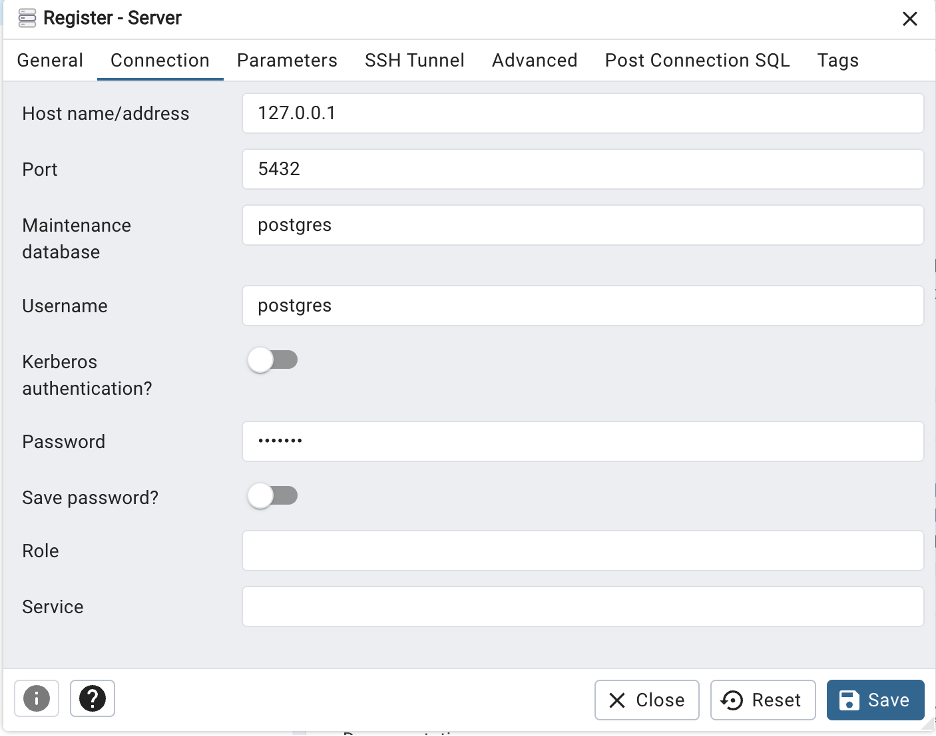

Spatial databases, such as [PostGIS](https://postgis.net/), allow us to store, query, and analyze geographic data within a database system.

Unlike file-based formats such as shapefiles, spatial databases are designed to efficiently **handle large volumes of spatial data**, support **multiple users** working simultaneously, and **integrate** with a range of tools and platforms including *Python*, *QGIS*, and *web applications*. This makes them ideal for collaborative projects, automated/reproducible workflows, and projects where large spatial datasets need to connect with other systems. 

Before we explore the spatial side of things, these first two pages will cover basics of relational databases and SQL. You will need access to postgres and PgAdmin 4 to work through this part of the tutorial.

## Relational database management systems

Relational Database Management Systems **(RDBMS)** such as [PostgreSQL](https://www.postgresql.org/) allow us to create, manage, and interact with databases. These systems can store both spatial and non-spatial data, and are especially useful for linking related datasets and enabling analysis across multiple sources.

Within a **database**, data are stored in **tables** which consist of records (rows) and attributes (columns). In GIS terms, you can think of a feature class or layer as a table, a feature as a record, and an attribute as a field.

To connect related data, RDBMSs use keys:

- A **primary key** uniquely identifies each record in a table
- A **foreign key** links a record in one table to a related record in another table

Before creating a database and tables to store your data, it’s helpful to think about appropriate *data types*. Every attribute must have a defined data type such as an integer, text, date or boolean.

## Creating a database with PostgreSQL

Let’s use *postgreSQl* and *pgAdmin 4* to set up a new database and create a non-spatial data table. PostreSQl is an open-source RDBMS and pgAdmin 4 is a graphical user interface client that makes it easy to interact our database without using command-line tools.

**Open the PostgreSQL application** and check that the server is running. You may also like to take note of the Port number being used here. For example, mine is connected to Port 5432 which I will reference through the tutorial.

Next, **open pgAdmin 4**. Right click **Servers > Register > Server**. If prompted, create a main password for logging in to pgAdmin 4.

Add the server name *localhost*.

Under connection, add the following details, including the main password you just created.

We will create a new database to store  data related to Toronto Public Libraries branches. First, download the CSV files for annual visits and annual circulation of library materials from the City of Toronto’s open data portal:

- [Annual visits](https://open.toronto.ca/dataset/library-visits/)
- [Annual circulation of library materials](https://open.toronto.ca/dataset/library-circulation/)

Back in pgAdmin 4, expand the **localhost server > Databases**. You may see some databases already in your system.

Right click on **Databases > Create > database**.

Name the database *libraries* then click **Save**.

### Defining database tables

**Expand your new database** in the navigation tree and open schemas. A schema is a collection of database objects which helps make things more manageable. A table is stored within a schema which is stored in a database.

**Expand public schema. Right click on Tables to create two new tables** with fields, data types and constraints (i.e., rules such as keys that help maintain data integrity) for both visits and circulation.
The table structure you create must match the structure of the csv file to enable input.

### Importing non-spatial data into a database table

Right click on each table in the navigation tree and select **Import/export Data**. Make sure import is selected then navigate to relevant file location to import data from CSV files.

Explore the options and consider how they may be updated depending on the structure of the data being imported.