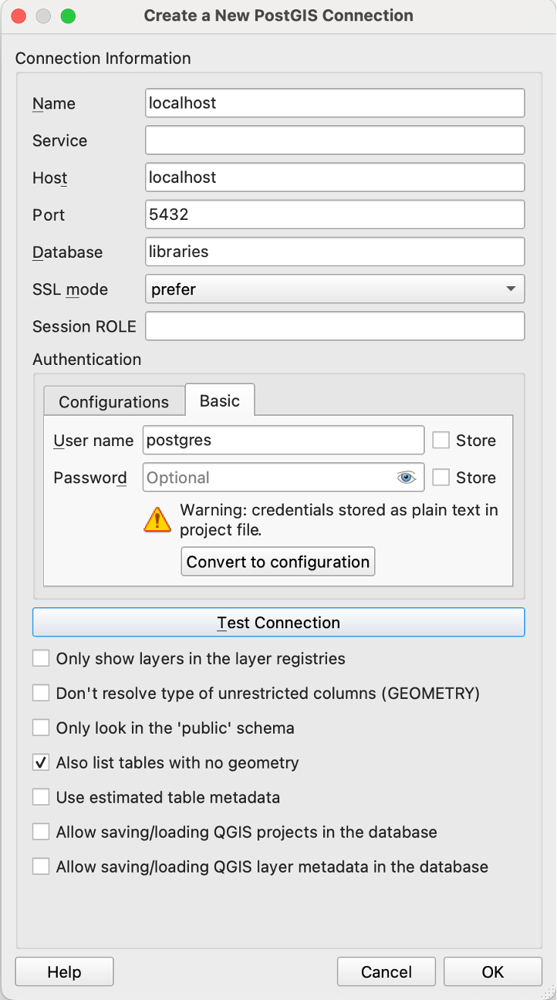
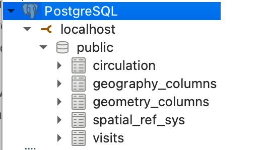
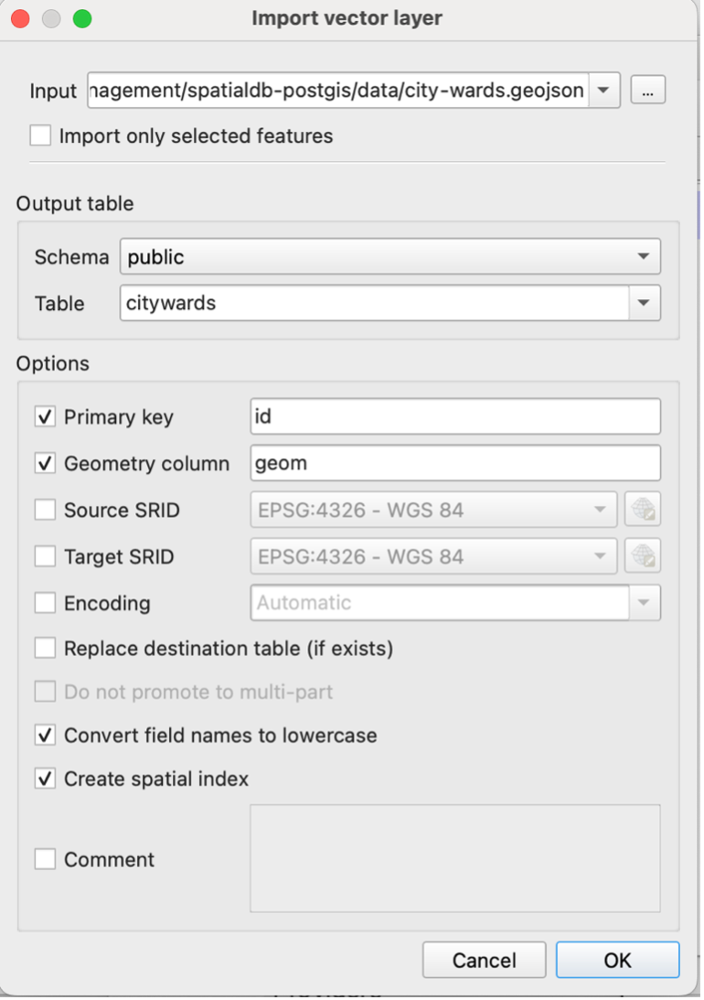

Now that you’re familiar with how to create, query, and manipulate data in relational databases using SQL, we can start to take a look at *spatial databases*.

Spatial databases extend traditional databases by allowing you to store and query *geographic features* such as points (e.g., library locations), lines (e.g., roads), and polygons (e.g., city ward boundaries). They are especially useful for combining spatial and non-spatial data, and exploring spatial questions such as:

-	What is the total area of each city ward?
-	Which libraries are located in each ward?

## PostGIS

[PostGIS](https://postgis.net/) is an open-source spatial database extender for PostgreSQL. It adds support for geographic objects so you can store, query, and manipulate spatial data directly in the database.

PostGIS can be enabled in a PostgreSQl database using pgAdmin 4.

In the filetree, **extend the libraries database**. Right click on **Extensions > Create > Extension** the search for and add ‘PostGIS’.

{width=60%}

Alternatively, use the **Query Tool** to run the following command:

```sql
CREATE EXTENSION postgis;
```

With the extension now activated, you have access to spatial types and functions. If you refresh the tables in your database, for example, you will now see a new table storing spatial reference system information.

## Importing spatial data

There are several ways to import spatial data into your PostGIS-enabled database, including the use of command line tools [shp2pgsql and ogr2ogr]( https://postgis.net/workshops/postgis-intro/loading_data.html).

For ease, and to learn about the benefits of using QGIS to visualize data, we will use QGIS to load data into PostGIS.

First, download the following data from the [City of Toronto's Open Data Portal](https://open.toronto.ca/):

- [City Wards (polygons)](./data/city-wards.geojson)
- [Library Locations (points)](./data/toronto-libraries-2023.geojson)

**Open QGIS and a new empty project**.

Within the QGIS browser pane, **right click on PostgreSQL** (or PostGIS, depending on version) and **select Connection**.

Input the following details, substituting your database name. 

Select ‘list tables with no geometry’ as you may also use this approach to import and view non-spatial data in your database (as an alternative to using PgAdmin 4).

{width=60%}

You should now see a connection to the public schema in the browser pane.

{width=60%}

Within QGIS, select **Database > DBManager**. Expand PostgreSQL/PostGIS > localhost > public schema and explore the metadata and any associated data of the spatial reference tables via the Info and Table panes of the DB Manager.

Select **Import layer/file** and then navigate to where the geoJSON files are stored.

Update the output table name to **all lower case and remove any special characters** (e.g., citywards). **Select the following options then Ok**.

{width=60%}

You should now see the *citywards* table under the public schema. The data are now being read from the database. Check the metadata to see if coordinate reference information has been imported.

**Repeat the import process for the library points** using a simplified table name (e.g., librarypnts) and the same options as above.

**Close the DB Manager and QGIS**.

## ST_ Functions

PostGIS provides a number of **ST_ (Spatial Type) functions** that allow you to interact with and manipulate geometry data. A full list of functions can be explored via [PostGIS documentation](https://postgis.net/docs/reference.html).

### Exploring geometries

Now you've imported your spatial data into PostGIS, you'll see that your geometries are stored in a *geometry field*. In the case of both the *citywards* and *librarypnts* tables, this field is named *geom*. 

The geometry field contains information about the spatial characteristics of each record, such as location, shape, and extent. The data are stored in *binary format*, meaning that we can not easily understand it as humans but that it can be easily processed and queried using SQL. We can use ST_ functions to explore the geometry further.

Back In PGAdmin 4, run each of the following queries separately.

```sql
-- View geometry information as binary format
SELECT geom FROM librarypnts;

-- View geometry information as Well-Known Text
SELECT ST_AsText(geom) FROM librarypnts;

-- View spatial reference ID. 4326 = WGS84
SELECT DISTINCT ST_SRID(geom) FROM librarypnts;
```

Notice that there are some library points without a geometry. We can run the following query to delete these:

```sql
DELETE FROM librarypnts
WHERE geom IS NULL;
```

We will next look at using ST_ functions to measure some geometries but notice that our data are currently stored in geographic coordinate reference system (CRS), WGS84, which uses latitude and longitude.

To measure areas, distances, or other spatial properties, it's helpful to transform the data into a projected CRS that uses units such as metres rather than degrees.

As the data are local to Toronto, we can use a projected coordinate system such as *NAD1983 UTM Zone 17N*. You can check the following link to identify required EPSG (SRID) codes. In this case, we will use code *26917*.

- https://spatialreference.org/ref/epsg/

The following code transforms our spatial data into UTM Zone 17N.

```sql
--Transform library point data to UTM Zone 17N
ALTER TABLE librarypnts
ALTER COLUMN geom
SET DATA TYPE geometry(POINT, 26917) 
USING ST_Transform(geom, 26917);

--Transform city ward polygon data to UTM Zone 17N
ALTER TABLE citywards
ALTER COLUMN geom
SET DATA TYPE geometry(MULTIPOLYGON, 26917) 
USING ST_Transform(geom, 26917);
```

Note that if you were not comfortable transforming your data, you could also use ST_Transform on the fly by adding it as a parameter into 


### Measuring geometries

Now that are data are in a projected CRS, we can use ST_ functions to measure geometries.

For example:
```sql
--Calculate city ward areas in sq m
SELECT area_name, ST_Area(geom) AS area_sqm
FROM citywards;

--Calculate city ward areas in sq km
SELECT area_name, ST_Area(geom) / 1000000 AS area_sqm_km
FROM citywards;
```

Other functions to measure geometries include ST_Length and ST_Distance.

Note that while we transformed our data into a projected CRS, it is also possible to maintain the original CRS and transform on the fly (e.g., `ST_Area(ST_Transform(geom, 26917))`).


### Testing spatial relationships

PostGIS provides a variety of ST_ functions that allow us to test different spatial relationships between geometries. 

For example:

| Function         | Description                                                                 |
|------------------|-----------------------------------------------------------------------------|
| **ST_Intersects** | Returns `TRUE` if two geometries intersect (share any space)               |
| **ST_Within**     | Returns `TRUE` if one geometry is within another (i.e., completely inside) |
| **ST_Contains**   | Returns `TRUE` if one geometry completely contains another                 |
| **ST_Distance**   | Returns the minimum distance between two geometries                        |
| **ST_Equals**     | Returns `TRUE` if two geometries are exactly equal                         |

Previously we learnt how to JOIN two tables based on a common value using `JOIN` and `ON`. To check for spatial relationships, we will use the `JOIN` clause combined with an ST_ function.

In the following examples, we return the branchcode for library points within each ward using ST_Contains:

```sql
SELECT w.area_name AS ward_name, l.branchcode AS branch_code
FROM citywards w
JOIN librarypnts l
ON ST_Contains(w.geom, l.geom);
```

So now we can get really fancy and start joining additional data from non-spatial tables. In the following example, the query returns the *total visits and circulation for each library branch, grouped by the city ward it is located in, for the year 2023*:

```sql
SELECT 
  w.area_name AS ward_name,
  l.branchcode AS branch_code,
  SUM(v.visits) AS total_visits,
  SUM(c.circulation) AS total_circulation
FROM citywards w
JOIN librarypnts l
  ON ST_Contains(w.geom, l.geom)
JOIN visits v
  ON l.branchcode = v.branchcode
JOIN circulation c
  ON v.branchcode = c.branchcode AND v.year = c.year
WHERE v.year = 2023
GROUP BY w.area_name, l.branchcode
ORDER BY ward_name;
```

{width=80%}


### Constructing new geometries

Lastly, we can use ST_ functions to create new geometries from existing ones. 

For example:

| Function                          | Description                                                                 |
|-----------------------------------|-----------------------------------------------------------------------------|
| `ST_Buffer(geom, distance)`       | Creates a polygon around the input geometry at the specified distance.     |
| `ST_Centroid(geom)`               | Returns the center point of a geometry.                                    |
| `ST_Union(geom)`                  | Merges multiple geometries into one (e.g., dissolve boundaries).           |
| `ST_Intersection(geomA, geomB)`   | Returns the geometry of overlapping areas between two input geometries.    |

In the case of our data, we may want to create buffers for each library point. Since our data are stored in CRS UTM 17 N, the distance is in metres.

```sql
SELECT ST_Buffer(geom, 100)
FROM librarypnts;
```

## Creating Views and Tables from Queries

Sometimes we may want to save the results of a spatial query, such as a buffer, either as a *view* (a virtual table that updates when the underlying data changes) or as a *new table*.

**A view is a saved SQL query**. It does not store the data itself but references the data in real time, which means any changes to the underlying tables will be reflected in the view.

We can create a view in the following way:

```sql
CREATE VIEW librarybuffers AS
SELECT *, ST_Buffer(geom, 800) AS buffer
FROM librarypnts;
```

And query the data as we would from a table:

```sql
SELECT * FROM librarybuffers;
```

Similarly, it's possible to store the results permanently in a new table. Unlike a VIEW, which dynamically reflects changes in the underlying data, a table created in this way is static. 

```sql
CREATE TABLE librarybuffers AS
SELECT *, ST_Buffer(geom, 800) AS buffer
FROM librarypnts;
```

### FYI!

While we have been working with our PostGIS data using PgAdmin, it's also possible to perform the same queries and functionality from within the QGIS DB Manager:


