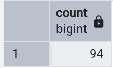

The *Data Manipulation Language (DML)* component of SQL is used to interact with and manage the data stored in your tables. These statements form the core of regular SQL tasks and allow you to query, filter, and group your data.

On this page, we will focus on the following key statements and clauses:

- SELECT – to query data from a table
    - WHERE – to filter records based on conditions
    - ORDER BY – to sort results
    - GROUP BY – to group results and apply aggregate functions
    - JOIN – to combine rows from two or more tables based on common values in related columns

We won’t cover INSERT, UPDATE and DELETE statements today but you can view the syntax required for these operations by right clicking a table name in pgAdmin 4 and selecting Scripts.

### Note on Literals

Before we start writing SQL statements, it’s important to note that different types of values (literals) require different formatting in order to be interpreted correctly:

- **Text** (i.e., string or non-numeric) values must be enclosed in *single quotation marks*
- **Numeric values** (e.g., integers, decimals) must *not be enclosed in quotation marks*
- **Identifiers** (e.g., table or column names) that contain **spaces** or **special characters**, or are **case-sensitive** should be enclosed in *double quotation marks*

For example:

```sql
INSERT INTO students(firstname, majorcode, group, "Dream Destination")
VALUES ('David', 2, 2, 'Spain');
```

## SELECT Statement

The `SELECT` statement is perhaps the most commonly used SQL command. Its purpose is to retrieve and display data from one or more database tables. You can choose to return all fields, or just a subset of specific fields.

Every `SELECT` statement must include two mandatory clauses:
-	`SELECT` – specifies the *fields* (columns) you want to retrieve
-	`FROM` – specifies the *table* where the data is coming from

Access the database created in the Introduction to spatial databases tutorial. **Within PgAdmin 4, open the Query tool**. 

{width=40%}

We will check our data were imported correctly into the library *visits* table by executing the following query to retrieve all data.

Here, `*` is a wildcard which means 'everything'. This is the simplest possible query to execute and returns all rows and fields from our data table. 

```sql
SELECT * FROM visits;
```

We can also specify which fields to return which can be especially useful for tables with a large number of fields.

```sql
SELECT branchcode, visits FROM visits;
```

Once you're comfortable retrieving data, you can start refining what you see in the output.

If your data, for example, has repeated values, the `DISTINCT` keyword allows you to return a list of *unique values* from the specified column. Any duplicates are automatically removed in the output.

For example:
```sql
SELECT DISTINCT branchcode FROM visits;
```

You can also control the *order* of your query results using the `ORDER BY` clause. By default, values are sorted in ascending (A–Z or lowest to highest) order. It’s also possible to switch to descending order using the `DESC` keyword, and to sort based on a number of fields.

For example: Sort in ascending order based on single field
```sql
SELECT * FROM visits
ORDER BY visits DESC;
```

For example: Sort with a mix of ascending/descending based on multiple fields
```sql
SELECT * FROM visits
ORDER BY branchcode, year DESC;
```

{width=60%}

What we’ve covered here is just the beginning of what you can do with `SELECT`. These basics are intended to get you started, but there's much more to explore including how to apply simple functions to create *derived values* (calculated on the fly as a query runs), and how to *check for missing data* using conditions. A few examples are shown below, but for a broader understanding of the full range of SQL functions and capabilities, you might also consider resources such as [W3Schools](https://www.w3schools.com/sql/default.asp) or the [PostgreSQL documentation](https://www.postgresql.org/docs/current/queries.html).

```sql
-- Derived values
SELECT visits * 0.1, LEFT(branchcode, 1) FROM visits;

-- Checking for missing data
SELECT * FROM visits WHERE visits IS NULL;
```

## WHERE Clause

Previous examples have returned all rows but often we need to restrict the rows that we receive from the data. The `WHERE` clause Limits the records included within the results depending on specified criteria. This is similar to the **Select by Attribute** option in ArcGIS Pro.

The criteria, or **search expression**, is evaluated as TRUE or FALSE for each row. `WHERE` may be used with a number of search expressions including comparisons, ranges, lists, patterns, and checks for missing values.

For example:

| Type             | Operators / Keywords                          | Example                             |
|------------------|-----------------------------------------------|-------------------------------------|
| **Comparison**   | `=`, `!=`, `<`, `>`, `<=`, `>=`, `NOT`, `AND`, `OR` | `WHERE visits > 50000`              |
| **Range**        | `BETWEEN`, `NOT BETWEEN`                      | `WHERE year BETWEEN 2018 AND 2020`  |
| **Membership**   | `IN`, `NOT IN`                                | `WHERE branchcode IN ('MA', 'BE')`  |
| **Pattern Match**| `LIKE`, `NOT LIKE`                            | `WHERE branchcode LIKE 'H%'`        |
| **Null Check**   | `IS NULL`, `IS NOT NULL`                      | `WHERE visits IS NOT NULL`          |

Below is an example query that will return all fields from the *visits* table for records where the branch code **starts with the letter M and the year falls between  2020 to 2023**. Results are ordered by year (most recent first) and then by highest number of visits:

```sql
SELECT * FROM visits
WHERE branchcode LIKE 'M%' AND year BETWEEN 2020 AND 2023
ORDER BY year DESC, visits DESC;
```

Now have a go at crafting your own complex search expressions!

## Aggregate functions and the GROUP BY Clause

Aggregate functions are useful when you want to **summarize** values in a column, for example, to calculate totals, averages, or counts. These functions return a single result based on a single column and multiple rows.

Example aggregate functions:

| Function        | Description                                     |
|----------------|-------------------------------------------------|
| `COUNT()`       | Counts rows (can include or exclude duplicates) |
| `SUM()`         | Adds up numeric values                          |
| `AVG()`         | Calculates the average                          |
| `MAX()` / `MIN()`| Finds the highest or lowest value              |
| `STDDEV()`       | Returns standard deviation  |
| `VARIANCE()`    | Returns variance                                |
| `CORR(a, b)`    | Correlation between two columns                 |
| `COVAR(a, b)`   | Covariance between two columns                  |
<br>

Example application of `COUNT()` function to data in *visits* table:

```sql
-- Count all rows in visits table
SELECT COUNT(*) FROM visits;

-- Count unique banch codes
SELECT COUNT(DISTINCT branchcode) FROM visits;

-- Count unique branch codes where over 50000 visits have been recorded
SELECT COUNT(DISTINCT branchcode) FROM visits
WHERE visits > 50000;
```

{width=30%}

<br>

It’s also possible to use the `GROUP BY` clause to apply aggregate functions to **subsets of your data**. Here, aggregate results are grouped by a shared value.

For example, the following query sums the number of visits for each library branch code and orders the results alphabetically:

```sql
SELECT branchcode, SUM(visits) FROM visits
GROUP BY branchcode
ORDER BY branchcode;
```

{width=50%}

## Aliases

It’s possible to create aliases using the `AS` keyword (though this is actually optional and a space would work just fine, too).

Aliases let you **rename a field or table** in your query/output, making results easier to read or simplifying references to tables in complex queries. The latter is particularly useful when using queries to create JOINS which we will come to next.

In the example below we create:
•  **Column aliases** (branchcode AS branch, visits AS "Total Visits")
•  A **table alias** (FROM visits AS v)

```sql
SELECT v.branchcode AS branch, v.visits AS "Total Visits"
FROM visits AS v;
```

While the table alias is not necessarily useful in this example, it gives you an idea of the syntax needed for more complex operations such as JOINS. If multiple tables have shared column names, the use of table aliases are important to avoid ambiguity across the tables.

## JOINS

So far we have explored data within a single table. The real power of relational databases comes from the ability to use `JOIN`s to combine rows of data from multiple tables based on shared values.

We will keep things relatively simple in this tutorial and focus on two types of `JOIN`s:

- `INNER JOIN`: Returns records where there is a **matching value in table A and table B**. Rows without a match are excluded from the results
- `LEFT JOIN`: returns **all rows from table A** (this is our left table as stated in the `FROM` cause) and includes matched data from table B (our right table as stated in the `JOIN` clause). This includes all rows from Table A in the results and where there’s no match in Table B, this will be shown as NULL


Now let's have a go at joining both our library *visits* and *circulation* tables. In the following example, both the year and branchcode are used to join the two tables since we want to join the annual circulation value for each branch.

```sql
SELECT v.branchcode, v.year, v.visits, c.circulation
FROM visits v
INNER JOIN circulation c
  ON v.branchcode = c.branchcode
  AND v.year = c.year;
```

Now that you've covered the fundamentals of SQL, you can start to think about how different clauses can come together to build more compex queries.

In the following example, we sum the total visits and circulation of materials for each branch in the year 2023, helping us identify the busiest libraries based on combined visitation and borrowing activity.

```sql
SELECT v.branchcode,
       SUM(v.visits + c.circulation) AS total_activity_2023
FROM visits v
INNER JOIN circulation c
  ON v.branchcode = c.branchcode
  AND v.year = c.year
WHERE v.year = 2023
GROUP BY v.branchcode
ORDER BY total_activity_2023 DESC;
```