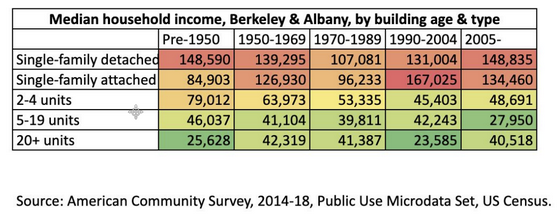
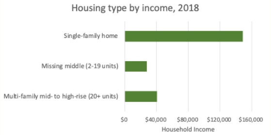

[📥 Click here to download this document and any associated data and images](/downloads/communicating-data-in-presentations.zip)

At the beginning of this textbook [Steps to building your urban data story](https://schoolofcities.github.io/urban-data-storytelling/urban-data-storytelling/urban-data-storytelling-importance/urban-data-storytelling-importance.html) helped you identify your project goals, your stakeholders, your audience, and your communication medium. That analysis should inform the data story and visualization. Prior to communicating the data in a presentation, it is important to understand the goals of the visualization and analyze the potential audience response.

The audience response will depend on both their background (their “priors”) and the power of the data story. Audience members bring baggage that shapes how they view the visualization. Their knowledge and experience will determine how well they understand data; their attitudes, values, and beliefs will affect how they react to it; and their needs and expectations will drive how much they engage with it.
 
But much will depend also on how persuasive the data visualization is. A good data story will have organized knowledge around the moral need to take action, integrating an understanding of what happened with a hint of what’s possible. It will need to convey some drama that inspires agency in the audience – even if that means sacrificing scientific precision.
 
Here are four simple rules for communicating data using slide decks such as those built in PowerPoint or Google slides. (Keep in mind also the [Practical tips for effective data visualization](https://schoolofcities.github.io/urban-data-storytelling/urban-data-visualization/data-visualization-practical-tips/data-visualization-practical-tips.html) outlined earlier.)

## Make people listen, not read.

Often slide deck presentations use bullet points with many words, and we lose people’s attention as they start reading. A few simple tricks can keep the audience focused on the message:
 
**Use headlines**. Title the visual with the punchline. This will pique the curiosity of the audience and ensure that they understand the takeaway.

**Highlight points**. Keep the audience focused on the point you are making, rather than the rest of the slide. Two complementary ways to do this are animation and fading. One is to have a bullet point appear only when you are speaking about it (e.g. using the animation feature in PowerPoint). The second is to fade out the text that you have already spoken to, so that it does not distract listeners. (Still, you will want to keep it on the page so the audience can refer to it.)

**Minimize text**. Don’t give people text to read! If you want to provide more detail, offer a handout. One rule of thumb is no more than 7 words per bullet point.

## Make every element comprehensible.

Too often, presentation slides are unreadable. Don’t apologize for your incomprehensible slide – fix it!  A few simple rules:
 
**Enlarge text**. First, you need to use fonts that are readable from the back of the room. The standard for text is 28 point font, but for the labels and legend text in visualizations, try for at least 16 point.

**Make one point per slide**. Unless comparing two data points, e.g. two different places or points in time, use one graphic per slide.

**Highlight the main point**. Use bolding, colours, and/or annotation to draw attention to the main point. If the main point is highlighted, the visualization still can offer other details – other data points, error bars, etc. – but they should be in the background.

## Simplify! Avoid TMI.

Data is exciting, and often we try to share all of our cool data points in a visualization when the story just calls for one or two. Keep it simple, and avoid providing too much information.
 
Here’s an example. A city councilmember in Berkeley, California put together a table to try to make the case for upzoning. She had data showing that single-family and new homes are occupied by more affluent households, while multi-family homes were occupied by more low-income households, so she argued that we should upzone for multi-family to help those most in need.

This table may not be very persuasive as a data story. It shows so much data – 25 data points – that people might just see the evidence they want to see, which confirms their prior beliefs. Also, the table emphasizes divisions.
 
Here’s one solution that simplifies the table, reducing it to the absolutely necessary information, with a headline. It eliminates the data on homes built before 2005, since the focus was supposed to be on new housing supply. It also gets rid of the detached versus attached housing categories, since the distinction is not important to the point.  Hopefully this is now a story that creates shared ground – and can be understood quickly in the context of a presentation.

**Every family should have a choice of what type of home to live in. Upzoning will create that choice.**

## Use maps! People see themselves in a map.

Everyone loves a map, because we are all living in one! Wherever possible, map your data.

 - [Line 2 transit stops](https://schoolofcities.github.io/transportation-tomorrow-survey/line-2-trips) 
 - [Dog Density](https://schoolofcities.utoronto.ca/whats-the-poop-on-dogs-and-cities/)
 - [Language map](https://schoolofcities.github.io/gtha-language-map/)
 - [Travel mode weave](https://schoolofcities.github.io/transportation-tomorrow-survey/mode-weave)