[📥 Click here to download this document and any associated data and images](/downloads/creating-shared-ground-data-storytelling.zip)

The purpose of constructing a compelling data narrative is often to enable change, whether through advocating for new policies or simply building consensus around an issue. To persuade people to change their hearts, minds, and actions, we need to start by creating shared ground. We do this by telling data stories in which everyone can see themselves. The challenge is not just that people bring different perspectives, but also that they may interpret data visualizations differently from how the author intends. 

This section examines the diversity of audiences and how they experience data stories. After outlining three different types of stories that speak to everyone, the chapter explains a key technique for overcoming division: shifting from a deficit- to an abundance or asset-based mindset.

## Understanding diverse audiences and their experience of data stories

People are diverse in terms of age, class, ability, race/ethnicity, gender, education, beliefs, culture, faith, experience, and many other characteristics. This is particularly true of cities. Each person may have their own story about their community, and some of these stories likely conflict. How, then, can we create data stories that speak to everyone?

The first strategy is to meet audiences where they are. To Sandercock, this means telling more inclusive stories of cities by developing a “multicultural literacy,” or deep familiarity with the histories of different social groups, leading to storytelling that acknowledges diverse experiences. Starting the conversation from a familiar place helps our audience integrate new knowledge into their existing belief systems.

We often feel like if we just had the data, we could change people’s minds. This idea is called the *information deficit model* – the belief that all our audience needs to come around to our point of view is more complete information. But it’s not that simple. When we present evidence that challenges people’s current beliefs, they often double down – a phenomenon psychologists call the *backfire effect*. The backfire can be particularly extreme in the context of urban data, since people may be incredulous if they can’t envision themselves in the data.

In contrast, when people see new data or a visualization that confirms their existing views, they are less skeptical. This confirmation can actually produce a rush of dopamine, a neurotransmitter made by the brain that acts as a hormone, stimulating attention, motivation, and pleasure.

The second strategy is to be engaging! Agreement on facts is not the only way to produce a dopamine rush. The same effect occurs when stories are told, particularly with a data visualization. Unlike dry facts, stories engage regions of the brain associated with smell, touch, and movement. This not only grabs audience attention, but also improves their concentration and thus learning. In other words, stories create an opportunity to engage audiences and create buy-in.

When a storyteller and a listener communicate successfully, neural coupling, or sort of a synchronization of brains, occurs. This alignment creates understanding and often agreement and empathy. In other words, it can create a sense of shared ground.

Stories also generate emotional reactions, which aids audience retention of the story and thus can motivate action. As listeners become immersed in a narrative, they can be “transported” – and in the process, realign their beliefs to accord with the story.

## Types of stories

There are three types of stories that we can tell to create shared ground: Core stories, foundational stories, and future stories.

Each one of us has a core story: We're actually creating a story with our own life. Communities and nation states also have core stories that give shape to their collective life.

Here’s a simple example. Toronto is often called a “city within a park,” and this map gives a sense of the ravine system and the city parks that create that identity. Torontonians celebrate this core story through a culture that embraces outdoor activity, regardless of the season. The creation, expression, and sharing of stories about the city’s parks and open spaces is key to local culture. Spatial data visualizations like this one illustrate that shared meaning.

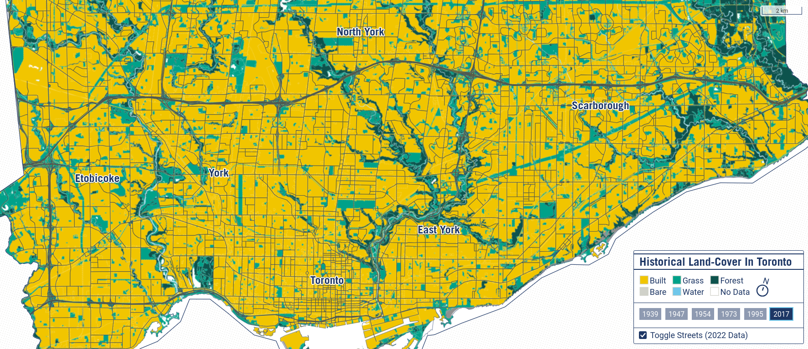

<small>Source: [School of Cities](https://schoolofcities.github.io/historical-land-cover-toronto/).</small>

A second type of story is a foundational story of how we came into being, or what we might call a mythopoetic story. In the urban context, foundational stories often draw from longstanding fables about home – for example, the single-family home on a large lot surrounded by a white picket fence – and community – for example, building out on the periphery, evoking the frontier myth. This simple visualization of where single-family homes are exclusively permitted in Vancouver, Canada draws from both of those foundational stories.

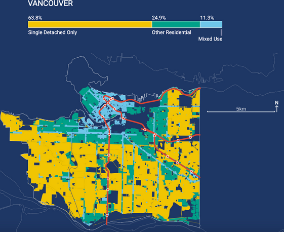

Future stories catalyze change, helping us to imagine different alternatives, as well as our own agency in the service of change. Future stories may evoke success in order to counter the dominant narrative or culture and show a different way forward.

For example, here is a map of the sites that could accommodate infill housing in Berkeley, California. In purple are the sites potentially for apartment buildings (called conventional infill development on the map). In red are the sites that have potential for backyard cottages. This shows a future story in which more backyard cottages are possible than conventional infill units. It’s meant to both tell a story about the potential of backyard cottages and inspire individual homeowners to take action.

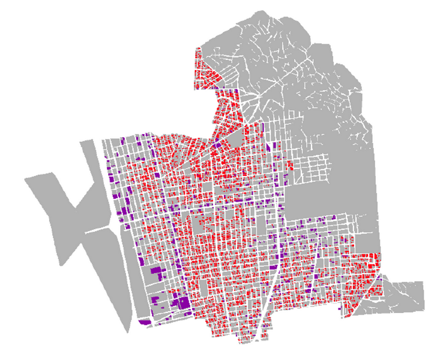

<small>Source: Karen Chapple. *Planning sustainable cities and regions: Towards more equitable development*. New York and London: Routledge, 2014.</small>

## Shifting from a deficit- to an abundance or asset-based mindset

A key obstacle to finding shared ground is the perception that there aren’t enough resources for everybody (time, money, expertise, and so forth). For example, if you build your house, I’ll lose my view (or my parking spot!). TheCaseMade calls this the scarcity narrative (or a deficit mindset), and suggests that to enable change, we need to refocus people on the abundance of choices we actually have. This idea is not actually new in urban studies: asset-based community development means looking inward to draw upon existing strengths.

Data can reinforce deficit thinking. We often categorize data about people or communities, defining groups by what they have (or have not). Data is divisive, creating false binaries that obscure the grey areas. This is particularly problematic with urban data since sample sizes for many urban phenomena are very small (e.g., number of pedestrians on a block). Census data are often partly imputed (meaning many values are estimated rather than real), and survey data may not be representative. When we create categories from this data with large (and sometimes unknown) error, it suggests a kind of scientific certainty that actually doesn’t exist.

The data, metrics, and indicators we typically use often perpetuate deficit thinking. But it is possible to refocus on assets and abundance even with the data we have access to already. We can do this by rethinking categories, refocusing on system impacts, highlighting hitherto invisible patterns, and reframing trends.

### Rethinking categories

To simplify and communicate data, we often organize it into categories. But these categories can actually reinforce a deficit mindset by focusing on certain classes instead of adopting a more holistic approach, by choosing inappropriate groupings, or by omitting some types altogether. 

For example, censuses around the world, particularly in the Anglosphere, tend to emphasize variables measuring income and poverty. A visualization of this data might look like this, where the darker red areas are the neighbourhoods with concentrations of poverty.

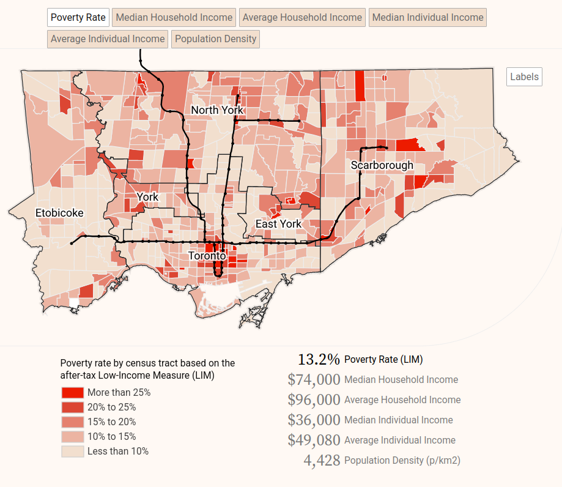

<small>Source: [School of Cities](https://schoolofcities.github.io/neighbourhood-income-toronto-2020/).</small>

There’s a long history behind this focus on poverty. Beginning in the 1850s, public health practitioners started studying and mapping where poor people lived because they blamed the poor for the spreading of disease, like cholera. The Canadian census included data on earnings when it launched in 1871, and both Canada and the U.S. began collecting extensive data on income beginning in the 1940s. Sociologists soon began studying concentrations of disadvantage at the neighbourhood level in order to shed light on what they considered to be pathological disorder. Often, though, this focus on concentrated poverty shifted attention away from concentrations of affluence.

A simple shift to visualizing median income across neighbourhoods, rather than just poverty, makes the more affluent residents more visible (in blue, below).

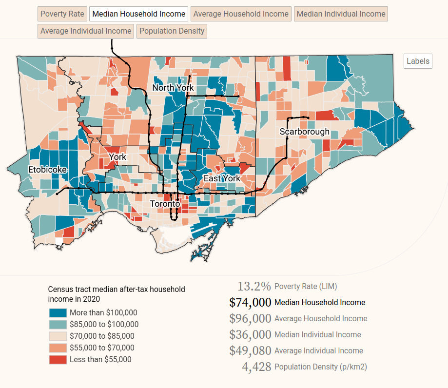

<small>Source: [School of Cities](https://schoolofcities.github.io/neighbourhood-income-toronto-2020/).</small>

Sometimes the categories chosen can be inappropriate reflections of life on the ground. A classic example of deficit thinking is mapping food deserts, which reveal long distances to the nearest grocery store from disadvantaged neighbourhoods. This deficit thinking is reflected in the language we use, in terms like “food desert,” which fails to acknowledge that communities may have an abundance of places, such as convenience stores, where healthy food choices could be made available. In some cases the “desert” may actually contain lots of food options but for either junk food or ethnic products not readily available in chain grocery stores. The naturalistic desert metaphor also minimizes the role that planners and retailers have played – in the context of the racial and economic inequities in the U.S. – in reducing access to food in some communities. But counting just the number of grocery stores doesn’t capture that complexity. To illustrate this, we created a map of where residents of East Greensboro, North Carolina, shop, using cell phone data to record their activity. It turns out that even though the neighbourhood doesn’t have as many stores as West Greensboro, its two large chain stores, Walmart and Food Lion, receive far more visits than other stores in the city.

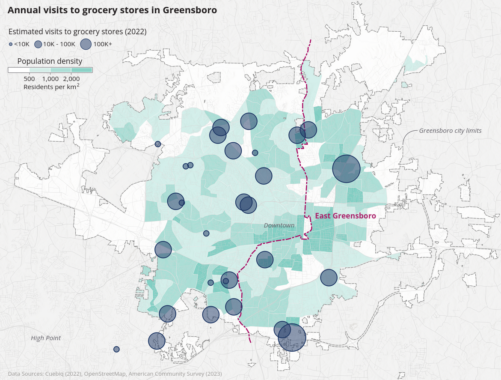

<small>Source: [School of Cities](https://schoolofcities.github.io/eddit/greensboro-nc).</small>

Sometimes the categories where we see ourselves belonging do not even exist in the data. Many datasets are constructed from a mainstream point of view that doesn’t take into account culturally-specific norms. For example, the U.S. census collects data on families and sex with categories that might not work for everyone: the standard decennial census form (from 2020) asks about stepdaughters but not stepmothers, and only allows a binary choice for sex. Another oft-cited example is the census categories for race and ethnicity (or visible minorities in Canada), which include rich detail on some ethnic groups while omitting others.

### Refocusing on system impacts

Data analysis can also reinforce deficit thinking by highlighting specific data points rather than the connections between phenomena that can lead to impacts on the wider system. Often, visualization depicts inputs and outputs rather than outcomes.

For example, at the School of Cities we love to map trees. A simple map like this can powerfully illustrate the uneven distribution of trees across the city.

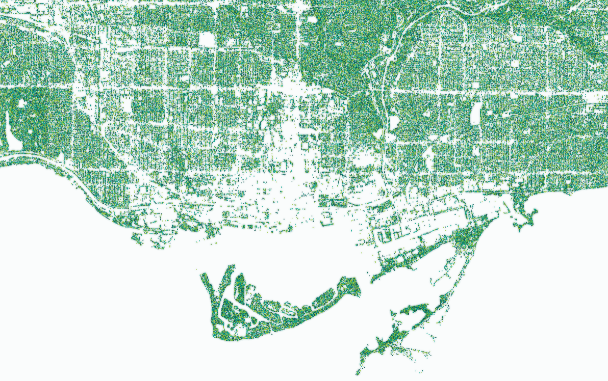

<small>Source: [School of Cities](https://schoolofcities.github.io/trees-toronto/dot-map).</small>

We can make a more powerful case for the abundance of trees if we use data to link trees to outcomes. It turns out that more trees can reduce the incidence of asthma and improve mental health, among other outcomes.

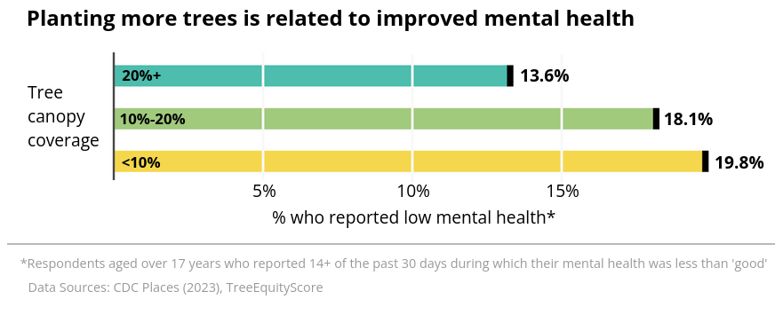

<small>Source: [School of Cities](https://schoolofcities.github.io/eddit/bridgeport-ct).</small>

It also helps to show connections rather than differences.  Often, communities portray themselves as islands, depicting their own economic and demographic patterns without acknowledging connections with neighbouring cities. In western Cook County, Illinois, a group of suburban municipalities decided to work together on climate action. However, they had a hard time understanding how they were connected to each other, partly because of their differences in land use, resident race/ethnicity, and income.

Visualizing the commute patterns among the cities clarified their close connections and helped motivate the collaboration. Understanding their connectedness can help these communities work together to adapt to climate change and strategically prioritize action.

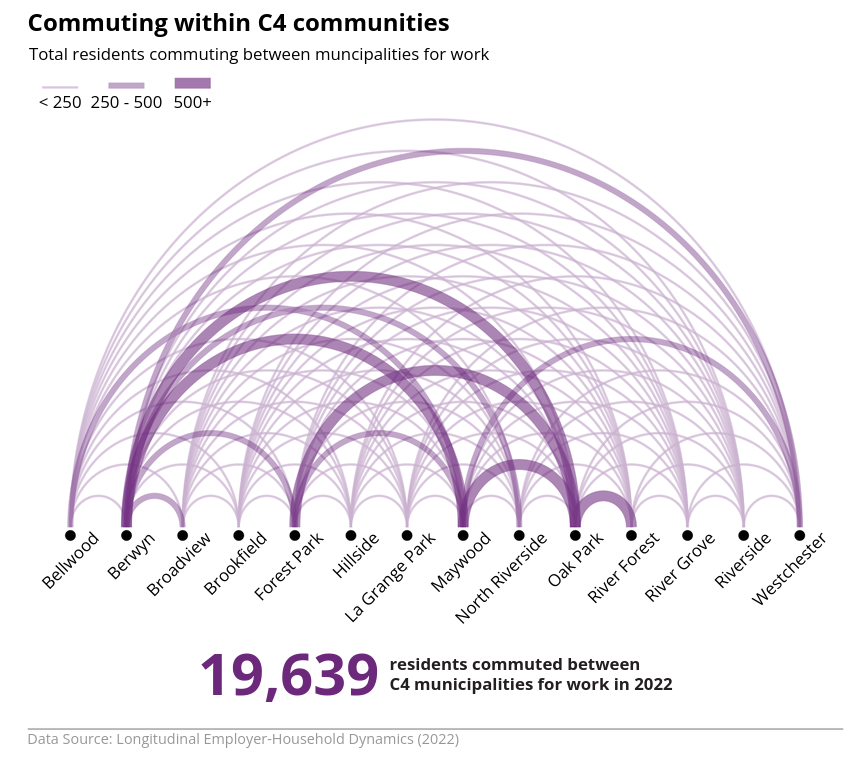

<small>Source: [School of Cities](https://schoolofcities.github.io/eddit/cook-county-il).</small>

Another way to shift focus to assets is to visualize outcomes and system impacts instead of inputs and outputs. Too often, visualizations simply depict what is happening, rather than telling a story about what it really means. For example, here’s a map of shooting incidents in Champaign, Illinois. A map like this helps raise awareness about the prevalence of violence in certain neighbourhoods. However, it leaves several questions unanswered: What exactly is going on in those areas without the red dots? What are the assets in those areas, and why can’t we get more of them in the other neighborhoods? And, why should we care about shooting incidents?

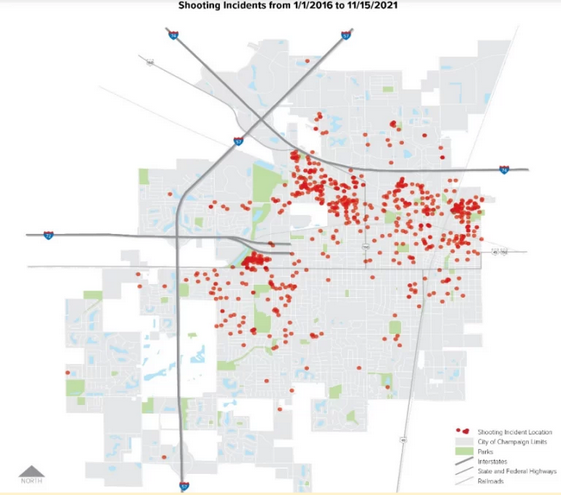

A different way to tell the story focuses attention on the deaths that resulted and the number of years of life stolen from the victims. Like the first figure, this is providing evidence that gun deaths are a threat, but it reframes the problem around an emotion: loss -- the loss of the remaining time on earth. The story is simple: leaving gun violence unresolved leads to more lives being cut short. Revisiting the elements of data storytelling, this story presents a strong moral tension that demands action to protect our greatest asset: human life. 

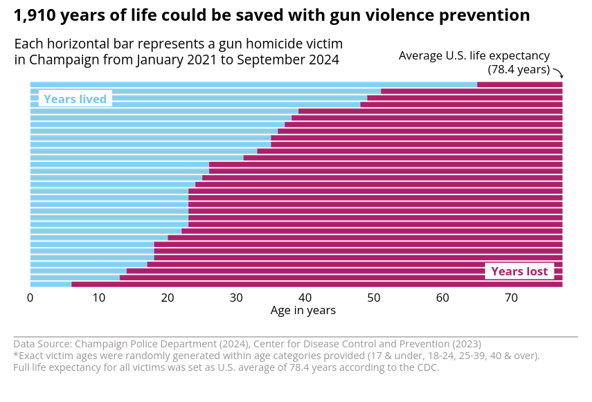

<small>Source: [School of Cities](https://schoolofcities.github.io/eddit/champaign-il).</small>

### Highlighting invisible patterns

To present an argument for more equitable outcomes, data visualizations often compare groups to show uneven distribution. For example, in the case of business ownership in High Point, North Carolina, a bar chart could show that the percentage of female and Black business owners is lower than that of White owners (the green bar in the figure). But it would be even more effective to make that comparison in terms of each group’s distribution in the overall population (the blue bar). Only through visualizing the lack of parity does it become clear that resource hoarding is occurring (likely because of inequities built into the system).

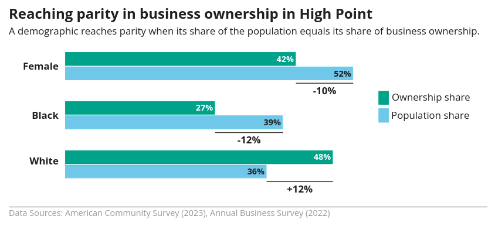

<small>Source: [School of Cities](https://schoolofcities.github.io/eddit/high-point-nc).</small>

Sometimes the costs and benefits of behaviour are not entirely clear, complicating the argument for an asset-based mindset. One classic example is the costs of driving. Not only is the cost of auto-related infrastructure subsidized heavily by federal government, but also households tend not to incorporate the full array of costs associated with owning a car – car payments, insurance, and repairs, in addition to gasoline -- into their decisions. In our work for Eau Claire, Wisconsin, we describe the range of car costs and compare it to the cost of bus ridership.

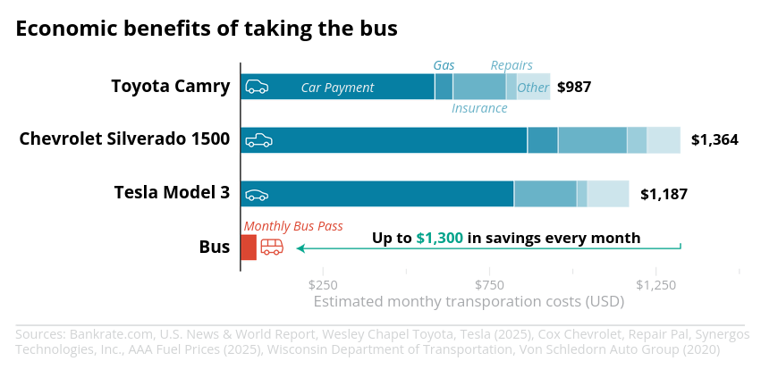

<small>Source: [School of Cities](https://schoolofcities.github.io/eddit/eau-claire-wi).</small>

### Reframing trends

Finally, examining trends thoughtfully can help point towards abundance while also showing us how we can act now to change the future. Data visualization can achieve this by showing activity patterns behind the trend depicted, and also by suggesting that a trend is not necessarily inevitable. For example, downtown Halifax, Canada is benefitting from increased visitor activity year over year, but examining monthly patterns tells us even more: their greatest asset is the summer months of July and August.

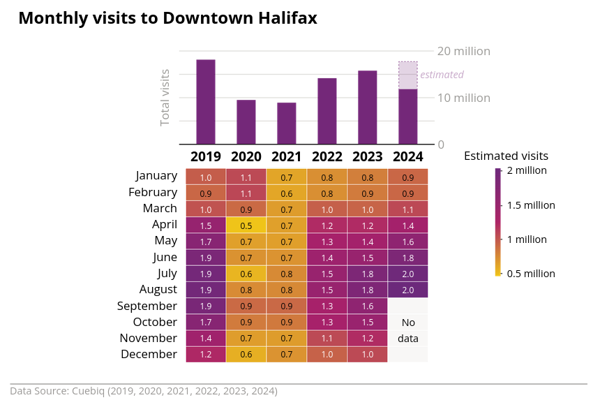

<small>Source: [School of Cities](https://schoolofcities.github.io/eddit/halifax-ns).</small>

Trends are a powerful reminder of where we are headed. Yet, those lines often seem to imply the inevitability of the future, rather than allowing for agency and intervention to change the future. A line chart that maps alternative future trajectories can help people to think about the future and inspire action.

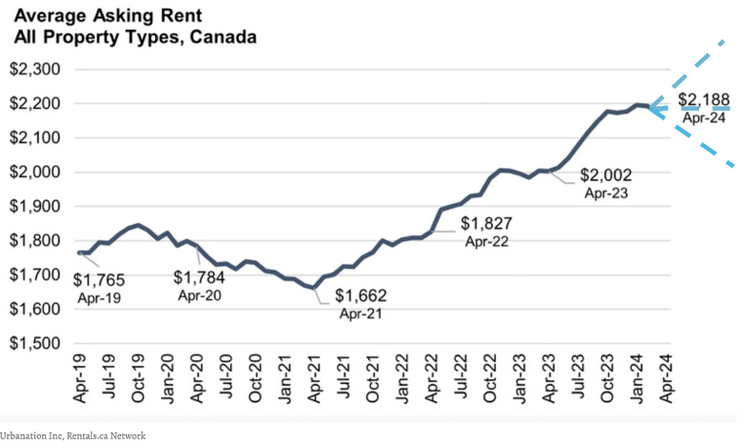

### Conclusion

It remains important to understand deficits, or where people and places lack the basic services and opportunities they need to thrive. However, only highlighting deficits may be divisive and fail to create shared ground. Using data stories to reframe the conversation towards assets helps to remind stakeholders of the values they hold in common. Asset-based data stories suggest situations where we can all win, and thus can inspire communities to work together towards a brighter future.