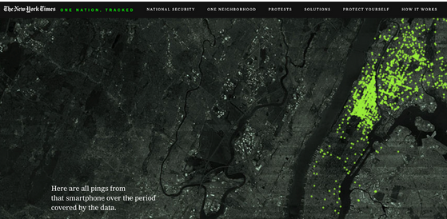
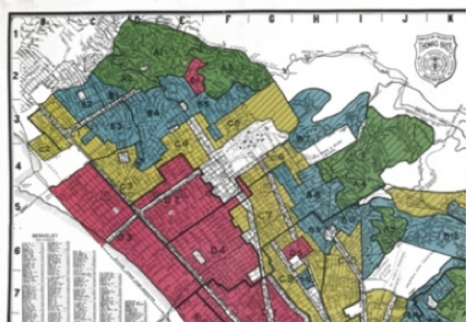
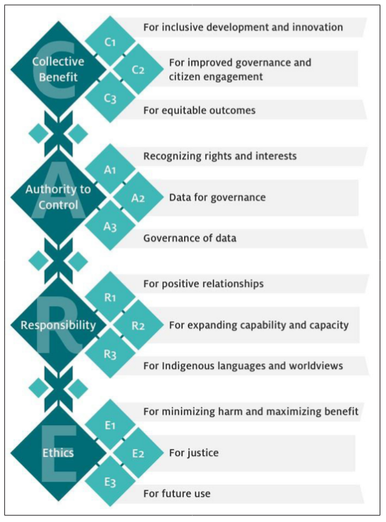

This section first examines ethical practices with data, and then how to centre equity in data.

## Data ethics

Many people are involved in the production of each dataset. Just as with data literacy, each time you encounter a dataset, you should ask questions about who they are. The community producing data includes the data generators, who are often our communities (creating a need to respect privacy); the data collectors, who have their own purposes and agendas behind data curation; and the data utilizers, who are trying to describe or predict or prescribe something through data.

These stakeholders have different frameworks that they are using in the production of data. Often they take an approach that emphasizes a deficit or scarcity mindset. It’s not their fault, necessarily; they were told to analyze and solve the problems with the data at hand. But it means that if we want to emphasize the assets of our community, we often have to reframe the data. 

They also bring a variety of potential biases that can infiltrate the dataset. Understanding these biases helps clarify who is missing from the data, who is benefiting, and who might be harmed.

There’s a great article on the ten simple rules of ethical data practice. We look here at a few of these rules.

 1. Acknowledge that data are people, who may be harmed when you use the data. Yes, your data are actually people. We often forget that behind the numbers are living beings, and analyzing their data can result in harm. We need to stay alert to that possibility.
 2. Privacy isn’t binary. In other words, it’s not like data is either private or not. There are gray areas; parts may need to be kept private, or it may need to be private in certain situations. Think about where your data is on that spectrum.
 3. Guard against the reidentification of your data. In some cases, it’s easy to figure out who’s behind the data point.
 8. Make sure your data is auditable, in other words, that anyone can figure out where it comes from, understands what it means, and replicate your results, at least in some form.

Another resource, this time specifically for spatial data, is the [Locus Charter](https://ethicalgeo.org/locus-charter/) from the American Geographical Society. This looks at how location data can inflict potential harm on the vulnerable. For example, a map of gentrifying neighbourhoods can help real estate brokers identify “hot” areas, with the unintended consequence of attracting even more new residents leading to higher housing prices (potentially displacing those without housing security). In another use case, a [New York Times analysis](https://www.nytimes.com/interactive/2019/12/19/opinion/location-tracking-cell-phone.html) showed how anonymized cell phone data can clearly reveal individual identities. Data companies were collecting an unnecessarily large quantity of data, with details on what people were doing every moment of the day – information not needed for their business. The Locus Charter suggests minimizing data collection in such instances to protect privacy.

<small>Source: [Gentry.io](https://www.nytimes.com/interactive/2019/12/19/opinion/location-tracking-cell-phone.html).</small>

## Centring equity in data

The production of urban data involves many different actors, often with different purposes, across time periods with changing norms and places with different histories and cultures. Given this complexity, the data portrayed and visualized may fail to acknowledge not just community assets, but also systemic and structural injustices, including inequality and racism. Some injustice is obvious to all (for example, hate crimes or job discrimination) but most is not – and thus can be perpetuated in data analysis and visualization.

In cities, systemic injustice manifests primarily in where you live; some evidence suggests that your zip code determines your destiny, since where you grow up shapes access to the opportunities that promote thriving.1 But too often the data is inadequate both for demonstrating entrenched inequalities and acknowledging the complexities of people’s identities.

New data sources are emerging to help reveal systemic injustices. For example, in the U.S., we can access maps of Home Owners’ Loan Corporation (HOLC) redlining – a 1930s system of designating neighbourhoods according to what was considered a rating of investment risk, but was really a reflection of societal misconceptions about race and ethnicity. This then created a system which was self-perpetuating, by denying access to mortgages and financial services to those in neighbourhood deemed higher risk.

There is a high correlation between today’s patterns of gentrification and exclusion and this historic rating system: for example, the HOLC rated 83% of today's gentrifying areas in San Francisco’s East Bay as "hazardous" (red) or "definitely declining" (yellow), and 75% of today's exclusionary areas as "best" (green) or "still desirable" (blue). Mapping redlining alongside current patterns of displacement highlights how historical discrimination continues to shape neighborhoods. An even more powerful story would be to calculate the generational wealth lost due to this exclusion.

<small>Source: [Mapping Inequality](https://dsl.richmond.edu/panorama/redlining/).</small>

Another example is the data from the Census on race and ethnicity. Race is a social construct, and each country talks about it in its own way, based on societal norms and history. For example, in Brazil people can classify themselves as white, black, yellow, brown, indigenous, or undeclared, while in England the choice is between white, mixed, Asian/Asian British, Black/Black British, or Chinese or other ethnic group.

But the growing availability of microdata allows us to examine dimensions of group and individual identity together, or their intersectionality. This then helps to expose how forces of oppression and privilege work differently across income, race, gender, ability, sexuality, and immigrant status, among other characteristics.

## Data Governance and Data Sovereignty

Related to data ethics and equity are the governance and control of data. Data sovereignty and data governance describe who gets to control data, how, and who will benefit from the data when it is used. 

**Data sovereignty** is the principle that those who generate data – defined usually as the nation-state – should have full ownership, control, and governance over their data across its full lifecycle. In a narrow sense, that means data should be governed in accordance with the laws of the country from which it originates. In a broader sense, data sovereignty relates to data equity in its assertion that a people have the right to own, control, and benefit from data from and about them. From this broad concept comes Indigenous data sovereignty (IDS or IDSov), which we will discuss on the next page.  

**Data governance** deals with the specific ways in which that control is exercised within an organization across the full life cycle of data. It refers to the policies, processes, and principles that control: how data is stored and/or disposed of, how it can be used to support decision-making, and who is accountable at each stage. A strong data governance framework ensures that ethical issues such as privacy, confidentiality, and responsible use are enforceable and traceable, and ensures compliance according to the principles of data sovereignty. 

Within many city building professions, you may not need to interact with these terms from a technical level. However, understanding what they are and how they relate to the data you are accessing and using can help you develop a more conscientious, informed, and equitable data storytelling practice. 

### Indigenous Data Sovereignty 

**Indigenous Data Sovereignty** is about the rights of Indigenous peoples and Nations to govern the collection, management, and use of data from and about them, their lands, and their cultures.  

The Indigenous Data Sovereignty (IDS) movement began in Canada, growing out of the [1996 Report of the Royal Commission on Aboriginal Peoples](https://www.bac-lac.gc.ca/eng/discover/aboriginal-heritage/royal-commission-aboriginal-peoples/Pages/final-report.aspx), within which a key principle was Indigenous self-governance. Over time, self-governance began to include Indigenous data, stories, and knowledge, with the [First Nations principles of ownership, control, access, and possession (OCAP®)](https://fnigc.ca/ocap-training/) published in 2016 by the First Nations Information Governance Centre. You can [watch more here](https://youtu.be/y32aUFVfCM0).   

While different Nations have different approaches to IDSov, many see it as part of self-governance efforts, sometimes requiring repatriation of data from the Crown in order to facilitate effective decision-making about local needs, community services for and by Indigenous peoples, and ongoing land claims. 

You can read about Indigenous Data Sovereignty in Canada through the [story of the Nishnawbe Aski Nation here](https://www.csps-efpc.gc.ca/tools/articles/indigenous-data-sovereignty-eng.aspx).  

Today, Indigenous Data Sovereignty networks and efforts have sprung up all over the world, including the [Te Mana Raraunga (the Māori Data Sovereignty Network)](https://www.temanararaunga.maori.nz/)) in Aotearoa (New Zealand), and the [United States Indigenous Data Sovereignty Network (USIDSN)](https://usindigenousdatanetwork.org/about-2/).  

For many of these networks, data sovereignty is the first step. Many of these networks are working towards CARE Principles for Indigenous data governance that focus on how data can be used by Indigenous peoples to further the purpose of Indigenous self-determination, thriving, and justice. 

<small>Source: [Carroll et al. 2020](https://static1.squarespace.com/static/5d3799de845604000199cd24/t/6397b1aff7a6fb54defdf687/1670885815820/dsj-1158_carroll.pdf).</small>

## Additional readings

The videos and content above represent a brief introduction to the topics of data ethics and centering equity in data. To learn more or dive in deeper, we encourage you to check out the following additional readings:

 - [Schwabish, J. (2018)](https://urban-institute.medium.com/form-and-function-let-your-audiences-needs-drive-your-data-visualization-choices-3c0603745822). Form and Function: Let Your Audience’s Needs Drive Your Visualization Choices. The Urban Institute, Data@Urban Medium. Retrieved from:
 - [Schwabish, J., & Feng, A. (2020)](https://osf.io/preprints/osf/x8tbw). Applying Racial Equity Awareness in Data Visualization.
 - [Schwabish, J. & Feng, A. (2021)](https://www.urban.org/research/publication/do-no-harm-guide-applying-equity-awareness-data-visualization). Do No Harm Guide: Applying Racial Equity Awareness in Data Visualization. The Urban Institute. Retrieved from:

Additionally, you can take a look at these extra resources for indigenous data sovereignty.

 - [What is Indigenous data sovereignty and why does it matter?](https://beyond.ubc.ca/what-is-indigenous-data-sovereignty-and-why-does-it-matter/)
 - [CARE Principles for Indigenous Data Governance](https://www.gida-global.org/care)
 - [Carroll et al. 2020](https://static1.squarespace.com/static/5d3799de845604000199cd24/t/6397b1aff7a6fb54defdf687/1670885815820/dsj-1158_carroll.pdf)
 - [The History of the Indigenous Data Sovereignty Movement](https://cdn.knightlab.com/libs/timeline3/latest/embed/index.html?source=1BKf-MtNpahaqe2Yc_QKx7fvcE6N_RNvnIa2zRtTipZQ&font=Lustria-Lato&lang=en&initial_zoom=0&height=1000)

## Footnotes

1 Chetty, R., & Hendren, N. (2018). The impacts of neighborhoods on intergenerational mobility I: Childhood exposure effects. *The quarterly journal of economics*, 133(3), 1107-1162.