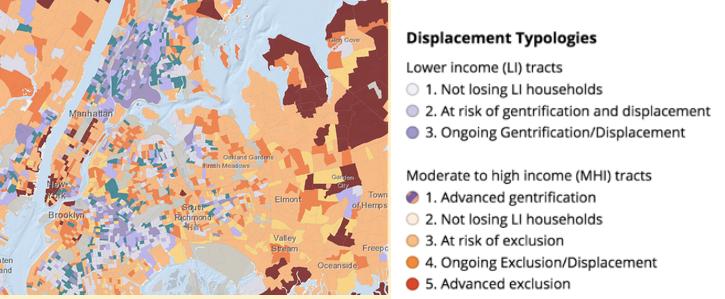
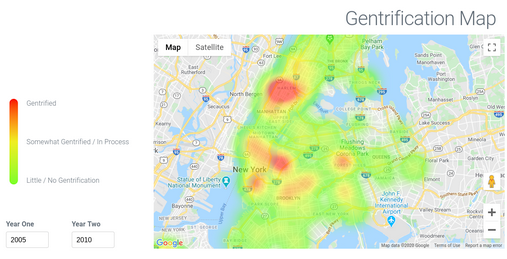
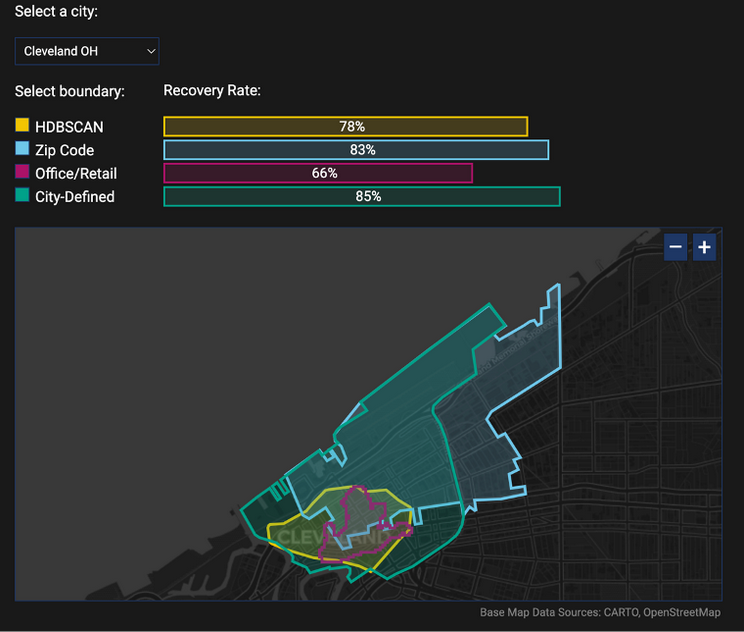

[📥 Click here to download this document and any associated data and images](/downloads/data-literacy.zip)

Data literacy begins with applying a critical lens and asking the right questions about data. Before interpreting a data point or visualization, or using a dataset yourself, you should always ask:

*What does the data say?* Does the data mean what we think it means? This is the concept of validity, that the values make sense and have a coherent meaning. Valid data should correspond to what we know from outside sources while being internally consistent, not contradicting itself. For example, if a census collects data both on household income and income for individuals within the household, the income data should be greater than zero and the individual income data should sum to the household income total.

*Who collected the data?* What was the position of the data collector – public agency, private company, community group, or individual stakeholder? This raises the issue of reliability, whether results are replicable.For example, could anyone gather the data and get the exact same results?

*Why did they collect the data?* Chances are, the reason someone collected the data is not the same as the reason you are interested in it. Data designed for one purpose can be deployed in different ways. Still, if the intent of data collection was narrow, this might limit its usefulness for other analyses. For example, wildlife surveillance cameras can provide data about not just coyotes but also extreme weather conditions, but since the lens focuses on animal pathways it  may not capture many storm impacts. 

*When was the data collected?* Some of the best data available, such as census data, are only collected at multi-year intervals. That means the data we are analyzing or visualizing to tell a story about today may actually be about patterns from several years ago. Moreover, variable definitions may shift over time, reflecting changing societal norms. It is important to acknowledge these limitations alongside any visualization.

*How and where did data collection take place?* Data can be collected in person, over the phone, in the mail, over the internet, by sensors, and in other ways, and comes from all different types of places. This then affects its validity and reliability. For example, respondents tend to be less truthful and less representative of the population when political polls are conducted over the phone. 

And most importantly, *what is missing from the data?* Often the real story is in the data points that are left out of the dataset.

To answer these questions, the best source will be the metadata, or the information available about the dataset. (In addition, examining the survey instrument deployed will help clarify definitions.) Issues to examine include:

 - Are the data cross-sectional (data collected at a single point in time for different places) or longitudinal (data collected for the same unit of observation at multiple points in time)?
 - What years do the data cover?  What bias may be introduced by the collection time frame? For instance, incomes fluctuate in the extreme at the peak and trough of the economic cycle.
 - Are these data disaggregate, meaning that they refer to  individual units of analysis (people, households, housing units, businesses, and so forth)? Or, are data presenting an aggregate of a collection of individual units? Aggregating data can lead to misleading generalizations about neighbourhoods that don’t ring true from one block to another. When making inferences about individuals from group data, an ecological fallacy problem can occur, where group characteristics or relationships may not apply to all individual members of the group.
 - What geographic scale are the data, and is this the right scale for the question you want to ask? The scale (or geographic unit of analysis) available for an analysis may not be conducive to telling the best data story. Even census tracts are not always ideal, since they may come with sampling bias and representation issues.

## Pitfalls to avoid

Being data literate means avoiding common pitfalls of data analysis. Factors that can lead to misinterpretation include levels of measurement, sample limitation, category and boundary definitions, and lack of legitimacy.

### Levels of measurement

Each variable level comes with potential pitfalls in interpretation. Nominal data creates categories that may oversimplify or misclassify, e.g., placing people of Chinese, Indonesian, and Indian origin into one big bucket that is supposed to represent all people who came from Asia. Ordinal data may be deceptive; although the categories are supposedly in order, sometimes the progression is uneven or poorly defined. For example, it may not be clear what the difference is between moderate and middle-income households. Finally, continuous (interval-ratio) data may not be truly continuous; for example, a time series based on months ignores the fact that some months are longer than others! *Be aware of what type of variable is used and what might be missing with that level of measurement*.

### Sample versus population

It is important to understand whether data comes from a sample of the population – and if so who that sample does and doesn’t represent – or the full population, i.e., a census. Many countries have a census of population and of housing every five or ten years, and the U.S. supplements theirs with a yearly survey called the American Community Survey (ACS). But even the census is not really a true count of every individual. Most countries impute data from nonresponsive individuals (meaning where data is missing, they estimate what the answer would have been based on group patterns), which  can introduce error for groups where response rates are low or the sample is not evenly distributed across the tract. In the ACS, the people that are missing are disproportionately disadvantaged, low-income communities of colour. *Look at the documentation for the data to determine who is and isn’t represented*.

### Categories

Data is often organized into categories before it can be analyzed. Categories chosen by others may be inappropriate to answer your research questions: the definition of groups may not be relevant, and some groups may be missing altogether (among other issues). For example, conventional definitions of race/ethnicity or gender may not work for everyone. Another example is how the census typically categorizes incomes. There is abundant detail on low-income groups (e.g., 4-5 categories below median income), but very little on high-income (e.g., a high-income category of $200,000 and above). Since categories determine what gets analyzed, there is very little research on the top 1% of income earners. *Take care to examine categories and identify missing groups*.

### Aggregation

In the U.S. and Canada, the gold standard for analyzing communities and neighborhoods is the census tract, a geographical unit of analysis that encompasses about 30 blocks. But census tracts can actually be deceptive on a map. If we classify neighborhoods in a particular way, we risk delegitimizing our work, because what’s true for a 30-block area may not be true for one particular block. Here’s an example of a map of gentrification and displacement in the New York City metropolitan area from the Urban Displacement Project. Despite deploying dozens of variables to depict neighbourhood change, these tract-wide designations may not represent every block. *If aggregation is potentially problematic, find other approaches, like using heat maps instead*.

<small>Source: [Gentry.io](https://github.com/Devonte202/gentry.io).</small>

### Boundaries

People who are familiar with particular communities may perceive its boundaries differently from the boundaries as defined in available datasets. Thus, the story from the ground may be very different from what your data says. For example, when we use different definitions of downtown we get very different results, like in this map of post-pandemic recovery for Cleveland from the Downtown Recovery Project at the School of Cities. The city might have an idea of what its downtown is, but one can also define downtown by where the jobs are or where the office and retail buildings are or where the post office says it is. The rate of recovery varies from 66% to 85% of pre-pandemic levels depending on where the boundaries are. *Thus, the process of analyzing communities and establishing analytical boundaries needs to be sensitive to the local context*.

<small>Source: [Gentry.io](https://downtownrecovery.com/blog/downtown-definitions).</small>

### Legitimacy

Any data visualization should have clear credentials: the what-who-why-when-where of data literacy. Data categories and axes need labels (what), the source of data needs to be cited (who), the original purpose of the data should be clear in that citation (why), the time period needs to be defined (when), and the place and means of data collection should be transparent (how and where). But note, credentialing urban data doesn’t mean adding more decimal places. This implies a scientific precision that may not exist in the small samples that constitute most urban datasets. *So, explain your work*!