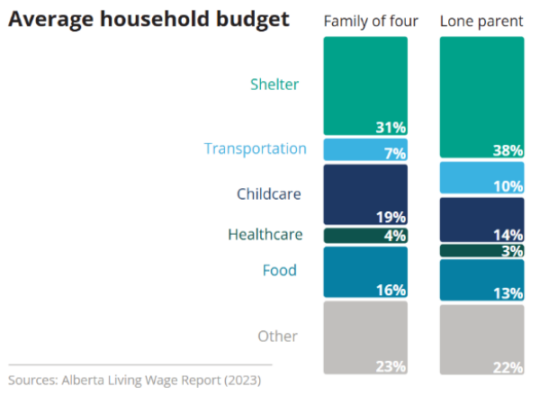
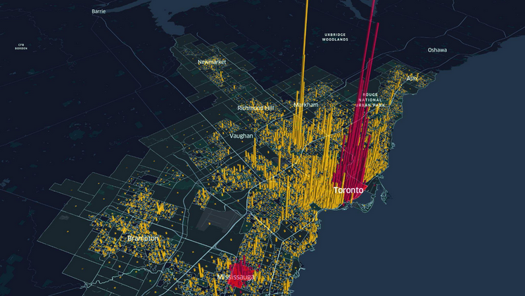
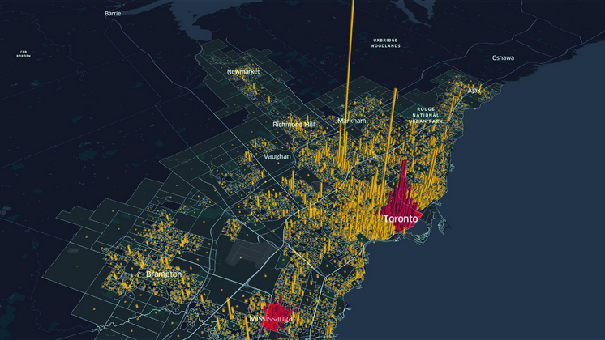
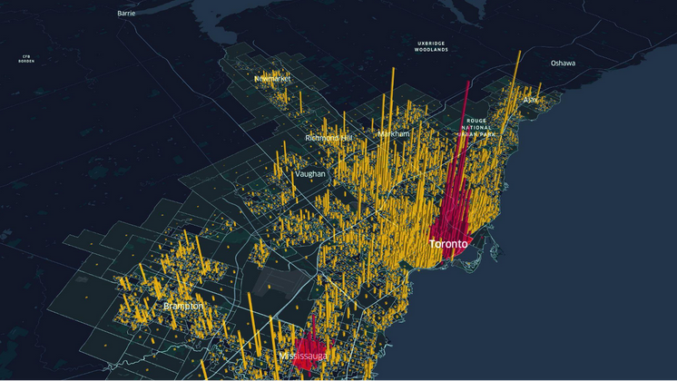
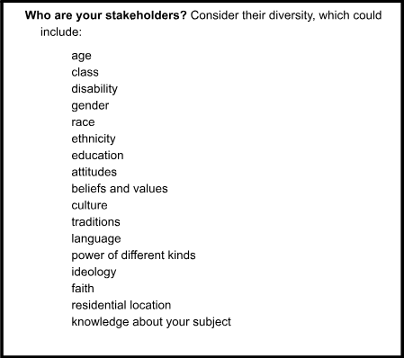
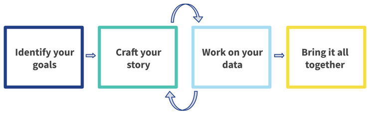

[📥 Click here to download this document and any associated data and images](/downloads/urban-data-storytelling-importance.zip)

This section will cover:

- an overview of data storytelling
- elements of a good data story
- examples of effective data stories

Urban data storytelling is the process and practice of using data to craft compelling narratives about cities. An urban data story is an effective way to communicate key insights, inform policy-making, build public will, and/or advocate for change.

Urban data storytelling combines data analysis, data visualization, and narrative techniques to make complex urban patterns and trends understandable and engaging for specific audiences, such as policymakers, funders, or community members. 

In the following sections we explain why urban data storytelling is special, its purpose, and its elements. The chapter concludes by outlining the steps to constructing an urban data story.

## The uniqueness of urban data storytelling

Storytelling is part of human life, key to building relationships and collective identity). We live in places where  we experience everyday life, and storytelling can strengthen the sense of belonging to our places and  neighbourhoods. The experience of crafting stories is typically a collaborative social exercise, involving both storyteller and audience, and in the process forges connections between communities and their environment, often bridging private and public spheres. 

Effective data storytelling in cities similarly grows out of collaboration and builds connections to place. The process of selecting a dataset, constructing variables, and designing visualizations does not happen in a vacuum, but is based on community norms and draws from local meanings. Even if the data storyteller technically works alone, familiarity with the community and the place will shape ways of representing it.

Because urban data stories are closely connected to specific places, we experience them in a different way than stories built using data at higher spatial scales, such as the national, state, or county data often visualized by data journalists. Most importantly, we can see ourselves in the data. Whether the data visualization is a map of a neighbourhood or a bar chart of travel times to work or a table of sales tax revenue from restaurants, the data points are small enough that it is easy to envision where we fit in. 

And if we don’t see ourselves, then we are likely to be skeptical of the data. This also makes urban data stories special. Researchers and their audiences can often  validate tables, charts, and maps about a place through ground truthing, or the process of verifying accuracy via direct, on-the-ground observation. This creates unique pressure on the data storyteller to communicate accurately and clearly–and even more so if the data story contradicts lived experience (or a community member’s skewed perception of reality). 

Even if we see ourselves in the data, the data story will need to build on something that we already believe. For example, a single parent will not just see their lives in a bar chart about the household budget (below), but might also feel affirmed in their belief that they are paying too much for rent (38% of income, compared to 31% for a family of four). A good data story will also help the audience expand their perspective by introducing new and unexpected findings that create surprise and thus engagement.

## Why tell urban data stories?

*“You can’t really change the heart without telling a story” (Nussbaum, 2007:176).*

We tell urban data stories for many different reasons – rallying the community around a cause, explaining problems to elected officials and policymakers, informing a new advocacy campaign, spurring others to share their own stories, or just communicating generally to anyone who will listen. Whoever the audience is, the story helps to raise awareness of our shared values, and thus often becomes a call to protect those values.
 
When storytelling has a purpose, planning professor (and former Iowa City mayor!) Jim Throgmorton calls it persuasive storytelling. As we give data meaning via visualization, we create a story around our moral concerns and thus impel action. This then becomes a two-way process with responsibilities on all sides: how we tell the story shapes action, so ethical principles need to guide the story. Later sections on Creating Shared Ground and Data Ethics will explore these concepts in more detail.

## Elements of a good data story

As Professor Leonie Sandercock explains in her classic 2004 article, an effective story has five elements:

 - **A temporal or sequential framework**. Things progress from a to b, in a linear fashion.
 - **Explanation or coherence**. The story isn’t a list of one thing after another, but is explaining what happened and what could be.
 - **Potential generalizability**. We want stories that illustrate the values that we all share, for example, about the human need for safety. When we recognize our values in a story, when we see the universal in the particular, we are more likely to buy into it.
 - **Conventions**. Stories typically have a plot and protagonist. There's a plot structure that can be revealed just by an image.
 - **Moral tension**. A good story is always going to have some kind of moral tension that hopefully gets resolved.

Here’s an analysis we did at the School of Cities of activity in the Toronto region before, during, and after the pandemic. We used people’s cell phones and visualized the activity in 3D. We highlighted downtowns in red. 

We start before the pandemic.

There is a drop in activity downtown as the pandemic starts.

And then, the comeback afterwards, though downtown still isn’t doing as great as it was before the pandemic.

The map series demonstrates  the five ingredients of a compelling data story: (1) change over time, (2) a coherent story about changing activity, (3) findings that are generalizable to other cities and  speak to a value most people share about having vibrant urban spaces, (4) us as protagonists  against the villain of the pandemic, and (5) moral tension that gets resolved as the activity comes back.

## Steps to building your urban data story 

To build an effective data story, first identify your goals and your audience (Step A). From there, you will craft your specific narrative (Step B) and analyze your data (Step C). You may iterate between these two general steps many times before finally bringing it all together into your final product or deliverable (Step D).

### A. Identify your goals

1. *Identify your project goals.* Thinking about your specific project, identify what you are aiming to achieve in the short term, medium term, and long term in relation to your specific project.

2. *Map your stakeholders and their positions.* Identify the people or organizations who have an interest in your work, or whom you wish had a stake in your work. What are their interests, and how do these interests relate to your project goals? What is the extent of their involvement in your work? What is your timeline for involving/engaging them?

3. *Prioritize an audience for your story.* From your list of stakeholders, identify which specific audience you want to engage with for this story, and why. 

4. *Identify the medium*. Before you start your analysis, think about how best to present your story: via an interactive map or website, a powerpoint, a policy brief, or some other medium (you may need to use several).

### B. Craft your data story

5. *Identify the type of story that is right for your goals.* Figure out what you need to do to get yourself, your organization, and your stakeholders from where you are now to the goal post that you set for yourself. Do you need to tell a descriptive story, a persuasive story, a causal story, or some other type of story?

6. *Build a story outline that creates shared ground with your audience.* Consider what story will create shared ground with your audience while also reflecting and tapping into your audience’s interests. What findings and metrics would speak most effectively to them? How can you look for opportunities or assets, and offer up forward-looking solutions?

7. *Brainstorm your key metrics.* Without being overly concerned just yet with data access and availability, brainstorm the key metrics that would be best suited to tell your story. These could be metrics that validate your success, highlight a need or issue to address, demonstrate the effectiveness of an intervention, and so forth.

8. *Draft an actionable takeaway for your audience.* Think about the final messaging or call to action you want to leave with your audience. What should be their main takeaway and what specific action(s) do you want your audience to take? 

### C. Work on your data

9. *Select and narrow down your data sources.* Now that you have drafted a story arc and brainstormed key metrics, it is time to investigate the data resources that are available to you now. Explore what datasets and variables are available from publicly available sources, third party proprietary data, or any other internal data you or your stakeholders might have access to. Narrow down a short list of accessible datasets and/or variables that you will use for your analysis and visualization. 

10. *Understand ethical issues related to your data.* Before proceeding with data processing and analysis, take the time to understand your dataset(s). How was this data collected, by whom, when, and why? Are there any confidentiality concerns? Are there any biases or limitations you should be aware of?

11. *Query, process, and analyze your data.* Now is the time to dig into your dataset(s) to understand and uncover trends, patterns, and findings for your story. Using spreadsheet software, geographic information system (GIS) software, and/or a coding language like Python or R, start cleaning, querying, and processing your data. Explore your data by creating basic summary statistics, pivot tables, maps, etc. Identify the key findings from your data.

12. *Create data visualizations.* Now that you have analyzed your data and decided what findings you want to highlight, create your data visualizations (charts and/or maps) and apply the principles of effective data visualization (uncluttered visuals, cohesive colors and fonts, etc.).

    - Create non-spatial data visualizations 

    - Create spatial data visualizations 

    - Apply principles of effective data visualization (aesthetics, graphic design)

### D. Bring it all together

12. *Finalize your deliverable.* Discuss and iterate your data insights with your team and partners. Integrate your data visualizations within your narrative to bring together your final story. Finalize your story in the form of the final deliverable of your choosing, whether it is a story map, webpage, slide deck, report, or another format. 

13. *Communicate using your final deliverable.* Circling back to steps 1-12, implement tips for effective visual deliverables (e.g. reduce visual clutter, minimize words on slides, etc.) and, if applicable, apply tips for effective verbal presentations (e.g. tone, voice, etc.).

 

