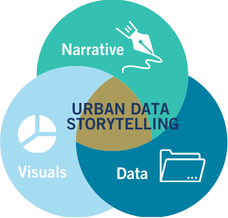
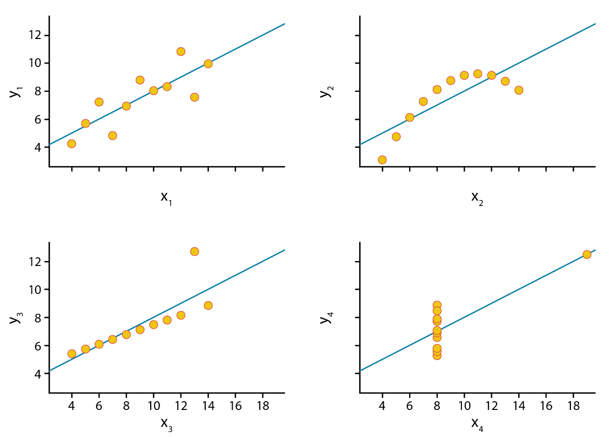
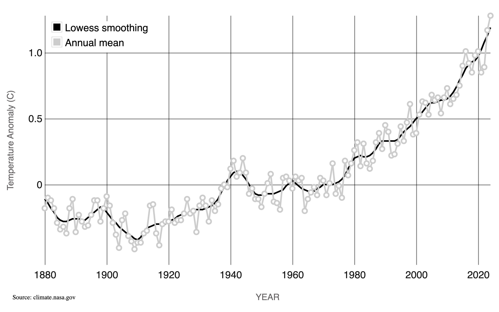
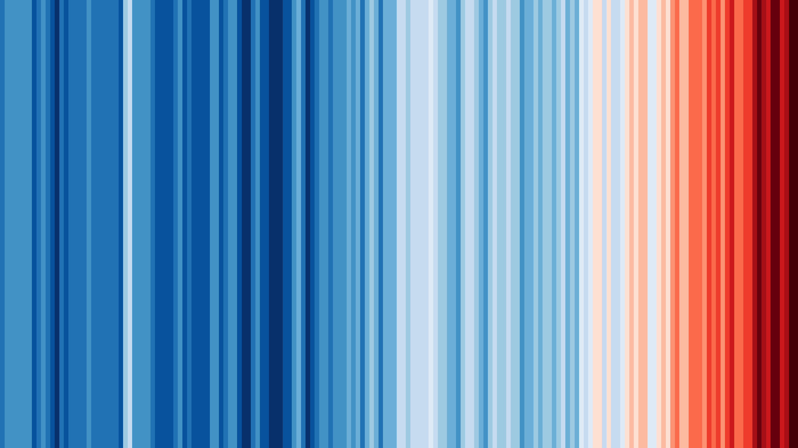
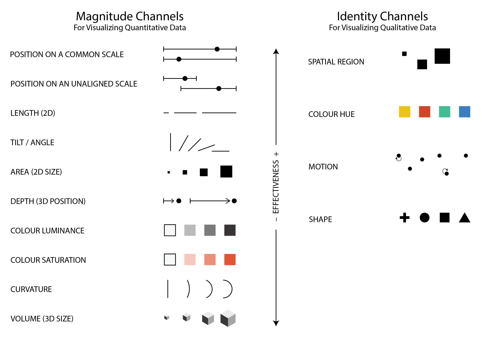
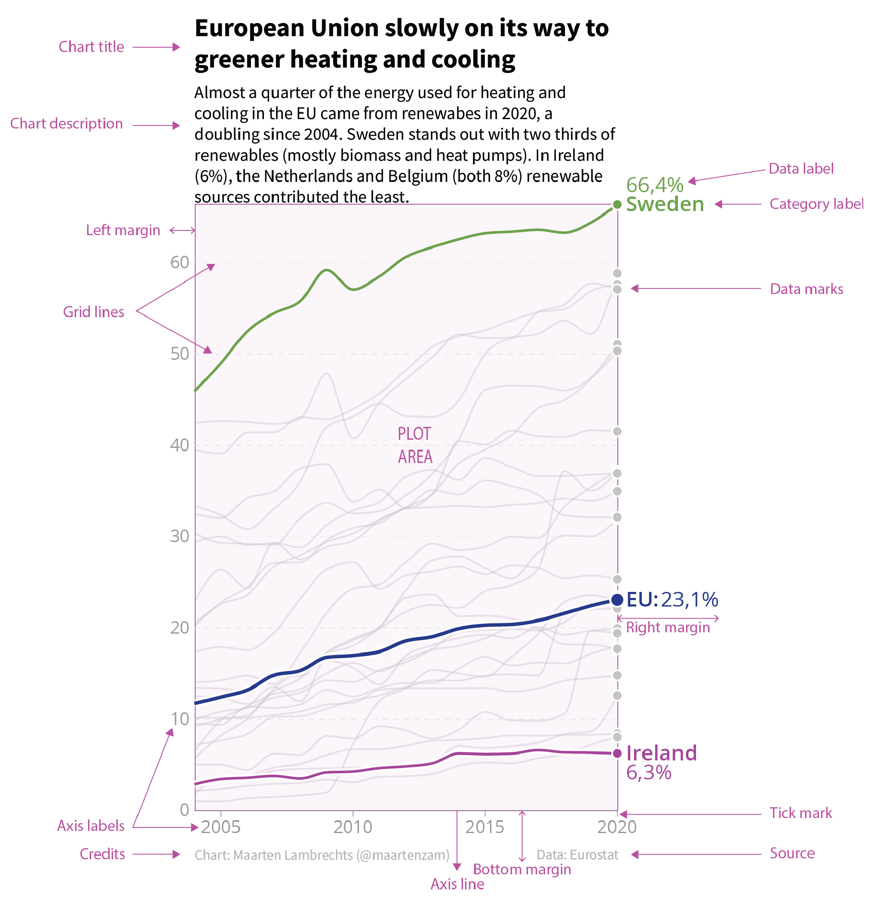

[📥 Click here to download this document and any associated data and images](/downloads/data-visualization.zip)

This section will cover:

- why you might want to visualize data: to explore internally or communicate to an external audience
- data visualization theory, including elements that make visualizations effective
- graphical components

Data visualization is the graphical representation of information and data. By using visual elements like charts, graphs, and maps, data visualization tools help people understand patterns, trends, and outliers in data. At its core, data visualization translates abstract numbers into something visible and intuitive, helping our audiences better understand what the data is telling us.

We live in a world increasingly shaped by data – from climate change and public health to business performance and social media behavior – however, raw numbers alone are difficult to interpret. Visualizations help bridge that gap by making data more accessible, understandable, and actionable. It’s not just about making things look good, it’s about making data make sense.

"The simple graph has brought more information to the data analyst’s mind than any other device. It specializes in providing indications of unexpected phenomena." – [John Tukey](https://en.wikipedia.org/wiki/John_Tukey)

## Why visualize data?

We visualize data to help us understand it better. When we turn numbers into pictures like charts or graphs, it becomes easier to see patterns, trends, or problems. Broadly speaking, visualization can serve two major goals:

1. *Exploration* – Using charts to help make sense of the data. It helps you find interesting things or answer questions.
2. *Communication* – Using visuals to help other people understand what you found in the data.

These goals are not mutually exclusive. The best data work is iterative. We often begin by visualizing data to explore patterns, test ideas, and uncover insights. Once we have made sense of the data ourselves, we can use visualizations to communicate key findings, tell a compelling story, or make a case for action. Whether the goal is understanding, persuasion, or advocacy, good data visualization helps bridge the gap between raw information and meaningful insight.

Visualizing data is ultimately about communication and striking the right balance between analysis, design, and narrative. To share data in a clear and meaningful way, it helps to think through this data storytelling framework:

1. *Data Analysis*: What does the data tell us? What patterns or relationships matter?

2. *Visualization*: How can this data be represented graphically to communicate findings effectively?

3. *Narrative*: What story does the data tell? What's your argument or takeaway? Who is your target audience?

This framework helps situate visualization as part of a broader storytelling or decision-making process. Whether you are creating a data story with multiple visuals or a single chart for a report, it is important to keep all of these things in mind. The purpose behind your visualization determines everything from the chart type you use to the level of detail, annotation, and tone you adopt.

## Data visualization for exploratory analysis

Before we share our findings with others, we often need to make sense of the data ourselves. This is where exploratory data analysis comes in. This is the process of visually investigating datasets to uncover trends, spot anomalies, test hypotheses, and surface insights that might otherwise be hidden in raw numbers or tables. 

Visualization during this stage can reveal unexpected patterns and outliers, correlations and clusters, distribution shapes, and data quality issues. 

It also helps uncover relationships that summary statistics alone might obscure. The exploratory process is typically iterative and often messy, with charts not needing to be beautiful, but instead, informative. Quick plots, heatmaps, and scatterplots are all useful tools in this phase, enabling a deeper understanding of the data before any formal analysis or presentation.

Even datasets with identical statistical properties can convey vastly different stories when visualized. A perfect example of this is [Anscombe’s Quartet](https://en.wikipedia.org/wiki/Anscombe%27s_quartet), a set of four datasets that have nearly identical means, variances, and correlation coefficients, yet their graphical representations reveal dramatic differences. This illustrates the importance of visualizing data, rather than solely relying on summary statistics, as the true patterns and relationships may be hidden within the numbers themselves.

## Data visualization for communication and storytelling

Once we’ve explored the data and identified key findings, the next step is to share these insights with others. Data visualization becomes a powerful tool for communication, helping us inform, engage, and persuade different audiences. In this context, visualization is not just about showing data, it’s about *shaping understanding* and sometimes even *inspiring action*.

Data stories combine charts and text to walk the audience through a narrative arc. These stories often include:

1. *Context* – What's the issue or question?
2. *Data* – What patterns or evidence are we seeing?
3. *Insight* – Why does it matter?
4. *Action* – What should happen next?

Good data visualizations and stories often zoom in and out to show both the big picture and key details while guiding the audience with clear visual hierarchy and annotations.

In advocacy contexts, data visualizations are used to support arguments, influence policy, and raise awareness. The visual design here should support the clarity and urgency of the message while still being transparent and truthful.

### Designing for specific audiences

Not all data visualizations are created for the same audience or communication goals. Some are meant to be read in detail (like charts in a policy report), while others are intended to create an emotional impact at a glance (like a billboard or social media graphic).

For example, a line chart depicting global temperatures over time provides nuance and precision, making it an excellent choice for scientists and analysts.

Alternatively, [warming stripes](https://en.wikipedia.org/wiki/Warming_stripes), a minimalist visualization uses a simple color gradient to represent temperature changes. This approach communicates the same pattern but in a more striking and emotionally impactful way, making it highly effective for public engagement and advocacy.

## Data visualization theory

A well-designed visualization isn’t just about making data look good – it’s about making it understandable, accurate, and accessible. This often requires a base understanding of how we encode data visually, how the human brain processes that information, and how to make charts function well across different audiences and mediums.

### Visual variables

At the heart of every chart or graph is visual encoding: the transformation of data into visual elements. Each variable in your dataset must be “mapped” to a visual channel, often called a *visual variable*. The effectiveness of these visual encodings depends on what type of data you’re working with.

](img/BertinVariables.png)

### Perception and cognition

Effective data visualization leverages our brain’s innate ability to rapidly process certain visual elements. This phenomenon, known as *preattentive processing*, allows viewers to quickly and effortlessly identify certain patterns, contrasts, and structures without conscious effort. 

This allows us to instantly spot outliers, notice trends and clusters, and recognize visual hierarchies.

Key preattentive features include color, form, orientation, and size. For example, we can quickly distinguish a red circle among blue circles (color) and identify a square amidst a group of circles (form). These features are processed so swiftly and effortlessly that they can influence our perception and understanding of visual information without conscious effort.

Even when designing a table for a slide deck or a report, you can use the theory of preattentive processing to pick a visual variable to focus your readers attention on specific data points that are important to your story.

)](img/PreattentiveProcessingTable.png)

Via preattentive processing, we can guide viewers’ attention efficiently, enhance comprehension, and reduce cognitive load.

### Perceptual Rankings

*Perceptual Rankings* help explain why some encodings are easier to interpret than others. Not all visual variables are equally effective.

You may have noticed that in the scatter-plot example in the previous section, that it is generally easier to pick out a red circle among a group of blue circles rather than a blue square among a group of blue circles.

Research has established a hierarchy of visual channels based on their accuracy and ease of interpretation:

Understanding these perceptual principles ensures that visualizations communicate information clearly and intuitively, aligning with how viewers naturally process visual stimuli.

For example, based on this research, position on a common scale is easier to interpret than size or area for quantitative data. Comparing volumes is also relatively difficult. This leads to two recommendations:

- Avoid pie charts (especially for more than 3 categories) since they can be less effective than alternatives (e.g. bar charts).
- Avoid 3D charts in most cases because they tend to over-complicate, be difficult to read, and add extra visual clutter compared to 2D alternatives.

## Chart components

Strong visualizations depend not just on the data and encodings, but on thoughtful framing. The supporting elements of a chart provide clarity and context. 

Thinking about and directly designing each of the different components of a chart, rather than just using the defaults of a software (e.g. what a chart in `Excel` or a `Python` library will give you initially), will go a long way in making effective graphics. The graphic below shows the components commonly used when constructing a chart. Try to think about the design of each of these components in your own charts. If it doesn’t clarify the data and story, it probably distracts, and it's probably best to either remove or de-emphasize it.

