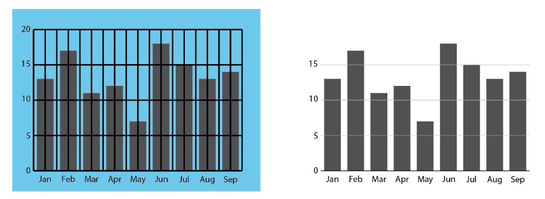
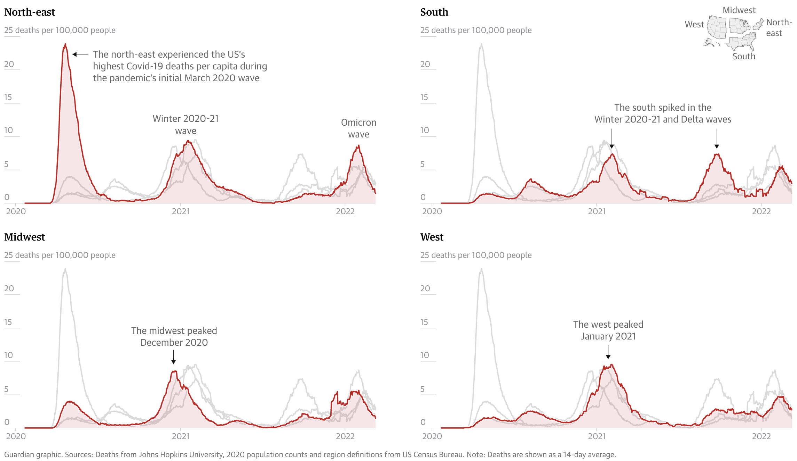
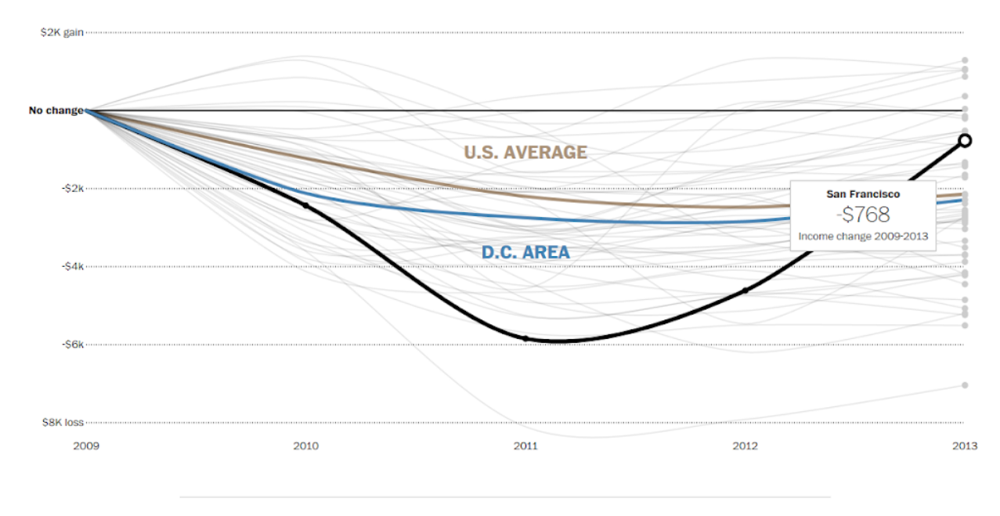
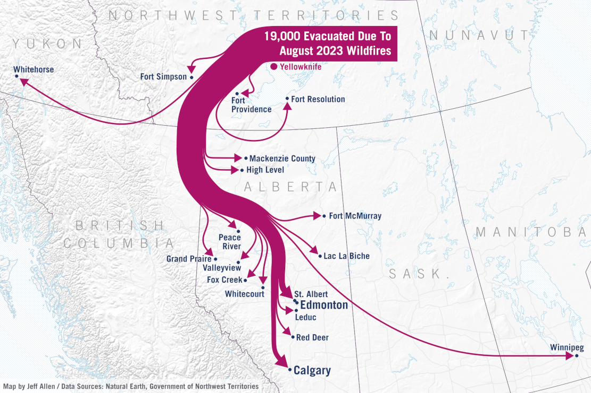
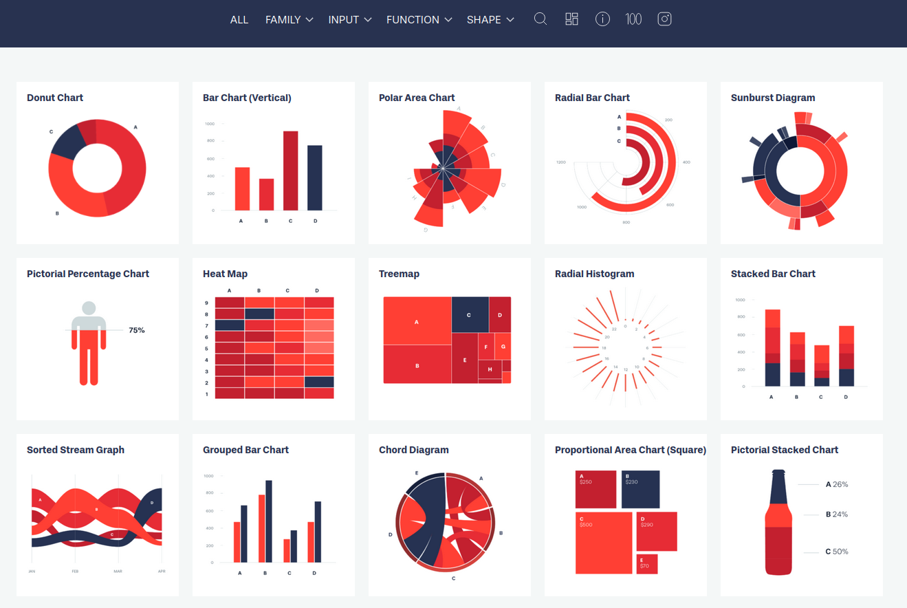
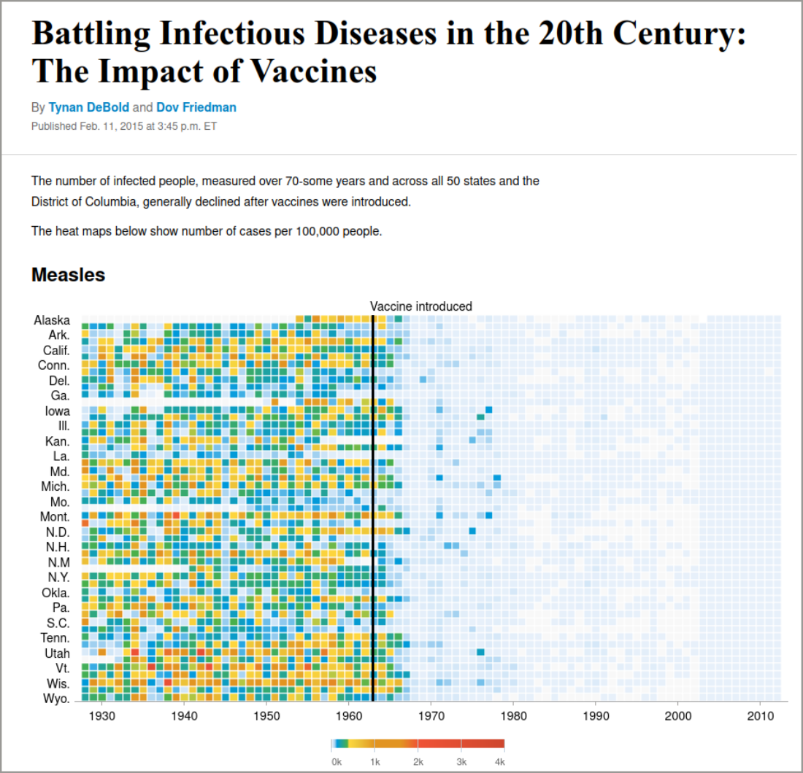
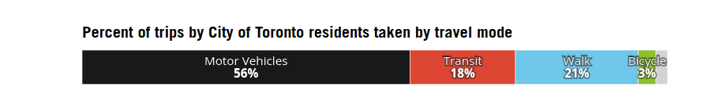
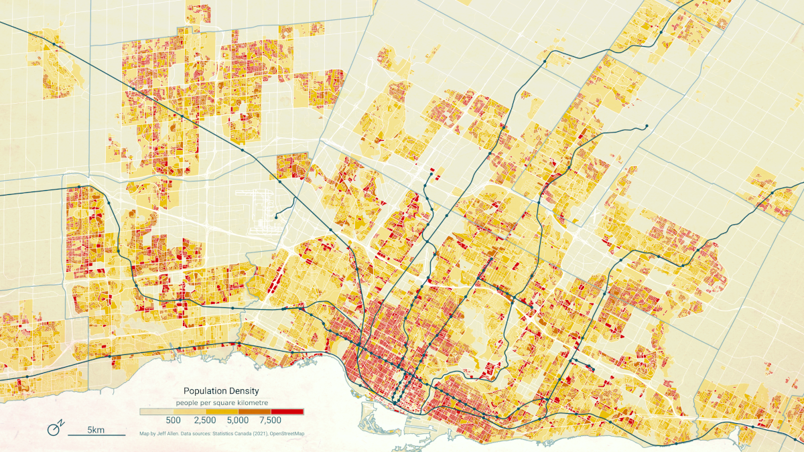

A strong visualization can make complex data accessible; however, without care, the message can get lost. Great visualizations balance clarity, precision, and aesthetics. This chapter offers practical tips and guiding principles to elevate your data visualizations.

Note that these are general recommendations and rules of thumb, not rules that you must follow 100% of the time! Data visualization is a combination of technical, design, and artistic skills, and there are often exceptions to the rules :)

## 1) De-clutter and high data-ink ratio

Coined by [Edward Tufte](https://en.wikipedia.org/wiki/Edward_Tufte), the data-ink ratio refers to the proportion of visual elements that represent actual data, rather than decoration, relative to all 'ink' on the chart.

In other words, this is about reducing clutter and focusing graphical elements of a chart on the data.

Here are a few recommendations for reducing clutter and increasing data-ink ratios:

- Remove non-essential "chartjunk" (3D effects, background shading, unnecessary gridlines, borders).
- Use direct labels instead of relying on legends.
- Choose simple chart types unless complexity is truly needed.
- Use subtle formatting of reference information like gridlines to keep the audience focused on the data itself.
- Avoid overuse of colors, labels, and gridlines.
- You don't need to visualize every possible variable or data point; focus on the story you're trying to tell.
- Group or collapse less important data to simplify interpretation.
- Whitespace is your friend.

Here's an example of a visualization of COVID-19 deaths from [The Guardian](https://www.theguardian.com/us-news/2022/mar/13/how-covid-shook-the-us-charts-graphs) that has limited visual clutter and strong hierarchy.

## 2) Start with monochrome

Sometimes it’s hard to figure out the story you want to tell. There are many potential data stories in any chart! But starting with grey makes it easier to foreground the data points that matter most to your story. 

For example, in the line chart below, we started with a mass of grey spaghetti representing all the large metropolitan areas in the US, with the idea of highlighting the post-recession dip in income in San Francisco, as compared to the US average. We then decided to highlight the Washington D.C. area as another point of comparison. But we labeled the San Francisco story in order to keep the reader’s attention focused on it.

## 3) Design for your output

Effective visualization isn't one-size-fits-all. Always consider where and how your work will be seen. Tailor your design choices to the medium and the audience:

- *Print vs digital*: Pick fonts, line weights, and colors that are clear at the specific resolution and/or paper size that you are designing for. What works on a low-resolution screen may not translate well to paper.

- *Presentations vs. reports*: Slides call for bold, minimal visuals with large text and fewer details. Reports allow for more complexity and written explanation.

- *Social media*: Prioritize clarity at small sizes. Expect compression and low resolution and keep text minimal and legible.

- *Audience expertise*: Technical audiences may appreciate complex charts and granular data. Broader or non-expert audiences often benefit from simpler visuals, clear labeling, and guiding annotations.

If you design a chart to fit within a specific medium (e.g. mobile view on a screen), it's recommended you redesign the chart if you want to have it in a different context (e.g. printed in a report). This is to prevent fonts being resized so they are no longer legible, graphics losing resolution and becoming fuzzy, or distorted if they are resized.

## 4) Make graphics accessible

Your data visualizations should be readable by everyone, which means thinking beyond aesthetics and into the realm of inclusive design. 

For charts and maps, there are two main things to consider:

1. Using colourblind safe colours. Tools, such as [ColorBrewer](https://colorbrewer2.org) can be used to pick safe colours. There are also [tools for uploading images](https://www.color-blindness.com/coblis-color-blindness-simulator/) (e.g. of a chart or a map), and test how it is viewed for different types of colourblindness. Highly recommend using this for any graphics that will appear in publications.

2. Using adequate font sizes and making sure there is adequate level of contrast between foreground and background, especially with text. The greater the contrast between the foreground and background, the easier it is to read. For text, keep in mind that font size plays a significant role: smaller fonts require even higher contrast between the text color and background to maintain readability. There are online [tools for checking contrast ratios](https://webaim.org/resources/contrastchecker/) between background and foreground that are useful for design.

## 5) Visual hierarchy

Guide the viewer’s eye by creating a hierarchy between background and foreground. Your key message should be the focus and highlighted while everything else (axes, grid-lines, background elements) should support and not compete with it.

- Bold or highlight key data points.
- Use size, contrast, and colour to signal importance.
- De-emphasize secondary elements like gridlines, minor tick marks, axis labels, or base maps.

)](img/PreattentiveProcessingTable.png)

## 6) Choosing charts based on your data

Match the visualization to the type of data and the message you’re trying to convey. Here's a quick overview of very common charts for different types of data:

Choosing the right chart type is essential to making your data clear, compelling, and truthful. While there’s no single “correct” choice for every scenario, understanding your data and communication goals will help you select a format that highlights the story you want to tell. Whether you’re comparing categories, showing trends over time, exploring distributions, or revealing relationships, each chart type has strengths and limitations. 

For a deeper dive into chart selection, visit [From Data to Viz](https://www.data-to-viz.com/), a comprehensive, visual guide that helps you choose the most appropriate chart based on your data structure and communication goals. The Financial Times also has a ["visual vocabulary" guide](https://ft-interactive.github.io/visual-vocabulary/) for which approach to take to visualizing data. For a wider range of charts, including types of infographics, check out [Data Viz Project](https://datavizproject.com/)

## 7) Annotations

Great charts don’t always speak for themselves. Use clear titles, subtitles, and axis labels. Add callouts or annotations to highlight patterns or anomalies. You can guide the reader to your takeaway rather than leaving it to interpretation.

## 8) Consolidate categories strategically

Many datasets offer rich detail. This can help answer interesting questions but once visualized may be TMI for your reader! Consider consolidating categories strategically in order to highlight elements that are key to the story. This means eliminating those that are more peripheral and could distract viewers. It also means limiting the number of categories. 

For example, we plotted out travel mode share in Toronto, but instead of having categories for different types of public transit (bus, subway, regional rail), we combined all into one category since the story was focusing on all transit, not sub-types.

There is no set rule of thumb about the most effective number, and it can be complicated since there may be two dimensions to the data (e.g. two places and 8 types of housing or ethnicity). In general, we recommend aiming for no more than 16 sub-categories (3 x 5 categories, or 2 x 8). For donut or pie charts, it is quite intuitive to limit the number of slices to 4, 6, or 8, as you would with a good fruit pie!

## 9) Data standardization

Avoid presenting counts without accounting for population size (i.e. standardization). Absolute numbers are hard to compare across places of different size, so standardization is important for apples-to-apples comparisons. For bar charts, this means deploying the 100% option. But this is particularly true for maps with polygons of uneven sizes. For example, rural census tracts tend to be huge, and can dominate a map if variables are not standardized by population, areas, housing units, or some other unit.

As with any rule, there are exceptions! There are times when it is important to see actual numbers. But if making a comparison of relative amounts, chances are standardization will help. If you do want to show absolute numbers, [proportional symbol maps](../proportional-symbol-maps/proportional-symbol-maps.md) or [dot density maps](../categorical-dot-maps/categorical-random-dot-maps.ipynb), might be a better choice.

## 10) Brand guidelines

If you’re creating visualizations within an organization or for a specific campaign, it’s important to follow established brand guidelines. 

This includes using approved typefaces, colors, and logos, and aligning your visuals with the tone and messaging of the broader content. 

Maintaining visual consistency across all charts, graphics, and reports reinforces brand identity, leads to more cohesive products, and builds recognition with your audience.