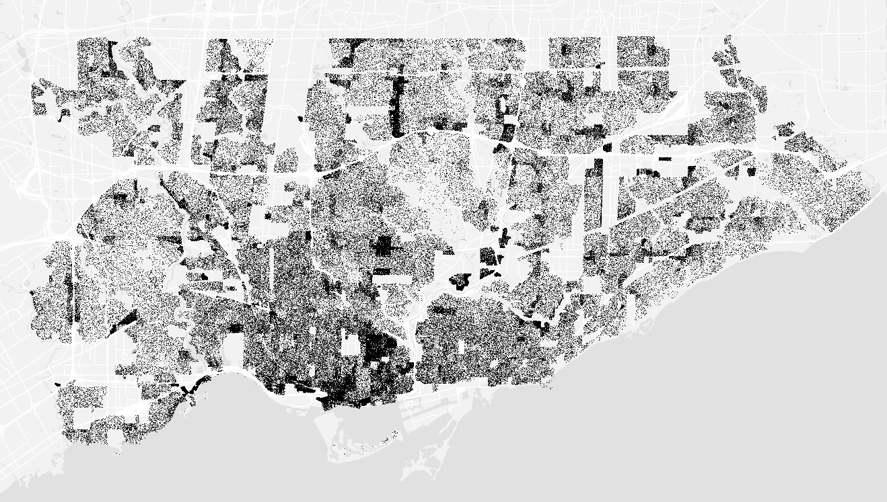
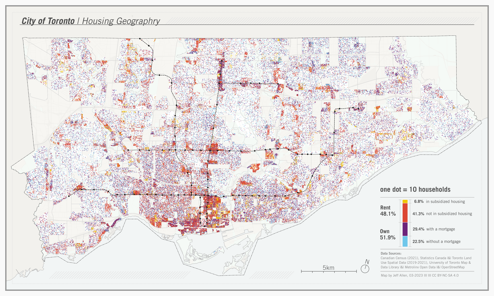
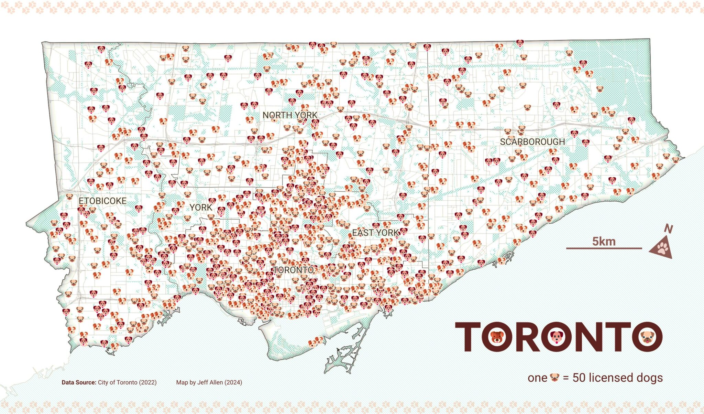
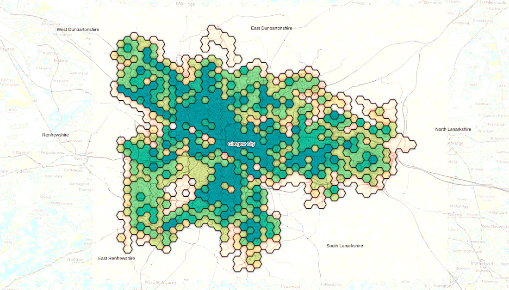
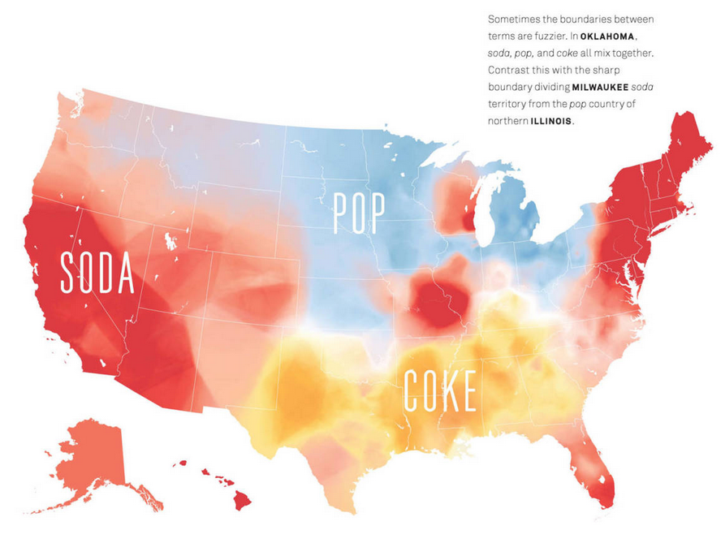

**[📥 Click here to download this document and any associated data and images](/downloads/visualizing-and-mapping-density.zip)**

This section will cover:

- Different methods for mapping density, including: dot/point maps, binning data to grids/hexagons, 3D bins/grids, contour maps, and heat maps
- Trade-offs, advantages, limitations, and considerations in determining what density mapping approach to use

## Why map density?

<small>Population density map of Toronto. Source: [School of Cities](https://schoolofcities.github.io/dot-density/)</small>

Take a look at this map of Toronto: at first glance, it's obvious that some parts of the city are different than others. It's a map that tells you where people live and concentrate - equally, where they don't live, and don't concentrate. And it's pretty simple: just one dot per 10 individuals. 

What density maps let us do is go beyond simple tables of numbers to understand how data is distributed geographically. We can get a feel for where events like traffic collisions 311 requests, or entities like trees, occur and exist - revealing clusters and gaps.

In this chapter, we will cover five different methods. The choice of map matters: different conclusions can be drawn from different representations.

There's numerous ways to implement these, whether you feel more fluent in coding, or GIS software. Since there's no one size fits all approach, we're going to focus on the intuition and design choices for each method rather than technical implementation details.

## Dot (or point) maps

Dot maps are a method of seeing both concentration and distribution at the same time intuitively - each dot feels like a tangible "unit" of whatever we're measuring. In the example above, we've added colors to represent ethnicity. At first glance, you can get a feel of where different groups cluster and mix across Toronto. Beyond population, dot maps can also be used to show things like the distribution of trees, crime incidents, or service requests - anything that could be an object or entity in space - and can be coloured by another variable to show spatial differences in categories (like housing for example)

When designing a dot map, there are a few key choices to consider:

| Design Choice | What it means                                                                    | Consideration                                                                              |
| ------------- | -------------------------------------------------------------------------------- | ------------------------------------------------------------------------------------------ |
| **Scale**     | Decides what one dot represents (e.g., 1 person, 10 people, 100 households).     | Too small a scale can overcrowd the map; too large can wash out local variation.           |
| **Placement** | Whether dots are tied to precise locations or distributed randomly within areas. | Random placement can suggest false precision; exact placement may not always be available. |
| **Color**     | Assigns categories (e.g., ethnicity, type of event, land use) to dots.           | Too many categories can overwhelm the map and obscure patterns.                            |

Also, dot maps don't have to use small circles as their symbol, they can be based on other shapes as well (triangles, squares, emojis, etc.). For example, check out our ['Dog' density map of Toronto](https://schoolofcities.utoronto.ca/whats-the-poop-on-dogs-and-cities/).

## Binning data to grids

Grids are a way of summarizing many individual points into manageable spatial units by counting or averaging the number of "items" inside of them to create manageable spatial units. These grids can be squares, rectangles, hexagons, triangles, or other more complex shapes that tesselate. Binning can be used, for example, to map noise complaints, restaurant locations, population density, mobile phone ping, or air quality sensor readings.

| Design Choice                         | What it means                                                                                                                                      | Consideration                                                                                                                 |
| ------------------------------------- | ------------------------------------------------------------------------------------------------------------------------------------------------------- | ----------------------------------------------------------------------------------------------------------------------------- |
| **Grid shape (squares vs. hexagons)** | The geometry used to divide space. Hexagons often look more natural and avoid sharp edges, while squares are simpler and align with coordinate systems. | Choice can influence how patterns appear - hexagons may emphasize smooth transitions, squares may emphasize boundaries.         |
| **Bin size**                          | The resolution of the grid - how big each square or hexagon is.                                                                                           | Too small and the map is noisy; too large and local variation gets lost.                                                      |
| **Aggregation metric**                | What you count or average within each bin (e.g., number of activities, average income).                                                                 | Different metrics highlight different aspects of density; totals may exaggerate large bins, while averages may hide extremes. |
| **Color scale**                       | How bin values are represented visually.                                                                                                                | Poorly chosen scales can exaggerate or flatten variation, misleading interpretation.                                          |

## 3D visualizations

<small>Source: [School of Cities](https://schoolofcities.github.io/urban-activity-atlas/?metro=toronto_on)</small>

3D is really just an extension of what we just covered in 2D. At its most basic form, it lets us visualize the data differently and observe a pattern in a way that might feel more physically tangible to what we see in the real world. The example above illustrates this: it takes activity data (generalize to all times of the day) and shows clearly different peaks and troughs across the Greater Toronto Area.

It doesn't just need to be an added perk though: we can also add another third variable. For example, instead of using colour and height to represent the same variable (amount of activity), perhaps we could instead represent something like population, access to transit, car ownership, or peak time of day. The point is, a third dimension lets us say more as long as we're smart about it.

| Design Choice                     | What it Means                                                                             | Consideration                                                                   |
| --------------------------------- | ----------------------------------------------------------------------------------------- | ------------------------------------------------------------------------------- |
| **Bin size (x, y, z)**            | The width, depth, and height of each 3D bin                                               | Too small can create a noisy visualization; too large can obscure local peaks   |
| **Aggregation metric**            | What is measured or counted within each bin (e.g., number of people, events, or vehicles) | Choice affects which patterns are emphasized; totals can exaggerate dense areas |
| **Color scale / height encoding** | How bin values are translated into color or vertical height                               | Poor choices can mislead perception of relative intensity                       |
| **Smoothing / interpolation**     | How abrupt or gradual transitions between bins appear                                     | Excessive smoothing can hide local peaks; too little can exaggerate noise       |

## Contour Maps

<small>Source: [CBC](https://newsinteractives.cbc.ca/features/2025/climate-matches/)</small>

Contour maps show continuous spatial patterns by segmenting sections of equal values with lines. In the example above from the CBC, these contour lines represent temperature and precipitation patterns, highlighting areas by how similar they are to a target city (in this case, Montreal). Besides weather, you can use them to visualize air pollution levels, noise intensity, or even gradients in real estate prices - it's good for anything that changes continuously across space.

| Design Choice           | What it Means                                                                 | Consideration                                                                 |
|-------------------------|-------------------------------------------------------------------------------|-------------------------------------------------------------------------------|
| Interpolating missing values | How the map estimates values between the points you actually have (e.g., inverse distance weighting, kriging) | Different interpolation methods can make the lines look slightly different, changing the perceived patterns |
| Contour interval        | How far apart each line is on the map (e.g., every 1°C, 5 dB, or $10k)        | Lines too close can look messy; lines too far apart can hide smaller changes  |
| Color and line style    | How the lines and colors are drawn to show the values (solid vs. dashed lines, color gradients) | Poor choices can make it hard to see differences or confuse the reader       |
| Smoothing               | How “soft” or “rough” the transitions between lines look                      | Too smooth can hide local bumps; too rough can make it look noisy            |

## Heat Maps

<small>Source: [Josh Katz](https://wtop.com/life-style/2016/11/speaking-american-pop-soda-subs-hoagies/)</small>

Heat maps are a way of visualizing the intensity or density of a phenomenon using a smooth color gradient across space. In the example above, different parts of the U.S. are colored to show whether people tend to say “soda”, “pop”, or “Coke”, immediately highlighting regional preferences without precise boundaries. Beyond this, heat maps can be used to show bike share usage, traffic congestion, or footfall at public parks - anything that benefits from seeing broad trends across space.

Unlike contour maps, which connect precise lines of equal value, heat maps blend values continuously, emphasizing overall patterns rather than exact thresholds. In other words, heat maps are best when you want to communicate general trends rather than pinpoint exact values.

| Design Choice              | What it Means                                                                                 | Consideration                                                                             |
| -------------------------- | --------------------------------------------------------------------------------------------- | ----------------------------------------------------------------------------------------- |
| Kernel or smoothing method | How the values of nearby points are averaged or blended to create the smooth gradient         | Different methods can make dense areas look bigger or smaller than they actually are      |
| Color scale                | How the range of values is translated into colors (e.g., from light to dark, or cool to warm) | Poor choice of colors can exaggerate or flatten patterns, making interpretation difficult |
| Radius or bandwidth        | How far a point’s influence spreads in the gradient                                           | Too small can make the map noisy; too large can obscure local variation                   |
| Normalization              | How values are adjusted relative to the total or per area                                     | Without normalization, very dense areas can dominate, hiding other patterns               |

## Choosing the right density map

Each of the density mapping methods we’ve reviewed has its own strengths and limitations. They offer different perspectives on spatial data, emphasizing precise locations, broad trends, or gradients. Understanding these trade-offs is critical to ensure your map communicates the patterns you care about without misleading or overwhelming the reader.

| Method                           | When to Use                                                                                                                                  | Limitations                                                                                                          |
| -------------------------------- | -------------------------------------------------------------------------------------------------------------------------------------------- | -------------------------------------------------------------------------------------------------------------------- |
| Dot / Point Maps                 | Useful for seeing both the location and distribution of individual items, giving a tangible sense of where things occur.                     | Can become cluttered with large datasets; hard to see overall patterns in very dense areas.                          |
| Binning Data to Grids / Hexagons | Helps reveal broader patterns and trends by aggregating many points into spatial units, making dense data easier to interpret.               | Choice of bin size and shape affects interpretation; may smooth out local variation.                                 |
| 3D Bins / Grids                  | Captures patterns that vary along a third dimension, like building floors, elevation, or stacked activity, adding depth to spatial analysis. | Can be harder to interpret visually; may require interactive or 3D visualization tools.                              |
| Contour Maps                     | Emphasizes gradual changes or gradients across space, helping to understand areas of increase or decrease in continuous phenomena.           | Assumes smooth variation between points; small-scale variation may be hidden; interpolation can introduce artifacts. |
| Heat Maps                        | Highlights overall intensity or density trends, allowing viewers to quickly grasp where concentrations are higher or lower.                  | Lose precise thresholds and fine-grained values; smoothing can exaggerate or hide patterns.                          |

No single method is inherently the best; the right choice depends on the story you want your map to tell. It’s essential to clarify your goals, experiment with different approaches, and adjust design choices to find the representation that conveys your data most clearly and effectively.