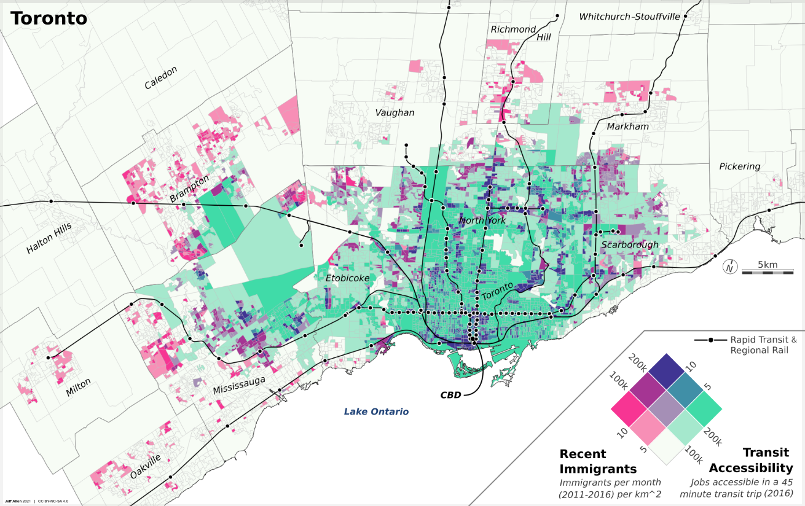
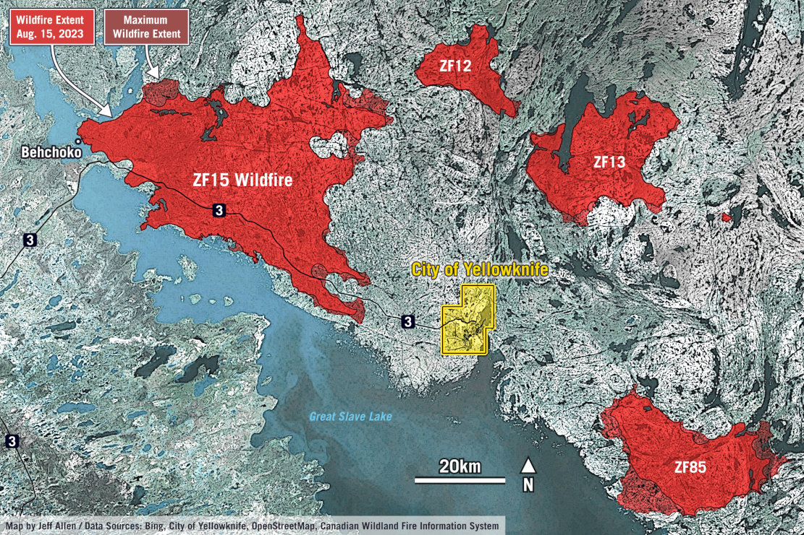
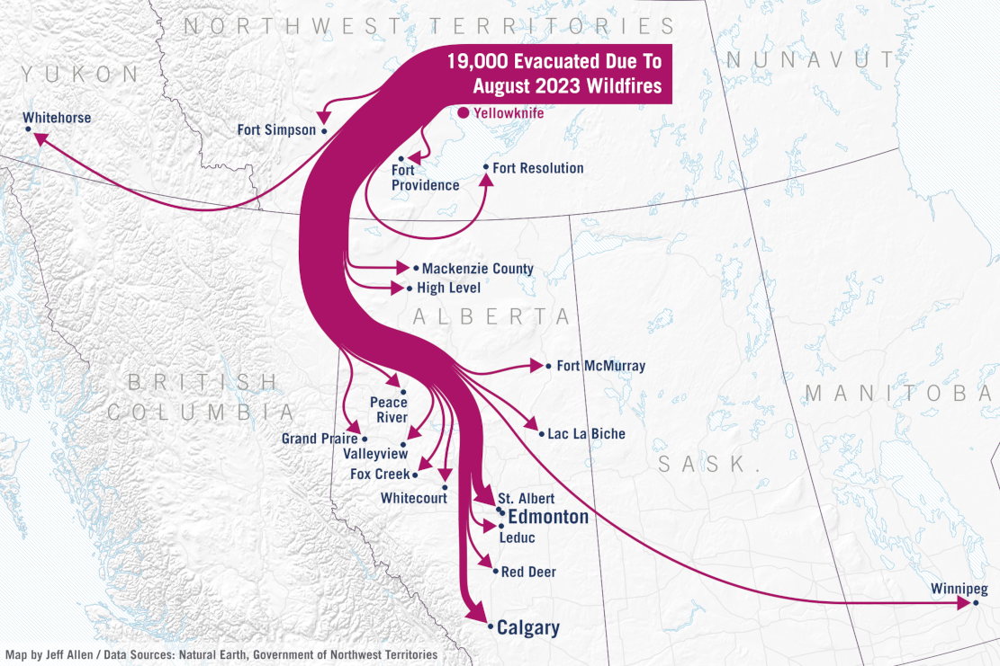

# Maps & Visualizing Spatial Data

 

## Overview

Maps and spatial data visualizations can either created be at the research stage where we are trying to uncover patterns in the data, or as polished communication visuals where we want to convey patterns in the data to a our intended audience.

*Cartography* is often defined as the science and art of creating maps. It often involves decisions about ...

1. **selection** of data to include on the map
2. **generalization** of data to reduce complexity and clutter
3. how we want to **style** and **symbolize** our data
4. how to order and **layer data**
5. what other **map layout elements** to include (e.g. title, legend, north arrow), as well as how to design these to make a map easy to understand

This page will cover the basics of what goes into making maps and spatial data visualizations, following each of these steps. 

The last part of this notebook shows an example in QGIS for making a simple map ............. The 

If you are interested in creating specific types of maps, check out the following notebooks:

- Choropleth maps
- Proportional symbol maps
- Mapping point density (dot maps, grid maps, heat maps)

## Types of maps

### Reference & thematic

Almost all maps can be thought of as either 

- *Reference maps*, which provide base geographic information (e.g. streets, land forms, water, etc.) often for locating places or for navigation. Google Maps is probably the most well-used example.
- *Thematic maps*, also called *geographic* or *spatial* *data visualizations*, emphasize patterns or trends tied to a specific theme (e.g., population density, election results, air pollution, etc.).

Reference maps are often used as base layers for thematic maps. 

For example, if we've collected a dataset about the location of public washrooms in a city, the first thing we might want to do is simply see where they are located by overlaying them onto a base map in GIS. This would be an example of a simple thematic map.

Here are a few examples of thematic maps that we've created, each with different urban data, objectives, and audience in mind.

### Static & interactive

*Static maps* are fixed, pre-generated images that display geographic information in a single, unchangeable format. They are ideal for simple visualization, printing, or when interactivity isn’t needed—such as in posters, reports, or static web images. 

Static maps can vary in size from just a few dozen pixels on a screen or a small figure in a report, to graphics in a slide deck, to large maps printed as posters or dozens of maps as part of a series, like in an atlas. The three maps shown above are examples of static maps.

*Interactive maps* are digital and allow users to engage with the content by zooming, panning, clicking for details, or filtering data. They are best for exploration, real-time applications, user-driven analysis, or providing increased engagement via animation in a data-story. Here are a few examples that we've developed at the School of Cities"

- [Urban Activity Atlas](https://schoolofcities.github.io/urban-activity-atlas/)
- [Heat Vulnerability in Toronto](https://schoolofcities.github.io/heat-vulnerability-toronto/)
- [Knowledge of Languages in the Greater Toronto & Hamilton Area](https://schoolofcities.github.io/gtha-language-map/)

Interactive maps can provide flexibility and deeper engagement with spatial data. However, interactive maps typically are much more work to create than a static map as they include all the visual design thinking in a static map, plus additional thinking about how users interact with them and how the maps respond to user inputs, as well as increased technical development time.

Our general recommendation is to always start with creating static maps, and then move on to creating an interactive version only if a static version is insufficient at conveying the story in your data that you want to convey.

If designed well, static maps can be super effective at highlighting key trends and stories in spatial data in a quick and easy to read way.

## What's on the map?

How do we decide what were are going to include on our map? Sometimes this may seem obvious, the key dataset(s) that we want to visualize should be there, but particularly with our reference layers, this can often require a lot of little subtle choices.

This is because maps always abstractions of reality. It is impossible to show everything in the world on a piece of paper or a screen - nor would we want to, as we usually want to focus our reader's attention on specific data point(s), trend(s), or story.

Making maps and spatial data visualizations therefore often involve various decisions on *selection* and *generalization* of spatial data to reduce visual clutter to focus on specific data points.

### Cartographic selection

Cartographic selection is about picking the most important things to draw on a map so it's not too crowded. Imagine drawing a treasure map — you’d likely want to show big landmarks like mountains or forests, but leave out tiny rocks or every individual tree. 

In practice, this can include deciding about whether or not to include a dataset at all when creating a map (e.g. in GIS or Python or other map-making software), or if we do include the dataset, if we want to filter it to only show certain features.

For example, you may want to include a dataset of public transit lines as a reference layer for a map of your city. However, you may not want to include every single transit route. An example of cartographic selection would be to only show major transit lines by pre-filtering the data by mode (e.g. only show metro/subway) or frequency (e.g. only show routes where a bus or train comes every 10 minutes or less). Now of course if the goal of your map and research is specifically about public transit, you may want to include all the routes. 

The process of selecting some, but not all of the data that you have available, reduces clutter on your maps and can make them easier to read. 

What data to include depends on your objectives, audience, and story.

### Cartographic generalization

Similar to selection is cartographic generalization, this is when mapmakers simplify real-world details to make maps clearer and less cluttered, especially at smaller scales. 

For example, a coastline with tons of tiny twists and inlets might get smoothed out—keeping the overall shape but removing unnecessary complexity. This helps the map stay readable without losing its key features. It’s like sketching a quick but accurate version of a photo instead of drawing every single pixel.

Another example would be that if you had a dataset of sports and recreation facilities in a city with data on the type of activity each is predominately used by (e.g. baseball, football, tennis, etc.). We can choose to have a different colour or symbol for each of these types, or generalize these to have them all look the same (e.g. the same shade of green).

## Symbols and layer styling

Once we've decided what we want to include on our map, we have to decide how we want to style each layer. In some mapping tools, like QGIS, style options are often called *Symbology*

These are the common graphic styling options available for vector data layers. If you've worked with other design software, especially vector graphic software, many of these will be familiar.

Points:

- Symbol type (e.g. circle, square, etc.)
- Size
- Fill colour
- Stroke colour
- Stroke width
- Opacity

Lines:

- Width
- Colour
- Stroke style (e.g. solid, dashed, etc.)
- Opacity

Polygons:

- Fill colour
- Fill pattern (solid, hatching, etc.)
- Stroke colour
- Stroke width
- Stroke style (e.g. solid, dashed, etc.)
- Opacity

Note that there are other options as well, the above are just the most commonly used.

### Single-rule styling

Single-rule styling is when we want all features in a dataset to look the same, regardless of how they may different in terms of their attributes

In the example in [our notebook on introducing spatial data and GIS](../../urban-data-analytics/spatial-data-and-gis/spatial-data-and-gis.md), we created a simple map of Toronto where we had two vector datasets 1) ward administrative boundaries (polygons) and 2) public libraries (points). 

Each of these layers is styled via a single rule. For example, all public libraries are shown as blue squares, even though some libraries may be larger than others or have longer opening hours.

### Data-defined styling

A power using tools like QGIS and Python or others like them, is that we can visualize spatial data based on a set of rules relating to their associated attribute data. For example ...

- Colour census tract data based on median income
- Size business point data based on their number of employees 
- Shade different land-cover (wetlands, forest, farmland) with different textures for each category
- Style street network data based on quality and safety of cycling infrastructure
- Many more!

Many of these options we use [visual variables]() like size, hue, saturation, orientation, etc. that we showed in our [data visualization]() notebook, but apply these directly to spatial data on a map.

Let's look at a couple examples in QGIS!

### Styling categorical data

Land cover? 

### Styling numeric data

Colouring some points libraries by number of books

How we decide to group (i.e. classify or bin) or data, as well as what colours we pick can 

## Layers and hierarchy

Maps are often the product of multiple layers, each with their own defined styling. Thinking about the ordering of the layers and their styling relative to each other goes a long way in making an effective map. 

Well designed maps, especially thematic maps, often have a *visual hierarchy* of background and foreground - where the background provides geographic reference (e.g. streets, bodies of water), while the foreground are the key data that we want to show.

These are two examples of maps relating to the 2023 wildfires in Yellowknife where we tried to design them to a have strong visual hierarchy of the key data (e.g. fire area, evacuation routes) relative to their geographic reference backgrounds. Both these maps are quite simple from data analytics standpoint, but were part of a story highlighting the scale and impact of the fires.

# Map layouts

