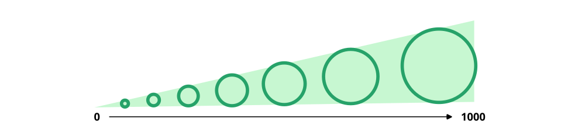

Proportional symbol maps are an intuitive way to visualize quantitative data on a map or visualization. Instead of relying on color gradients like choropleth maps, proportional symbol maps use symbols (most often circles) sized in direct proportion to the data they represent. 

They are most often used for representing totals or counts (e.g. larger symbols, greater totals). 

They are typically applied to point data (e.g. circles for transit station sized by ridership) or to polygons (e.g. census tracts represented by a circle, that is sized based on its population)

Here are a few examples

)](./img/pop-change-edmonton.png)

)](./img/language-map.png)

Pros of proportional symbol maps:

- Intuitive visual comparison of values.

- Flexible placement—symbols can sit above or alongside base features.

- Good for visualizing raw counts or totals

- Can be adapted to create bivariate maps, e.g. classify symbols by both size and colour to show two different variables (e.g. the language map above uses colour for different languages and size for the number of speakers)

Cons of proportional symbol maps:

- Symbols overlap in dense urban areas and can reduce legibility.

- Perceptual issues—humans aren’t great at comparing areas of circles precisely.

- Not ideal for showing non-count data (e.g., per capita, averages, ratios, etc.) unless clearly annotated.

## On how to size symbols

When creating a proportional symbol map, one of the key decisions is how to size your symbols so they reflect the data meaningfully. There are two main choices you'll make:

### Continuous versus grouped symbol sizes

**Continuous sizing** means each symbol is scaled exactly to match the data value it represents. For example, a location with 800 people might have a slightly smaller circle than one with 900.

Pros:

- Precise, smooth visual differences.

- Good for showing nuanced variation in data.

Cons:

- Small differences can be hard to detect.

- Can look cluttered or inconsistent, especially in dense urban areas.

**Grouped sizing** means values are binned into categories (e.g., low, medium, high), and each category gets a fixed symbol size. For example, circle sizes representing population could be grouped by 0-500, 500-1000, and 1000 and up, therefore locations with population 800 and 900 would have the same size.

Pros:

- Easier to read at a glance.

- Cleaner visual presentation.

Cons:

- Less precise—small but important differences might be lost.

### Area versus diameter symbol sizes

If we scale our circles as a direct mathematical function of our data, we have a few options.

**Scaling by diameter** means the width of the symbol (the circle’s diameter) is proportional to the data value. 

Pros:

- Easy to calculate.

- Easy to explain.

Cons:

- Can exaggerate large values (e.g. doubling the diameter actually quadruples the area)

**Scaling by area** means the total surface area of the symbol (usually a circle) is proportional to the data value. This is the recommended approach because we perceive the area of a shape more accurately in relation to data.

Pros:

- True to the math—doubling the value doubles the area.

- More accurate visual representation of magnitude.

Cons:

- Even if this is this better than diameter in most cases, some research has found that people tend to underestimate the size differences between circles. This can be adapted with [Flannery scaling](https://en.wikipedia.org/wiki/Proportional_symbol_map#Apparent_magnitude_(Flannery)_scaling), which slightly inflates larger symbols in area-based scaling to compensate for how we see them.

## Proportional symbol maps in QGIS

Great! lets take a look at an example of how to make a proportional symbol map in QGIS. We'll use the same data for Edmonton that is shown at the top of this page to try to make a map showing the distribution of population in the city.

Good prerequisites for this tutorial would be our [introductory GIS](../../urban-data-analytics/spatial-data-and-gis/spatial-data-and-gis.md) and [spatial data visualization](../maps-and-spatial-data-visualization/maps-and-spatial-data-visualization.md) notebooks.

[Click here to download data for census tracts in Edmonton](./data/edmonton-ct-population-96-21.geojson). The data includes the following columns, sourced from the Canadian census. Check out [our notebook on Canadian census data](../../urban-data-analytics/canadian-census-data/canadian-census-data.md) for more details on this data source.

- `CTUID` unique identifier for each census tract (which can be used to join with other data)

- `area` area in square kilometres

- `pop_2021` population in 2021

- `dwe_2021` number of dwellings in 2021

- `pop_1996` population in 1996

- `dwe_1996` number of dwellings in 1996

Since our data are polygons, but proportional symbol maps are typically based on single points, we'll have to first convert our polygons to points first before we can visualize. The common way to generate representative points of polygons is by computing centroids. We can do this via *Vector* - *Geometry* - *Centroids*. Or by opening the *Processing* - *Toolbox* and searching for *Centroids*. The result should look something like this (likely with different colours)

(Note that computing centroids is one of may common spatial data or geo-processing functions. Read more in our [notebook on spatial data processing](../../urban-data-analytics/spatial-data-processing/spatial-data-processing.ipynb))

Once we have our points, we can then visual them based on their size! To do so, open up the *Properties* of the centroids layer, go to *Symbology*, and then select *Graduated*. The default is to style by colour, but if you can change the *Method* to *Size*. The *Size from* options define the size of the smallest and largest circle. These are worth tinkering with since you want all circles to be visible, but you don't want too much clutter on the map either (i.e. circle too big that they cover everything).

In the example below, I am testing out 3 groups of sizes, based on quantiles of 2021 population. 

Here's the output based on this initial styling.

Note as well that the map is in an area-conserving CRS (a local Mercator projection) and that an OpenStreetMap basemap is in the background to give the map some visual reference. (check out our [introductory QGIS](../../urban-data-analytics/spatial-data-and-gis/spatial-data-and-gis.md) tutorial on how to do this).

This output on its own is great for exploratory analysis, can clearly pick up patterns of high and low population in Edmonton, but if you were going to export this to include it in a publication it would be better to include a title and legend. Check out some of the other example maps on this page on how legends for proportional symbol maps can be designed, this is sometimes done via graphic design software since base legend options in QGIS and similar tools can be limited in terms of custom layout and legend design. 

What we did, as well, is relatively simple. It only shows population in one year. However, in the data (the same source as the very first map shown in this notebook) we have population and dwelling counts for 2021 and 1996. From here you could use proportional symbols to show...

- 1996 population or dwelling counts
- Population growth
- Population decline
- Growth or decline on the same map! 

## More symbol options! :)

Circles are the most common shape for proportional symbol maps - but there are many other options available! Check out the following map, which uses triangles (or spikes) to show where Christmas trees grow in the USA. To make maps similar to this with your own data in QGIS or other software, the process would be to select a different symbol, or even load in your own custom symbol (e.g. as an `.svg`).

)](./img/spike-tree-map.png)

Proportional symbol maps can also be combined with charts to both show size alongside other data. It is possible to create chart-based symbols like this in QGIS by going to a layers *Properties* and then *Diagrams*. There are options for pie charts, bar charts, and histograms. Just be careful with the size and number of variables in each chart, as if there are many on a map, it can become difficult to read and parse out trends.

![1858 map by (Charles Joseph Minard)[https://en.wikipedia.org/wiki/Charles_Joseph_Minard] where each region in France has a circle sized according to the amount of meat shipped to Paris for consumption, including pie charts distinguishing the types of meat. ([Source](https://en.wikipedia.org/wiki/File:Minard-carte-viande-1858.png))](./img/minard-carte-viande-1858.png)

Everything that we've shown above pertains to single points (either a point dataset or polygons represented by their centroids). However, we can also do similar proportional symbols for line-data, for example where the width or thickness of a line is based on a data value. For example, this map visualizes ridership by transit route in Toronto via line-width. 

In QGIS, you can create something similar by classifying your line data via *graduated* and then either A) manually changing the symbol styling to different line-widths or B) styling via a function using the [expression builder](https://www.qgistutorials.com/en/docs/3/vector_styling_expressions.html)

)](./img/ttc-ridership.png)

