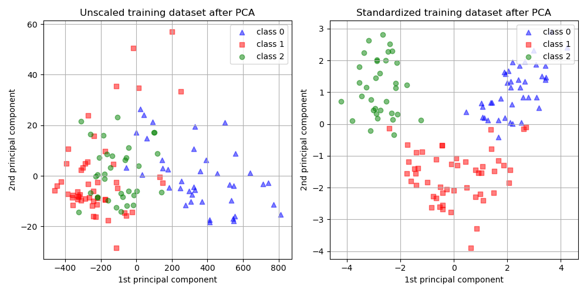
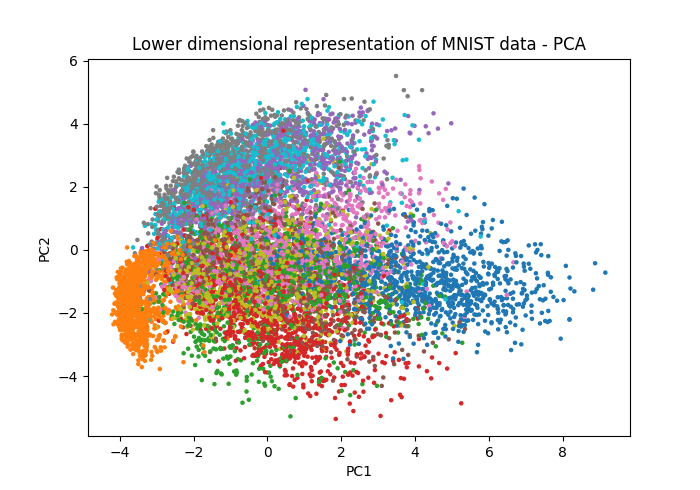
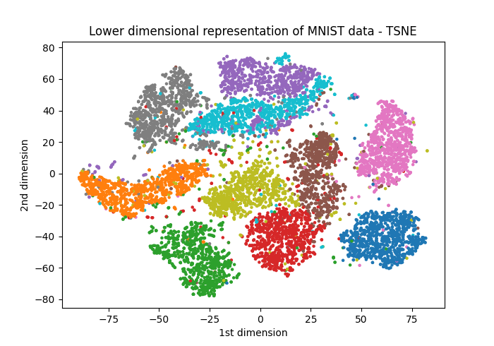
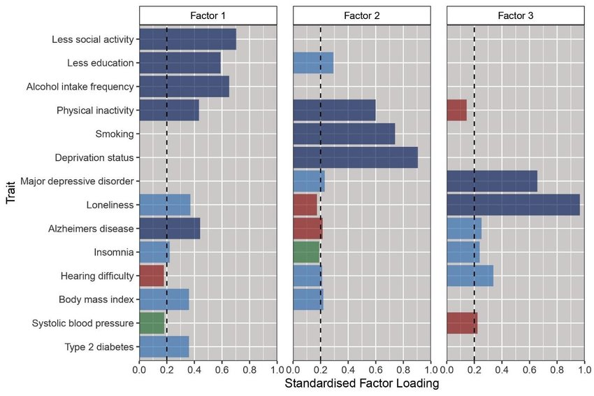

[📥 Click here to download this document and any associated data and images](/downloads/advanced-statistics-multivariate-methods.zip)

This section will cover:
 
- the utility and limitations of multivariate statistical models
- key statistical approaches including regression, clustering, and dimensionality reduction techniques
- a high-level introduction to advanced machine learning methods

In the previous section on statistical foundations, we provided a detailed overview with lots of practice. The content of this section is much more advanced; each subsection often ends up being weeks of university courses. In this chapter then, we'll just be providing an overview of different methods, intuition, applications, and resources for you to learn more and apply these methods yourself.

## Why use more advanced models?

In the previous section on statistical foundations, we learned how to describe, find relationships, and test hypotheses in the data. Much of the time, this will get you quite far. Sometimes, however, it won’t be enough: suppose you want to understand housing prices, where income, education, distance to downtown, and neighborhood crime, all interact. Or, perhaps you want to discern which neighborhoods are similar based on many demographic variables. These kinds of questions require us to go beyond the simple one variable methods we've seen.

Multivariate methods are tools for analyzing situations where many variables operate together. Cities are intrinsically multivariate systems: built environment, demographics, infrastructure, mobility patterns, environmental factors - these are all interdependent, and a single one rarely tells the full story.

In this chapter, we’ll introduce three major families of multivariate methods:

 - Regression and classification models, which explain or predict outcomes based on multiple predictors.
 - Clustering methods, which group similar observations without pre-defined categories.
 - Dimensionality reduction techniques, which simplify complex, high-dimensional data into a smaller set of underlying structures.

Each of these approaches has a trade-off between interpretability and predictive power. Regression, for example, allows us to easily observe the relationship between particular variables, but loses nuance. That nuance might be preserved in other methods, but at the loss of direct causal interpretation. The key to using these methods effectively is to know what it is you're trying to achieve, as that will tell you what is a priority in your analysis.

## Regression and classification models

In the previous chapter, we talked about simple linear regression. The goal was straightforward: figure out how one variable affects another. It isn't a big leap toward more advanced regression models. Instead of that one variable, now we ask questions like:

 - How do multiple variables affect another?
 - Is a certain outcome likelier because of multiple variables?
 - What is the role of distance and spatial relationships in predicting an outcome?

Below, you can see an overview of different methods and a link to libraries used to implement them.

### Classical regression

Classical regression models let us study how multiple predictors together influence an outcome. They're useful when we want to isolate the effect of individual factors - like income, education, or transit access - while holding others constant.

| Method | What it is / When to use | Example |
|--------|-------------------------|---------|
| [Linear regression](https://scikit-learn.org/stable/modules/generated/sklearn.linear_model.LinearRegression.html) | Models a continuous outcome predicted by one or more variables. Works best when relationships are roughly straight line. | Estimating how housing price varies with distance to city center, number of rooms, and neighborhood crime rate. |
| [Logistic regression](https://scikit-learn.org/stable/modules/generated/sklearn.linear_model.LogisticRegression.html) | Models the probability of a binary outcome (yes/no). Useful when the dependent variable has two categories. | Predicting whether or not a household owns a car based on income, household size, and transit accessibility. |
| [Multinomial regression](https://scikit-learn.org/stable/modules/generated/sklearn.linear_model.LogisticRegression.html) | Logistic regression but generalized to more than two, unordered categories | Predicting primary commuting mode choice (car, bus, subway, bike, walking) based on demographic and location variables. |
| [Ordinal regression](https://www.statsmodels.org/stable/examples/notebooks/generated/ordinal_regression.html) | Handles outcomes that are ordinal (ranked categories). Assumes the "distance" between categories may not be equal. | Modeling residents' reported satisfaction with local services (e.g., "poor," "fair," "good," "excellent"). |

### Spatial regression

Spatial regression is just an extension of the classical models. It recognizes that places are not just independent, and that in cities, what might happen in one neighborhood can spill over to another.

| Method | What it is / When to use | Example |
|--------|---------------------------|---------|
| [Spatial lag model](https://pysal.org/spreg/generated/spreg.ML_Lag.html) | Adds the influence of nearby areas’ outcomes into the model. Use when you think what happens in one place directly affects its neighbors. | Housing prices in one neighborhood tend to rise if surrounding neighborhoods also become more expensive. |
| [Spatial error model](https://pysal.org/spreg/generated/spreg.ML_Error.html) | Adjusts for unmeasured factors that are clustered in space. Use when missing variables or regional patterns cause neighboring areas to have similar errors. | Air pollution levels in adjacent districts may be correlated because of wind patterns or shared industrial sources, even after controlling for known predictors. |

## Cluster analysis

Clustering methods are ways of finding structure in data when we don’t have predefined categories. Instead of telling the model what groups exist, clustering lets the data speak for itself by revealing neighborhoods, patterns, or “types” of observations.

### Partitioning Methods

#### K-Means

K-means is one of the simplest clustering algorithms. It works by guessing k centers, assigning each data point to the closest center, then shifting the centers to better fit their assigned points. This repeats until the clusters stabilize. The method is fast and intuitive but requires knowing k in advance - but you can always test multiple k-values.

 - *Example*: segmenting neighborhoods into five socio-economic profiles based on census variables (income, education, housing type, etc.).

*To do: add a photo*

#### Expectation-Maximization (EM)

Expectation-Maximization is a softer alternative. Instead of assigning each point to exactly one cluster, it estimates probabilities of belonging to each cluster. It’s particularly useful when groups overlap or boundaries are fuzzy.

 - *Example*: classifying areas of a city into “residential,” “commercial,” and “mixed” land-use types when some zones share characteristics of both

*To do: add a photo*

### Density-Based Methods

#### DBSCAN (Density-Based Spatial Clustering of Applications with Noise)

DBSCAN finds clusters by looking for areas where points are densely packed together, separated by regions of lower density. It doesn’t require specifying the number of clusters and can handle irregular shapes. Importantly, it also identifies “noise” points that don’t belong to any cluster.

 - *Example 1*: detecting hotspots of nightlife venues in a city, where bars and clubs naturally cluster.
 - *Example 2*: identifying clusters of traffic accidents along a road network.

*To do: add a photo*

### Hierarchical Clustering

Hierarchical clustering builds clusters step by step, either starting from individual points and merging them (agglomerative) or starting from the whole dataset and splitting it (divisive). The result is a tree (dendrogram) that shows groupings at different levels of granularity.

 - *Example*: creating a hierarchy of neighborhood types, from very fine-grained (street blocks) to broad categories (inner city vs. suburbs).

*To do: add a photo*

### Comparison of Clustering Methods

| Method | Advantage / Purpose | Limitation |
|--------|---------------------|------------|
| [K-Means](https://scikit-learn.org/stable/modules/generated/sklearn.cluster.KMeans.html) | Simple, fast, works well when clusters are spherical and roughly equal in size. | Must predefine number of clusters (*k*), struggles with irregular shapes. |
| [Expectation-Maximization](https://scikit-learn.org/stable/modules/generated/sklearn.mixture.GaussianMixture.html) | Allows soft assignment (probabilities), good for overlapping or fuzzy clusters. | More computationally intensive; still requires specifying the number of clusters. |
| [DBSCAN](https://scikit-learn.org/stable/modules/generated/sklearn.cluster.DBSCAN.html) | Finds clusters of arbitrary shape, automatically detects noise/outliers, no need to predefine number of clusters. | Sensitive to parameter choices; struggles with varying cluster densities. |
| [Hierarchical Clustering](https://docs.scipy.org/doc/scipy/reference/cluster.hierarchy.html) | Produces a full tree of groupings, doesn't require predefining number of clusters, intuitive visualization. | Can be computationally heavy for large datasets; once merged or split, groups can't be undone. |

## Dimensionality reduction

Considering the following problem: you have a large data set of neighborhoods in a city, each with information on demographics, housing characteristics, transit accessibility, pollution, and so on. It's hard to just plot on one variable, and it's also not clear which of these variables depend on each other. This is where dimensionality reduction comes in handy: we can summarize the most important information and relationships of a large multi-dimensional data set by looking at what patterns matter.

### Dimensionality Reduction Techniques

#### Principal Component Analysis (PCA)

The goal of PCA is to capture the essence of the data; it creates a new (and smaller) set of axes based on what will capture the most variation in the high-dimensional data. The first component (or axis) captures the largest amount of variance, the second component captures the second largest, and so on. The goal is to preserve as much information as possible.

Let's take our neighborhood example again - we have census data on income, education, housing size, and other details, for each neighborhood. There's three steps that happen here, usually implemented through [existing libraries](https://scikit-learn.org/stable/modules/generated/sklearn.decomposition.PCA.html).

 1. Standardize variables to the same range (otherwise there is artificial variance). 
 2. Compute the n principal components that capture the most variance - you get to choose n. Intuitively, they might combine different salient input variables (eg. PC1 may represent income and education)
 3. Project the data from high dimensions onto the n principal components and observe how they cluster.

Below, we can see an example of how PCA groups similar data points, and the risks of forgetting to standardize variables.

<small>Source: [scikit-learn](https://scikit-learn.org/stable/auto_examples/preprocessing/plot_scaling_importance.html#effect-of-rescaling-on-a-pca-dimensional-reduction)</small>

#### Factor Analysis

Instead of trying to capture the maximum variance - that is, preserve the most amount of information - factor analysis assumes the list of variables we know exist are influenced by a smaller set of latent factors.

For example, census variables like income and education could be a proxy for economic class. Likewise, variables like housing size, age of building, and length of occupancy, could be grouped together as housing characteristics.

The resulting factors show how strongly each variable relates to particular factors. The hope is that these latent factors capture major underlying trends and provide an interpretable and low dimensional method to understanding the data. [You can find an implementation here](https://scikit-learn.org/stable/modules/generated/sklearn.decomposition.FactorAnalysis.html).

### Visualization and Interpretation

#### Determinism and visual clusters in PCA

In the image above come out we saw a successful case of PCA neatly categorizing data. Sometimes, however, peculiarities in the higher dimensions of the data make it hard for PCA to categorize as easily. It can end up looking something like this:

<small>Source: [Towards Data Science](https://towardsdatascience.com/how-t-sne-outperforms-pca-in-dimensionality-reduction-7a3975e8cbdb/)</small>

PCA is effective because it's pretty simple. The method draws lines in higher dimensions which capture the most variants ("linear components"). This means it's computationally straightforward, and always results in the same output for the same data. It also means that if the data is shaped in circles, curves, other formats, PCA misses out.

This is where t-SNE (t-distributed Stochastic Neighbor Embedding) comes in. It's a machine learning algorithm that finds these peculiar local shapes and relationships and preserves them. For the same data, we get something much more visually interpretable. [You can find an implementation here](https://scikit-learn.org/stable/modules/generated/sklearn.manifold.TSNE.html).

<small>Source: [Towards Data Science](https://towardsdatascience.com/how-t-sne-outperforms-pca-in-dimensionality-reduction-7a3975e8cbdb/)</small>

But this comes at a cost. Unlike PCA, it relies on statistical processes to identify these patterns. That is, every time you run t-SNE, you might get a different output. 

#### Understanding latent factors

What exactly makes up those latent factors? In a paper examining Alzheimer's risks, the authors used a factor analysis to identify how different variables relate. Below, we can see the relative contribution of different variables into different factors - notice that some variables can be prominent across multiple factors.

<small>Source: [Foote et al. (2021)](https://www.medrxiv.org/content/10.1101/2021.02.23.21252211v1.full)</small>

Once we've created these factors, we can similarly plot them in lower dimensions using the factor scores.

## Advanced machine learning

## Choosing the right tool

