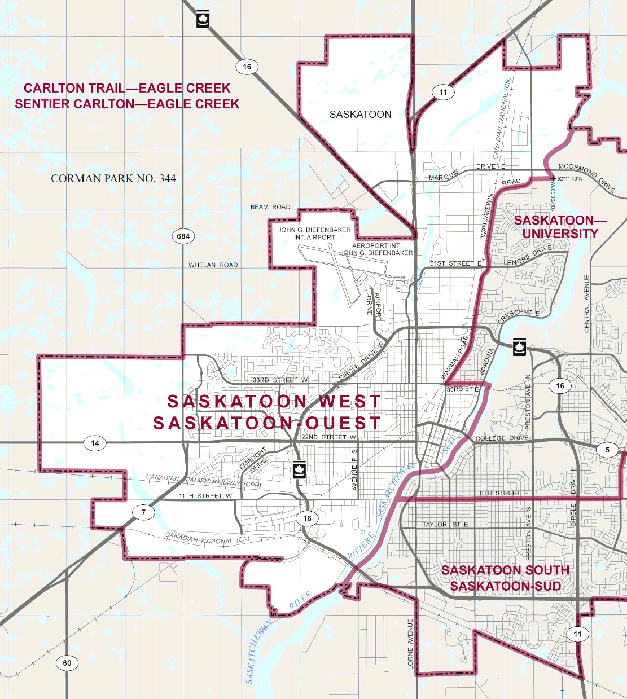
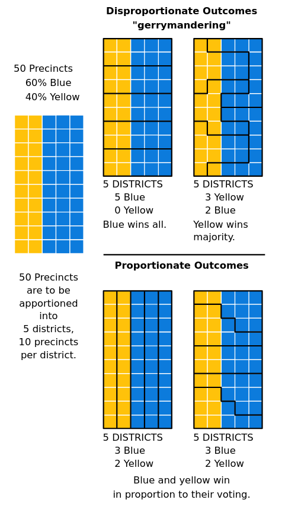

This page covers 1) common metrics and indicators used in urban analysis, 2) spatial units and measures of aggregation often used for urban analysis, and 3) limitations and biases for working with urban datasets to keep in mind when working with urban data.

## Common metrics and indicators for urban analyses

The table below lists examples of variables/metrics that are used in urban analyses, grouped by topic.

| Topic | Common metrics |
|--------|---------------|
| People / socioeconomics | - Population density (e.g., population per square kilometer) - Population change over time - Average household size - Median household income - % population from a given racial-ethnic category (e.g., % Asian) - % population from a given educational level (e.g., % with a high school degree) - # of crimes by census tract - % votes for a given party by riding (e.g. in [Toronto](https://schoolofcities.github.io/place-and-politics-toronto)) - [Displacement risk](https://www.urbandisplacement.org/maps/california-estimated-displacement-risk-model/) - [Social vulnerability index](https://www.atsdr.cdc.gov/place-health/php/svi/svi-interactive-map.html) - Inequality metrics (e.g., Gini index - [US](https://www.census.gov/topics/income-poverty/income-inequality/about/metrics/gini-index.html) & [Canada](https://data.worldbank.org/indicator/SI.POV.GINI?locations=CA)) - [Dissimilarity index of racial segregation](https://www.censusscope.org/about_dissimilarity.html) |
| Housing | - % owners vs. renters - % single family homes vs. multifamily homes - Median rent - Median home sale price per sq. ft. - Vacancy rate - Housing cost burden (share of income spent on housing costs) - Core housing need (housing suitability plus cost burden) - # of units built or permits issued over time or in a given neighborhood (e.g., [Canadian ADU analysis](https://schoolofcities.github.io/gentle-density/adu-development-in-canadian-cities); [market-rate housing in the Bay Area](https://www.urbandisplacement.org/blog/does-new-market-rate-housing-displace-low-income-people/)) - # of dedicated affordable housing units |
| Land use | - % change in land cover or forest area ([Toronto example](https://schoolofcities.github.io/historical-land-cover-toronto/)) - % of land zoned single-family vs. multifamily (e.g., [zoning policy changes](https://schoolofcities.github.io/gentle-density/toronto-rooming-houses); [residential zoning in Canadian cities](https://schoolofcities.github.io/yellowbelt-canadian-cities-2022/), [National Zoning Atlas](https://www.zoningatlas.org/)) - [Walk score](https://www.walkscore.com/) - [Entropy index](https://www.geographyrealm.com/calculating-land-use-mix-with-gis/) for land use |
| Economics / employment | - Job density overall or for a given industry sector - Location quotient ([definition](https://www.bea.gov/help/faq/478)) - % of jobs from a given occupation - % of jobs from a given industry sector - % of workers commuting in/out of a given boundary (commuting patterns) - [Venture capital investment by city](https://schoolofcities.github.io/venture-capital-canada/) - [Sales by sector downtown](https://docs.google.com/presentation/d/1hXiIEZ7L5KxM7x11Xdwf_JDRgLxap5kB/edit?slide=id.p20#slide=id.p20) - Downtown recovery post-pandemic (e.g., [trends](https://downtownrecovery.com/charts/canada_trends); [Urban Activity Atlas](https://schoolofcities.github.io/urban-activity-atlas/)) |
| Transportation | - % of people who commute via public transit vs. car (commute mode) - [% population within 1-km of a rail station](https://schoolofcities.github.io/rail-transit-and-population-density/) or [population near a given transit station](https://schoolofcities.github.io/tod-toronto-1996-to-2021/) (public transit accessibility) - [E-bike trip distance](https://schoolofcities.github.io/bike-share-toronto/efit-analysis) - % or number of bike share trips by neighborhood or dock station (e.g. [Bike share trips in Toronto](https://schoolofcities.github.io/bike-share-toronto/trips-062024)) - Density of traffic violations by street or by intersection (e.g. [Traffic violations](https://schoolofcities.github.io/king-street-toronto/traffic-violations)) - # of public electric vehicle charging stations by neighborhood ([US/Canada Alternative Fueling Station Data](https://afdc.energy.gov/stations#/find/nearest?fuel=ELEC)) - Pedestrian counts |
| Environment | - Prevalence of PM 2.5 by census tract (e.g. [Emissions/air pollution](https://schoolofcities.github.io/air-pollution-and-premature-mortality)) - Average temperature by census tract (e.g., [heat exposure in Toronto](https://schoolofcities.github.io/heat-vulnerability-toronto/)) - % population within 0.5-km from a public park (park accessibility) - % of land at risk of flooding in a given city or neighborhood (e.g., [Toronto](https://schoolofcities.github.io/flood-data-equity/); [FEMA](https://hazards-fema.maps.arcgis.com/apps/webappviewer/index.html?id=8b0adb51996444d4879338b5529aa9cd); [Canada](https://natural-resources.canada.ca/science-data/science-research/flood-mapping)) - % tree canopy coverage by census tract (e.g. [Toronto](https://schoolofcities.github.io/trees-toronto/dot-map), [U.S.](https://www.treeequityscore.org/map#3.72/37.22/-98.75) data) - # of census tracts that are Environmental Justice communities |
| Health | - Average life expectancy - Prevalence of chronic diseases by census tract (e.g., diabetes, asthma) - # of gun deaths over time |

## Common spatial units and measures of aggregation

Urban data is often linked to specific places. This is often called *spatial* or *geographic* data.

When analyzing spatial data, our analysis is often at the level of specific *spatial units* or *unit of aggregations*.  Sometimes our data is directly collected at these units, while sometimes it is useful to aggregate large datasets to these units to help analyses and visualizations. 

When working with urban data, it's essential to consider how geographic boundaries are defined. Standard units like census tracts or zip codes may not reflect actual community identities and are subject to change over time. 

Below are spatial units and types of encoding that are often used for collecting and analyzing urban data. 

In our notebook on [spatial data and GIS](notebooks/urban-data-analytics/spatial-data-and-gis/spatial-data-and-gis.md), we go into details on how different spatial data is structured, and how we can begin to view, explore, and analyze different data in GIS.

### Administrative or political boundaries

Political boundaries that delineate jurisdictions for different levels of government, from national down to local levels. Countries, provinces or states, counties, municipalities, electoral districts or city wards, and within cities, neighbourhood planning areas, are all examples of commonly used spatial units. 

### Census geographies

National censuses aggregate data to a variety of spatial units ranging in size, many are the same as administrative and political boundaries, as well as many smaller-geography boundaries that are super useful for urban- and neighbourhood-scale maps and analyses. Census tracts (usually in the range of 2,500 and 8,000 persons) and Dissemination Areas (400 to 700 persons) are two scales that are often used. Check out ([Statistics Canada documentation](https://www12.statcan.gc.ca/census-recensement/2021/geo/sip-pis/boundary-limites/index2021-eng.cfm?year=21), [U.S. Census documentation](https://www.census.gov/geographies/mapping-files/time-series/geo/cartographic-boundary.html)) or see our notebook on [Canadian census data](../canadian-census-data/canadian-census-data.md) for more information.

### Grids

A grid is repetitive tesselation spread across the surface of a map. Grids are used in spatial analysis when existing boundaries are unavailable, unsuitable, or when evenly sized, uniform areas are required. [Geohashes](https://www.ibm.com/docs/en/streams/4.3.0?topic=334-geohashes), which uniquely identify specific regions according to their latitude and longitude everywhere on Earth, are one type of commonly used grid. 

)](img/geohash.png)

Grids do not have to be 4-sided. Triangular and hexagonal grids are often used for some studies. Hexagon's are often recommended since they are the regular polygon with the most sides (i.e. can closest represent a circle), that can tesselate without any gaps.

### Streets

While streets are often added to maps to provide geographic context, streets can also be their own unit of analysis. For example, traffic flow could be measured on street segments throughout a city. In the image below, streets are coloured by how many parking tickets that they have.

)](img/toronto-parking-tickets.png)

### Addresses

Some urban data is measured or collected at the address level. For example, address of businesses, non-profits, or community facilities. To map them and compare with other spatial data, addresses are often *[geocoded](https://en.wikipedia.org/wiki/Address_geocoding)*, where their names are converted into geographic coordinates (latitude and longitude). See our [Spatial data and GIS](../spatial-data-and-gis/spatial-data-and-gis.md) tutorial for more.

 project](img/addresses-mississauga.png)

## Biases and limitations of spatial data

When collecting and analyzing data, it is important to verify the quality of the dataset. Some data is incomplete or has missing values, which can bias the results, especially if data from certain categories is missing disproportionately. For example, if income data is missing more often for lower-income individuals, the results may overestimate average income and under-represent vulnerable populations.

These are a few important sources of bias or limitations when working with spatial data that are super important to be aware of when working with data linked to places.

- *Self-reporting bias* which is when individuals report inaccurate information about themselves in a survey. This can be intentional (e.g., under-reporting income or over-reporting education) or unintentional (e.g., forgetting details). This can lead to biases in the final dataset and any subsequent analysis.

- *[Ecological fallacy](https://en.wikipedia.org/wiki/Ecological_fallacy)* is the phenomenon of drawing conclusions about individuals based on the group they belong to. For example, one might infer that everyone in a census tract with an overall high median income is wealthy. Although the median income is high, there may be low income residents who live in the tract who are not close to the median.

- *[Edge effects](https://en.wikipedia.org/wiki/Boundary_problem_(spatial_analysis)#Types_and_examples)*  in spatial analysis refer to the limitations or distortions that occur at the boundaries of a study area. They can bias results or reduce accuracy, especially when spatial patterns or processes extend beyond the area being analyzed. For example, let's say you were mapping access to healthy food in a city. Your map may show that one corner of your city does not have a grocery store, leading to a conclusion of it being a food dessert. But if you didn't consider grocery stores just outside the edge or boundary of your city adjacent to this corner, this may not be the case. 

- *[Modifiable areal unit problem](https://en.wikipedia.org/wiki/Modifiable_areal_unit_problem)* (MAUP) is another source of bias when working with spatial data. It is a form of statistical bias that results from the fact that changing the scale or shape of aggregation units leads to different results. [Gerrymandering](https://en.wikipedia.org/wiki/Gerrymandering) is a classic example of intentional MAUP to obtain specific voting outcomes. Check out the graphic below, we can see the results of how different spatial units are arranged would impact the overall results of an election. Overall, it is important to think critically when working with different spatial units to avoid misrepresenting data or cherry-picking results.

{width=50%}

