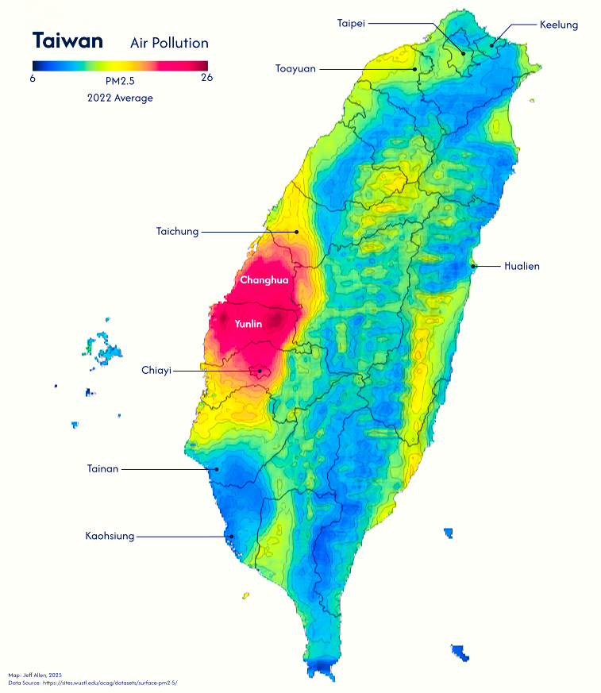
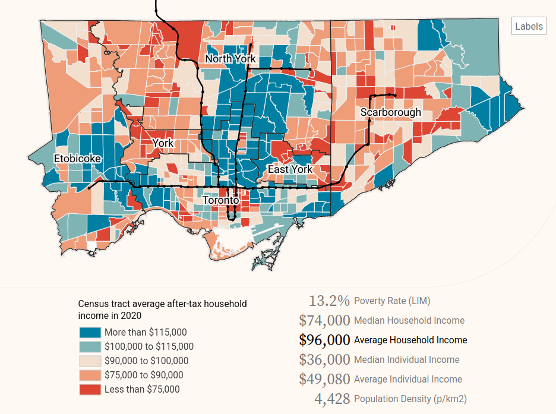
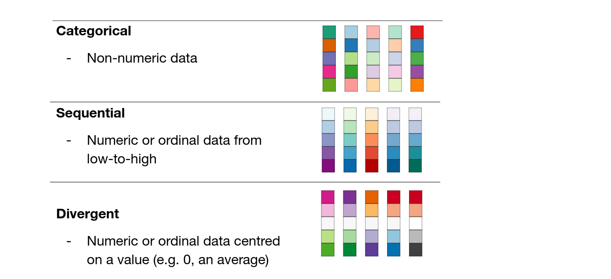
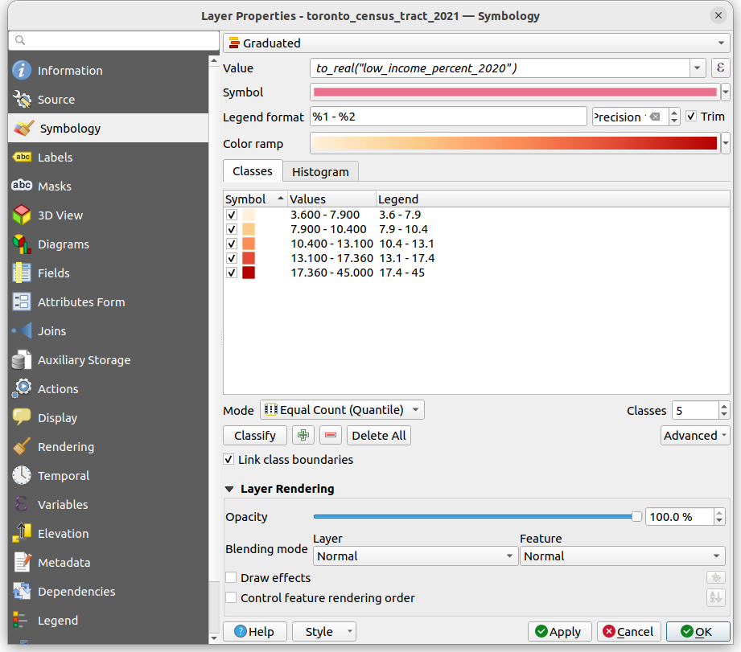
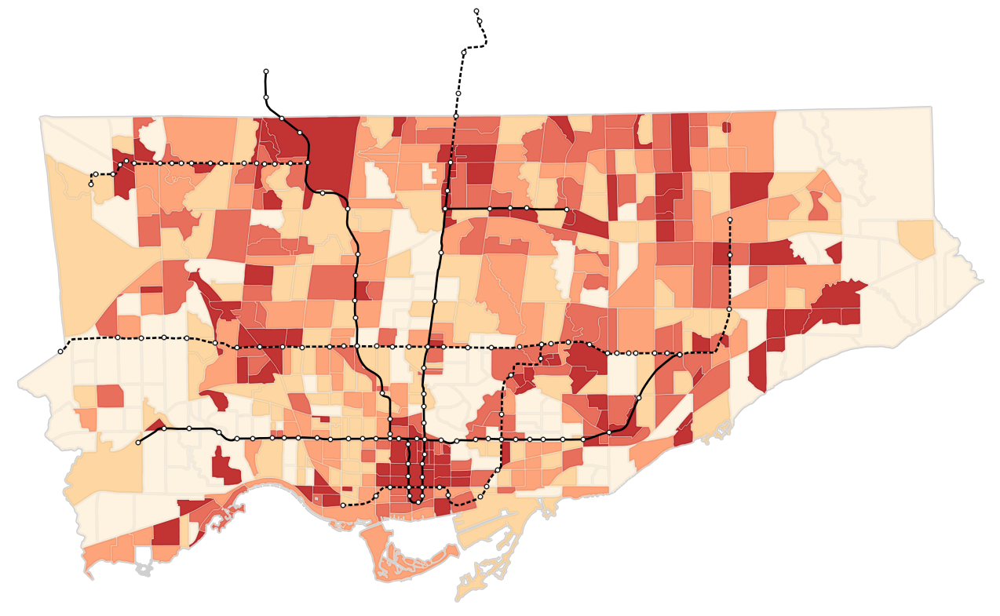

Choropleth maps use color to show how a variable changes across geographic areas — perfect for spotting patterns, trends, and regional differences at a glance. These are one of the most common types of thematic maps.

Here are a couple examples. 





This notebook will cover the base theory and show how you can make maps like these in QGIS


## Colour options

There are three main types of colour schemes for choropleth maps;  *categorical*, *sequential*, and *divergent*; each are best for different types of data, summarized in the image below.



With categorical colour schemes, each unique value in a column is given a unique colour and symbol. There should be some thought given to what colours to pick for which categories, and whether to group multiple categories as one colour (e.g. should parks and cemeteries be the same colour green?), but the steps to create a categorical map are straightforward. For example, in QGIS, right-click the layer, go to **Properties**, then **Symbology**, and then at the top there will be a dropdown where one of the options is **Categorical**. The below dropdown is the **Value**, which is the column in your data that you want to use to define the style of your data.

With sequential and divergent colour schemes, there are a couple extra design and classification steps to follow. The first is whether we want to *group* (or *bin*) our numeric data or whether we want a *continuous* colour scheme. 


With ordinal data, having distinct colours is the default choice, but if your data are integers or floats, then you need to  choose whether to represent continuously or to “bin” the data. Here are quick benefits and drawbacks of each.

*Continuous choropleth* (e.g. smooth gradient):

- Best for showing gradual variation across space
- Shows fine-grained variation, highlights subtle spatial patterns
- Great for dense, relatively evenly distributed data
- Avoids arbitrary cutoffs

*Grouped choropleth* (e.g. classified into ranges)

- Best for simplifying or comparing groups
- Easier to interpret and compare regions
- Useful for highlighting thresholds (e.g. income brackets), enables meaningful grouping or policy categories
- Cleaner, more readable legends
- Downside are that cutoffs can skew legibility (e.g. if a cutoff is at 20 and 40, a 21 and 39 are the same colour, but 19 and 21 are different)

The choice depends on your data, research goals, story, and audience.


## Classifying data

If we choose to bin or group our numeric data, we have a further set of choices to make: how do we define the breaks between groups? The method used to define these breaks affects how patterns appear on the map. Here are some of the most common ways to define these breaks:

*1. Equal Interval*

- Divides the data range into equal-sized intervals.
- *Pros*: Simple to understand. Good when data is evenly distributed.
- *Cons*: Can mislead if data is skewed. Many values may fall into a few groups and some might even be empty.

```
|--   |---- |--- -|-----|-   -|
0    20    40    60    80   100
```

*2. Quantiles*

- Each group contains an equal number of data points.
- *Pros*: Ensures each group is populated.  Great for comparing relative rankings.
- *Cons*: Class ranges can be uneven. Can exaggerate small differences.

```
|--    ----| --- - --|-----   -|
0         38        70       100
```

*3. Natural Breaks*

- Uses an algorithm (e.g. Jenks) to find class breaks that best group similar values and maximize differences between classes.
- *Pros*: Reflects natural groupings in data. Often produces intuitive classes.
- *Cons*: Not consistent across datasets. Harder to explain to non-experts.

```
|--  | ---- --- | - ------- | -|
0    18        55          90  100
```

*4. Manual / Custom*

- User-defined class breaks based on domain knowledge or design reasons (e.g. to have nice rounded numbers).
- *Pros*: Tailored to specific needs. Can align with thresholds of interest. Can be easier to read.
- *Cons*: Can introduce bias. Less replicable.


## Choropleth maps in QGIS

[Click here to download the data for this section](data.zip)


### With vector data

Let's try to make a map in QGIS! We'll try to make a map of Toronto showing the percent of people who live in low-income households by neighbourhood relative to major transit lines.

First, let’s look at the data. We have a polygon layer which represents census tracts. These data are created by Statistics Canada to share aggregated data from  the [Canadian census](../../urban-data-analytics/canadian-census-data/canadian-census-data.md). They approximately correspond to neighbourhoods.

We have a `.csv` table which contains data linked to the unique identifier, `ctuid`, of each census tract (CTUID stands for Census Tract Unique ID) . We can use the `ctuid` to join this tabular data to the spatial boundaries of census tracts. When working with census data or many other data sources, it is quite common that our data do not come prepared as a single data set. We often have to *join* data from multiple tables or sources like this. (For more details about *table joins*, check out our [data processing notebook](../../urban-data-analytics/data-analytics-and-processing/data-analytics-and-processing.ipynb)).

To do the join, we first add the table as a layer into QGIS. Then open up the **Properties** of the census tract polygon layer, and go to **Joins**. Add a new join (the **+** at the bottom), using `ctuid` as the source and target fields. Once complete, we can open up the attribute table and see these additional columns.

Lastly, we also have a line layer representing major transit lines in Toronto (originally sourced from Metrolinx). We can categorize line data by status, using different colours or line types to display whether the transit route is existing or under construction.

We can now visualize the census tract polygons as a choropleth map (maps where polygons are shaded by numeric attribute values). Similar to the previous tutorial, open up the layer properties, go to **Symbology**, and style based on **Graduated** symbols.

(Beware that a numeric column can sometimes get imported as a string in QGIS. To convert the string back to a number to visualize it, click on the **ε** on the top-right, and use the to_real() function to convert to a numeric value)



Here's the map with the transit lines and stops layered on top (with the transit lines classified categorically based on their `Status`).



**Try to update the map to use Natural Breaks or Equal Intervals. Also try out different colours!**

**Try to update the map to use Natural Breaks or Equal Intervals** (you can change the break types using the ‘Mode’ drop-down menu, or increase/decrease the total number of classes). **Also try out different colours!** Notice how the output changes when you do so.

Choropleth maps are great for showing a rate or a density (in terms of people per area) or a statistic such as an average, but they are not always ideal for representing a count or total. For example, if we mapped just the total number of low-income residents by neighbourhood, it could exaggerate counts in larger areas relative to smaller areas.


### With raster data

Let's now try to colour a raster layer to make a choropleth map. The example data we have is the same air pollution raster used to make the map of Taiwan at the top of this page.

Start off by opening up this layer in QGIS. It will likely default to a white-to-black (i.e. grayscale) colour scheme based on the values in each cell of the raster. This is already a choropleth map! But if we want to update the colours and the way the data are being classified, we can **right click on the layer**, go to **Properties**, then **Symbology**, and then pick **Singleband pseudocolor**. Once you have selected your options, click **OK** in the bottom-right.


Here we have lots of options to tinker with, including ...

- **Color ramp**, for selecting the colour gradient
- **Interpolation**, for whether we want continuous or discrete (i.e. group) colours
- **Mode**, for our classification scheme

**Try to update the map to show 5 equal interval groups and a blue-to-red divergent colour ramp.**


## Choropleth maps in Python

If you're interested in learning more about creating single-variable choropleth maps in Python, including how to classify data, check out the Geographic Data Science textbook's [chapter](https://geographicdata.science/book/notebooks/05_choropleth.html) on the topic. 

If you're interested in creating bivariate choropleth maps, maps that show correlations between two variables like income and population density on the same map, check out our [bivariate choropleth map tutorial](../bivariate-choropleth-maps/bivariate-choropleth-maps.ipynb)

You can also refer to the `geopandas.GeoDataFrame.plot` [documentation](https://geopandas.org/en/stable/docs/reference/api/geopandas.GeoDataFrame.plot.html) for more information on how to quickly visualize spatial data in Python.