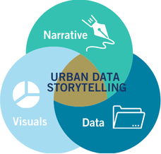
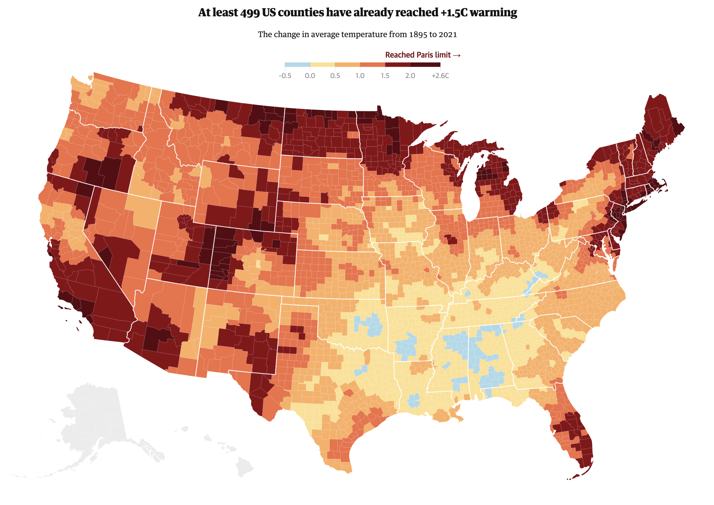
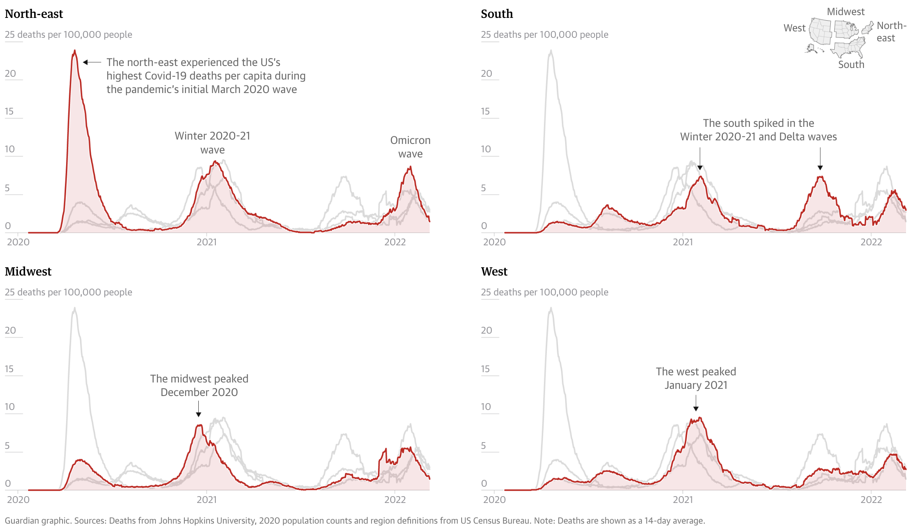

[📥 Click here to download this document and any associated data and images](/downloads/data-visualization.zip)

 

Data visualization is the graphical representation of information and data. By using visual elements like charts, graphs, and maps, data visualization tools help people understand patterns, trends, and outliers in data. At its core, data visualization translates abstract numbers into something visible and intuitive, helping our audiences better understand what the data is telling us.

We live in a world increasingly shaped by data – from climate change and public health to business performance and social media behavior – however, raw numbers alone are difficult to interpret. Visualizations help bridge that gap by making data more accessible, understandable, and actionable. It’s not just about making things look good, it’s about making data make sense.

"The simple graph has brought more information to the data analyst’s mind than any other device. It specializes in providing indications of unexpected phenomena." – [John Tukey](https://en.wikipedia.org/wiki/John_Tukey)

## Why visualize data?

We visualize data to help us understand it better. When we turn numbers into pictures like charts or graphs, it becomes easier to see patterns, trends, or problems. Broadly speaking, visualization can serve two major goals:

1. *Exploration* – Using charts to help make sense of the data. It helps you find interesting things or answer questions
2. *Communication* – Using visuals to help other people understand what you found in the data

These goals are not mutually exclusive. The best data work is iterative. We often begin by visualizing data to explore patterns, test ideas, and uncover insights. Once we have made sense of the data ourselves, we can use visualizations to communicate key findings, tell a compelling story, or make a case for action. Whether the goal is understanding, persuasion, or advocacy, good data visualization helps bridge the gap between raw information and meaningful insight.

Visualizing data is ultimately about communication and striking the right balance between analysis, design, and narrative. To share data in a clear and meaningful way, it helps to think through this data storytelling framework:

1. *Data Analysis*: What does the data tell us? What patterns or relationships matter?

2. *Visualization*: How can this data be represented graphically to communicate findings effectively?

3. *Narrative*: What story does the data tell? What’s your argument or takeaway? Who is your target audience?

This framework helps situate visualization as part of a broader storytelling or decision-making process. Whether you are creating a data story with multiple visuals or a single chart for a report, it is important to keep all of these things in mind. The purpose behind your visualization determines everything from the chart type you use to the level of detail, annotation, and tone you adopt.

## Data visualization for exploratory analysis

Before we share our findings with others, we often need to make sense of the data ourselves. This is where exploratory data analysis comes in. This is the process of visually investigating datasets to uncover trends, spot anomalies, test hypotheses, and surface insights that might otherwise be hidden in raw numbers or tables. 

Visualization during this stage can reveal unexpected patterns and outliers, correlations and clusters, distribution shapes, and data quality issues. 

It also helps uncover relationships that summary statistics alone might obscure. The exploratory process is typically iterative and often messy, with charts not needing to be beautiful, but instead, informative. Quick plots, heatmaps, and scatterplots are all useful tools in this phase, enabling a deeper understanding of the data before any formal analysis or presentation.

Even datasets with identical statistical properties can convey vastly different stories when visualized. A perfect example of this is [Anscombe’s Quartet](https://en.wikipedia.org/wiki/Anscombe%27s_quartet), a set of four datasets that have nearly identical means, variances, and correlation coefficients, yet their graphical representations reveal dramatic differences. This illustrates the importance of visualizing data, rather than solely relying on summary statistics, as the true patterns and relationships may be hidden within the numbers themselves.

## Data visualization for communication and storytelling

Once we’ve explored the data and identified key findings, the next step is to share these insights with others. Data visualization becomes a powerful tool for communication, helping us inform, engage, and persuade different audiences. In this context, visualization is not just about showing data, it’s about *shaping understanding* and sometimes even *inspiring action*.

Data stories combine charts and text to walk the audience through a narrative arc. These stories often include:

1. *Context* – What’s the issue or question?
2. *Data* – What patterns or evidence are we seeing?
3. *Insight* – Why does it matter?
4. *Action* – What should happen next?

Good data visualizations and stories often zoom in and out to show both the big picture and key details while guiding the audience with clear visual hierarchy and annotations.

In advocacy contexts, data visualizations are used to support arguments, influence policy, and raise awareness. The visual design here should support the clarity and urgency of the message while still being transparent and truthful.

### Designing for specific audiences

Not all data visualizations are created for the same audience or communication goals. Some are meant to be read in detail (like charts in a policy report), while others are intended to create an emotional impact at a glance (like a billboard or social media graphic).

For example, a line chart depicting global temperatures over time provides nuance and precision, making it an excellent choice for scientists and analysts.

Alternatively, [warming stripes](https://en.wikipedia.org/wiki/Warming_stripes), a minimalist visualization uses a simple color gradient to represent temperature changes. This approach communicates the same pattern but in a more striking and emotionally impactful way, making it highly effective for public engagement and advocacy.

## Data visualization theory

A well-designed visualization isn’t just about making data look good – it’s about making it understandable, accurate, and accessible. This often requires a base understanding of how we encode data visually, how the human brain processes that information, and how to make charts function well across different audiences and mediums.

### Visual variables

At the heart of every chart or graph is visual encoding: the transformation of data into visual elements. Each variable in your dataset must be “mapped” to a visual channel, often called a *visual variable*. The effectiveness of these visual encodings depends on what type of data you’re working with.

](img/BertinVariables.png)

### Perception and cognition

Effective data visualization leverages our brain’s innate ability to rapidly process certain visual elements. This phenomenon, known as *preattentive processing*, allows viewers to quickly and effortlessly identify certain patterns, contrasts, and structures without conscious effort. 

This allows us to instantly spot outliers, notice trends and clusters, and recognize visual hierarchies.

Key preattentive features include color, form, orientation, and size. For example, we can quickly distinguish a red circle among blue circles (color) and identify a square amidst a group of circles (form). These features are processed so swiftly and effortlessly that they can influence our perception and understanding of visual information without conscious effort.

Even when designing a table for a slide deck or a report, you can use the theory of preattentive processing to pick a visual variable to focus your readers attention on specific data points that are important to your story.

)](img/PreattentiveProcessingTable.png)

Via preattentive processing, we can guide viewers’ attention efficiently, enhance comprehension, and reduce cognitive load.

### Perceptual Rankings

*Perceptual Rankings* help explain why some encodings are easier to interpret than others. Not all visual variables are equally effective.

You may have noticed that in the scatter-plot example in the previous section, that it is generally easier to pick out a red circle among a group of blue circles rather than a blue square among a group of blue circles.

Research has established a hierarchy of visual channels based on their accuracy and ease of interpretation:

Understanding these perceptual principles ensures that visualizations communicate information clearly and intuitively, aligning with how viewers naturally process visual stimuli.

For example, based on this research, position on a common scale is easier to interpret than size or area for quantitative data. Comparing volumes is also relatively difficult. This leads to two recommendations...

- Avoid pie charts (especially for more 3 categories) since they can be less effective than alternatives (e.g. bar charts)
- Avoid 3D charts in most cases because they tend to over-complicate, be difficult to read, and add extra visual clutter compared to 2D alternatives

### Visual accessibility

Your data visualizations should be readable by everyone, which means thinking beyond aesthetics and into the realm of inclusive design. 

For charts and maps, there are two main things to consider

1. Using colourblind safe colours. Tools, such as [ColorBrewer](https://colorbrewer2.org) can be used to pick safe colours. There are also [tools for uploading images](https://www.color-blindness.com/coblis-color-blindness-simulator/) (e.g. of a chart or a map), and test how it is viewed for different types of colourblindness. Highly recommend using this for any graphics that will appear in publications

2. Using adequate font sizes and making sure there is adequate level of contrast between foreground and background, especially with text. The greater the contrast between the foreground and background, the easier it is to read. For text, keep in mind that font size plays a significant role: smaller fonts require even higher contrast between the text color and background to maintain readability. There are online [tools for checking contrast ratios](https://webaim.org/resources/contrastchecker/) between background and foreground that are useful for design.

## Chart components

Strong visualizations depend not just on the data and encodings, but on thoughtful framing. The supporting elements of a chart provide clarity and context. 

Thinking about and directly designing each of the different components of a chart, rather than just using the defaults of a software (e.g. what a chart in `Excel` or a `Python` library will give you initially), will go a long way in making effective graphics. The graphic below shows the components commonly used when constructing a chart. Try to think about the design of each of these components in your own charts. If it doesn’t clarify the data and story, it probably distracts, and it's probably best to either remove or de-emphasize it.

## Practical tips for effective data visualization

A strong visualization can make complex data accessible; however, without care, the message can get lost. Great visualizations balance clarity, precision, and aesthetics. This section offers practical tips and guiding principles to elevate your data visualizations.

Note that these are general recommendations and rules of thumb, not rules that you must follow 100% of the time! Data visualization is a combination of technical, design, and artistic skills, and there are often exceptions to the rules :)

### Hierarchy in graphics and stories

Guide the viewer’s eye by creating a hierarchy between background and foreground. Your key message should be the focus and highlighted while everything else (axes, grid-lines, background elements) should support and not compete with it.

- Bold or highlight key data points.
- Use size, contrast, and colour to signal importance.
- De-emphasize secondary elements like gridlines, minor tick marks, or axis labels

For example, the line chart in the image above has a strong visual hierarchy between the key data points it wants to show (e.g. the lines for Sweden, the E.U., and Ireland) relative to the rest of the chart components.

When guiding your readers through a story with a series of visualizations, sometimes it is useful to follow a Data Visualization Sandwich metaphor:

This is very similar to journalistic styles of writing, “don’t bury the lead” and “bottom line up-front”.

Let’s look at an example. This is a map of the United States from an article by the [Guardian](www.theguardian.com/environment/2022/feb/05/americans-above-average-temperature-increase-climate-crisis) on how the USA is facing above average rises in temperatures. This map acts as the Patty – it draws the attention of the reader and introduces the topic of the article.

The article then takes a deeper look at specific counties that have experienced significant temperature increases via a table:

Finally, this visual, which could be considered a patty or bun, helps illustrate the temperatures across U.S. states. It also includes a “topping” – an annotation over California that highlights how the entire population has experienced a temperature increase since 1895.

### De-clutter and high data-ink ratio

Coined by [Edward Tufte](https://en.wikipedia.org/wiki/Edward_Tufte), the data-ink ratio refers to the proportion of visual elements that represent actual data, rather than decoration, relative to all 'ink' on the chart.

In other words, this is about reducing clutter and focusing graphical elements of a chart on the data.

Here are a few recommendations for reducing clutter and increasing data-ink ratios:

- Remove non-essential "chartjunk" (3D effects, background shading, unnecessary gridlines, borders).
- Use direct labels instead of relying on legends.
- Choose simple chart types unless complexity is truly needed.
- Use subtle formatting of reference information like gridlines to keep the audience focused on the data itself.
- Avoid overuse of colors, labels, and gridlines.
- You don't need to visualize every possible variable or data point, focus on the story you're trying to tell.
- Group or collapse less important data to simplify interpretation.
- Whitespace is your friend

Here's an example of a visualization of COVID-19 deaths from [The Guardian](https://www.theguardian.com/us-news/2022/mar/13/how-covid-shook-the-us-charts-graphs) that has limited visual clutter and strong hierarchy.

### Design for your output

Effective visualization isn’t one-size-fits-all. Always consider where and how your work will be seen. Tailor your design choices to the medium and the audience:

- *Print vs digital*: Pick fonts, line weights, and colors that are clear at the specific resolution and/or paper size that you are designing for. What works on a low-resolution screen may not translate well to paper. 

- *Presentations vs. reports*: Slides call for bold, minimal visuals with large text and fewer details. Reports allow for more complexity and written explanation.

- *Social media*: Prioritize clarity at small sizes. Expect compression and low resolution and keep text minimal and legible.

- *Audience expertise*: Technical audiences may appreciate complex charts and granular data. Broader or non-expert audiences often benefit from simpler visuals, clear labeling, and guiding annotations.

If you design a chart to fit within a specific medium (e.g. mobile view on a screen), it's recommended you redesign the chart if you want to have it in a different context (e.g. printed in a report). This is to prevent fonts being resized so they are no longer legible, graphics losing resolution and becoming fuzzy, or distorted if they are resized.

### Brand guidelines

If you’re creating visualizations within an organization or for a specific campaign, it’s important to follow established brand guidelines. 

This includes using approved typefaces, colors, and logos, and aligning your visuals with the tone and messaging of the broader content. 

Maintaining visual consistency across all charts, graphics, and reports reinforces brand identity, leads to more cohesive products, and builds recognition with your audience.

### Annotations

Great charts don’t always speak for themselves. Use clear titles, subtitles, and axis labels. Add callouts or annotations to highlight patterns or anomalies. You can guide the reader to your takeaway rather than leaving it to interpretation.

### Choosing charts based on your data

Match the visualization to the type of data and the message you’re trying to convey. Here's a quick overview of very common charts for different types of data:

Choosing the right chart type is essential to making your data clear, compelling, and truthful. While there’s no single “correct” choice for every scenario, understanding your data and communication goals will help you select a format that highlights the story you want to tell. Whether you’re comparing categories, showing trends over time, exploring distributions, or revealing relationships, each chart type has strengths and limitations. 

For a deeper dive into chart selection, visit [From Data to Viz](https://www.data-to-viz.com/), a comprehensive, visual guide that helps you choose the most appropriate chart based on your data structure and communication goals.

