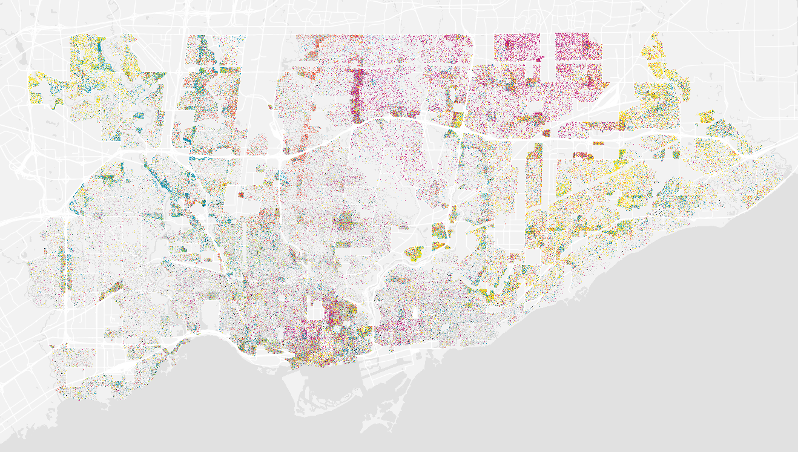
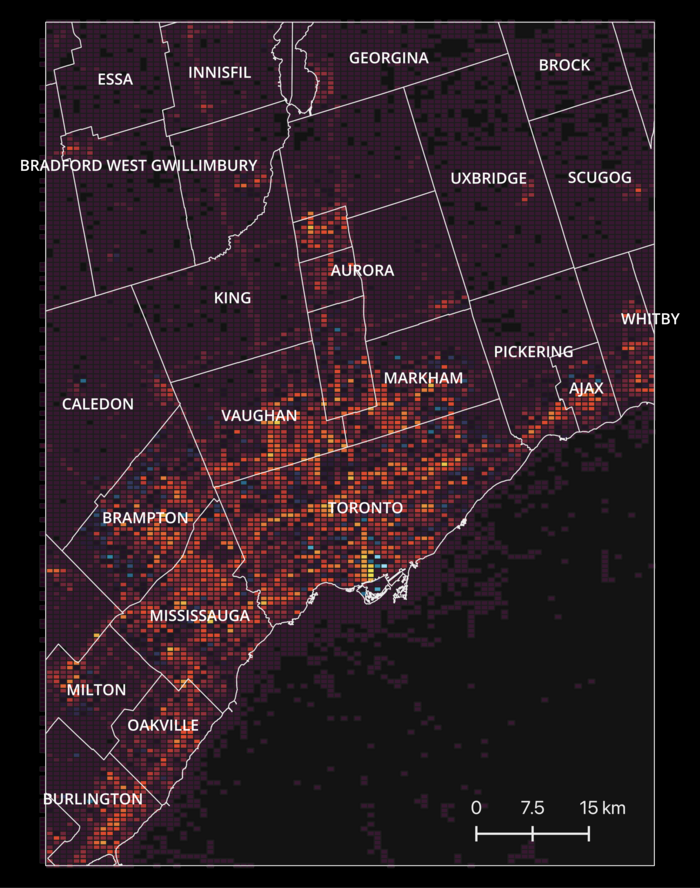
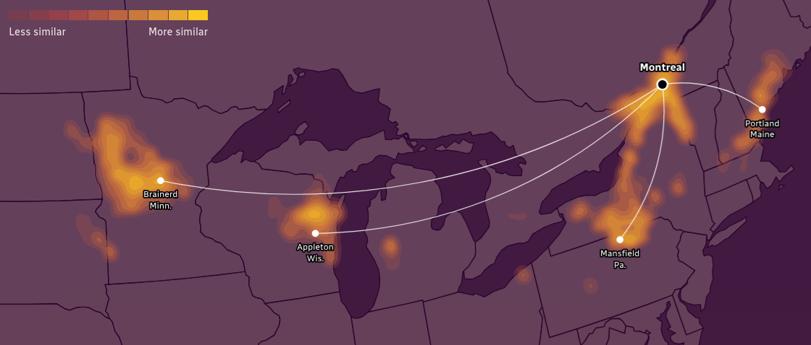
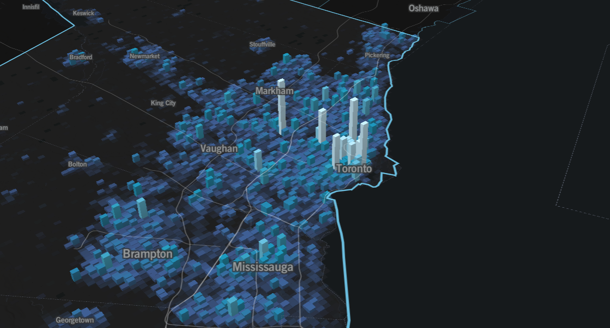

**[📥 Click here to download this document and any associated data and images](/downloads/visualizing-and-mapping-density.zip)**

This section will cover:

- Different methods for mapping density, including: dot/point maps, binning data to grids/hexagons, contour maps, heat maps, and 3D bins/grids
- Trade-offs, advantages, limitations, and considerations in determining what density mapping approach to use

## Why map density?

<small>Source: [School of Cities](https://schoolofcities.github.io/dot-density/)</small>

Take a look at this map of Toronto: it's obvious at first glance that some parts of the city are different than others. This is a map of people in Toronto shown through dots (per 10 individuals). It tells you where people live, and in doing so, shows us that some areas in spatial geography are different from others.

Mapping density is a way for us to go beyond how much of something there is, to know where it is distributed geographically. It lets us go beyond a simple table of numbers to see the density of events like collisions, 311 requests, or trees, to reveal clusters and gaps.

At the same time, density maps come with challenges. Overcrowded dots might give the impression of overwhelming density, while a smooth heat map and obscure key local variation. In other words, the map choice matters: different conclusions can be drawn from different representations.

## Methods for mapping density

### Dot/Point Maps

<small>Source: [School of Cities](https://schoolofcities.github.io/dot-density/)</small>

### Binning Data to Grids/Hexagons

<small>Source: [School of Cities](https://schoolofcities.github.io/urban-activity-atlas/exploring-hourly-activity-toronto)</small>

### Contour Maps

<small>Source: [CBC](https://newsinteractives.cbc.ca/features/2025/climate-matches/)</small>

### Heat Maps

### 3D Bins/Grids

<small>Source: [School of Cities](https://schoolofcities.github.io/urban-activity-atlas/?metro=toronto_on)</small>

## Choosing the right density map
