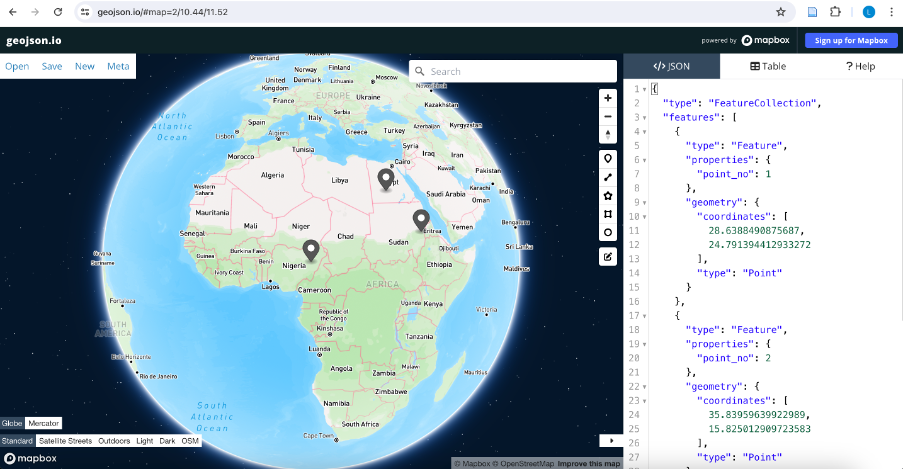

**[📥 Click here to download this document and any associated data and images](/downloads/webmaps.zip)**

<br>

Web maps are great for allowing users to explore and interact with spatial data on their own terms. They are openly accessible, eliminating the need for specialised software during development and GIS expertise for interpretation.

In this tutorial, you will learn basic web programming and web map development using the [MapLibre GL JS library](https://maplibre.org/maplibre-gl-js/docs/).

Both an example web map and supporting code can be found here:

- https://smith-lg.github.io/webmap-demo/
- https://github.com/smith-lg/webmap-demo/

## Basic web development

In order to build an interactive web map, it’s helpful to learn some basic web programming skills. To construct the client-side architecture (the interface the user interacts with), we can use three coding languages:

- HTML
- CSS
- JavaScript

A text editor serves as an ideal development environment – I like to use [Visual Studio Code](https://code.visualstudio.com/download) for its auto-completion features.

Within Visual Studio Code, set up the following three files in Visual Studio Code a new empty folder.


### HTML

HTML acts as the backbone of our webpage, relying on *tags* to structure the elements that are included on the page.

Helpfully, Visual Studio Code offers shortcuts and prompts to streamline our coding. For example, typing **“!” and hitting enter** generates a basic HTML boilerplate. The boilerplate code includes key tags `<head>` which holds metadata and links to external resources, and `<body>` where the main content resides.

```html
<!DOCTYPE html>
<html lang="en">
<head>
    <meta charset="UTF-8">
    <meta name="viewport" content="width=device-width, initial-scale=1.0">
    <title>Document</title>
    <link rel="stylesheet" href="style.css">
</head>
<body>

    <script src="script.js"></script>
</body>
</html>
```

Let’s add some simple tags to get started. **Within the `<body>`, add a heading, text, and button**. For an understanding of the range of tags that are available, take time to explore alternative options on [w3schools](https://www.w3schools.com/tags/default.asp). We’ll be using a `<div>` tag, for example, as a container for our map.

```html
<h1>This is a heading</h1>
<p>This is a paragraph.</p>
<button id = "my-button">Click me!</button>
```

You can view your webpage in the browser by rightclicking on `index.html` in the navigation tree and selecting **Open in default browser**. You may need to add the extension 'Open in browser' within Visual Studio Code. Alternatively, find your `index.html` in your file explorer and select **Open with > Browser**.
<br>

### CSS

CSS is responsible for adding styling to our webpage and controlling layout. For example, we can apply colours, positioning, fonts etc to our HTML elements using CSS. Again, [W3Schools](href="https://www.w3schools.com/css/default.asp") is a great resource to get you started and provide you with an idea of the different properties you can update.

```css
body {
    background-color: lightblue;
    }

h1 {
    color: white;
    text-align: center;
    }
                      
p {
    font-family: verdana;
    font-size: 20px;
    }
```

To apply styling to HTML elements, we use *selectors* (the value preceding the curly braces) in CSS rules. These tell the browser which elements the style rule applies to. The rules inside the curly braces provide *style properties*. 

Setting an element name (e.g., p) as a selector will apply styling to all `<p>` elements across our webpage. 

However, there are scenarios where we may want to target a specific element uniquely for styling purposes. In such cases, we can assign the element an **id** in HTML (e.g., `<p id="unique-para">`) and use a **#** adjacent to our selector in CSS.

Similarly, if we have multiple elements requiring common styling, we can add a **class** to the HTML elements (e.g., `<p id="para-class">`)* and then refer to the class using **dot notation** in CSS.

```html
<p>This is a paragraph. All paragraphs use Verdana font at size 20.</p>

<p id="unique-para" class="para-class">
    This is a separate paragraph. In this case, text will be bold and centred.
</p>

<p class="para-class">In this final paragraph, text will be centred but not bold<p>
```

```css
#unique-para {
    font-weight: bold;
    }
                    
.para-class {
    text-align: center;
    }
```
<br>

### JavaScript

JavaScript is what brings our web page to life. It allows us to build in interactivity, for example, by writing functions that are fired following an event in the browser (e.g., a page load or user mouse click).

For today, we’ll just get started with some basics, although I recommend the Codecademy course [Learn JavaScript](https://www.codecademy.com/learn/introduction-to-javascript) to help deepen your knowledge.

```javascript
// Variables
const placename = "Toronto"; // Value cannot be reassigned
let year = 2024; //Value can be reassigned if needed

// Arrays
let coords = [-79, 43]

// If statements
if (year > 2020) {
    console.log("Year is greater than 2020");
    }

// For loops
for (let i = 0; i < 5; i++) { // 3 args: Initial value i, condition to be met for iteration of loop, increment value i
    console.log("Loop " + (i + 1));
    }

// Functions
function message(home) {
    return "I live in " + home;
    }

    let mytext = message(placename);
    console.log(mytext);
```

*Open the Console via Dev Tools to view the console.log() output. This is a helpful way to test and de-bug!*

### Event Handlers

Event handlers are functions that are executed in response to events occurring in the browser. 

For example, the JavaScript code below shows how a click of a button by the user triggers an event which in turn evokes a function to update text for HTML element  `<p id = "update-text">`.

To build the event handler, we first make reference to the HTML elements using the **getElementById** method, next we add an **event listener** to the button’s **click** event and lastly, we include a callback function **() => {}** for the desired action.

```javascript
const myButton = document.getElementById("my-button");
const updateText = document.getElementById("update-text");
let clickCount = 0;

myButton.addEventListener("click", () => {
    clickCount++;
    updateText.textContent = "You clicked me! " + clickCount + " times";
    });
```

## Web mapping API: MapLibre

Ok, so now we know the basics of building a web page, let’s have a go at developing a web map!

There are a range of different mapping APIs that can help us with this (e.g., [Leaflet](https://leafletjs.com/), [OpenLayers](https://openlayers.org/),  [CARTO Maps](https://carto.com/blog/creative-maps-carto-js-4), [D3](https://mappingwithd3.com/), and [MapLibre](https://maplibre.org/maplibre-gl-js/docs/)). APIs are essentially libraries that have predefined functions to help us do fun things like add our own data layers, listen out for HTML or map events, and respond by filtering data, showing pop-ups etc. Often, working with an API is a case of identifying existing functionality within documentation and adding in your own parameters to suit your data and needs.

We will use **MapLibre GL** which is an opensource alternative to Mapbox offering a comparable range of methods and classes. I encourage you to explore the documentation – the [API pages](https://maplibre.org/maplibre-gl-js/docs/API/), particularly the [methods for the map object](https://maplibre.org/maplibre-gl-js/docs/API/classes/Map/#methods), and the [examples](https://maplibre.org/maplibre-gl-js/docs/examples/) can be super helpful.

To get started, update the code in each of your files:


1. HTML:
- Add [CDN](https://maplibre.org/maplibre-gl-js/docs/#cdn)CDN links to the MapLibre GL JS package in the `<head>` tag
- Add a `<div>` tag with ID in the `<body>` tag – this will be the container for our map

```html
<head>
    <meta charset="UTF-8">
    <meta name="viewport" content="width=device-width, initial-scale=1.0">
    <title>My webmap</title>
    <link rel="stylesheet" href="style.css">
    <script src='https://unpkg.com/maplibre-gl@latest/dist/maplibre-gl.js'></script>
    <link href='https://unpkg.com/maplibre-gl@latest/dist/maplibre-gl.css' rel='stylesheet' />
<body>
    <div id='map'></div>
    <script src="script.js"></script>
</body>
```
<br>

2. CSS:
- Add style properties to map ID selector to position map so that it fills the browser window

```css
#map {
    position: absolute;
    top: 0;
    bottom: 0;
    width: 100%;
    }
```
<br>

3. JavaScript
- Initialise the map object

```javascript
const map = new maplibregl.Map({
    container: 'map', // container id
    style: 'https://demotiles.maplibre.org/style.json', // style URL
    center: [0, 0], // starting position [lng, lat]
    zoom: 1 // starting zoom
    });
```

**Take a look at your map in the browser!** This is a good starting point but ideally we want our basemap to suit our map scale, data, and purpose. 

Let's update the demo basemap provided by MapLibre to a CARTO basemap and position the starting view position and zoom level of our map.

```javascript
const map = new maplibregl.Map({
    container: 'map', // container id
    style: 'https://basemaps.cartocdn.com/gl/positron-gl-style/style.json', // style URL
    center: [-105, 58], // starting position [lng, lat]
    zoom: 3 // starting zoom
});
```

Now let's start making use of the *MapLibre API*.

## Add map controls

```javascript
map.addControl(new maplibregl.NavigationControl());
```

## Add a data layer

GeoJSON files work well for web development and we can easily access attribute and geometry properties. 

If you're not familiar with GeoJSON files, have a go at creating your own using https://geojson.io/ to plot some different geometry types and add data properties and values. Notice how the text structuring of the file updates as you make edits. 

You can also create GeoJSON files by exporting them using GIS desktop software such as QGIS. Just be mindful that we don't want our files to be too large as this will limit the time it takes for our web page to load. If you have a GeoJSON with a large number of nodes, you may find tools such as 
https://mapshaper.org/ helpful for simplifying your geometries and reducing file size.



To add data to our web map, we first want to use the [addSource](https://maplibre.org/maplibre-gl-js/docs/API/classes/Map/#addsource) method to access our data. Here, we will need a url to fetch our GeoJSON. Having a GeoJSON stored in an online GitHub repository is a good way to do this.

Once we have our data source, we can use the [addLayer](https://maplibre.org/maplibre-gl-js/docs/API/classes/Map/#addlayer) method to visualize our data. Here, there are a range of arguments we can include. We must have an **id** and **source**, and our **type** must be appropriate for our geometry *(e.g., fill = polygon, point = circle)*. 

Additional paint and layout properties allow us to customize the appearance of our data. The maplibre layer [style spec](https://maplibre.org/maplibre-style-spec/layers/) details the possible arguments.

I've added these methods inside a map load event handler (which is similar to our button event handler above) so that they are fired after the map finishes loading.

```javascript
map.on('load', () => {
    map.addSource('canada-provterr', {
        type: 'geojson',
        data: 'https://raw.githubusercontent.com/smith-lg/ggr472-wk6-demo/main/data/can-provterr.geojson', //Link to raw github files when in development stage. Update to pages on deployment
        'generateId': true //Create a unique ID for each feature'
        });

    map.addLayer({
        'id': 'provterr-fill',
        'type': 'fill',
        'source': 'canada-provterr',
        'paint': {
            'fill-color': '#627BC1',
            'fill-opacity': 0.5,
            'fill-outline-color': 'white'
        },
    });
});
```
<br>

### Adding interactivity

- Using event handlers, we can add functionality to our map. Below, we listen out for a click in our data layer on the map and fire a response. For example, we can add a message to the console or add a pop-up window in the map.
- You can get pretty creative with interactivity. Start to think about adding HTML elements on top of your map and using buttons, drop downs etc to update the map in some way. For example, you may like to change the visibility of a layer (e.g., with **setLayoutProperty** method) or filter the data shown (e.g., with **setFilter** method).

```javascript
// Simple click event
map.on('click', 'provterr-fill', (e) => {
    //console.log(e);   //e is the event info triggered and is passed to the function as a parameter (e)
    let provname = e.features[0].properties.PRENAME;
    console.log(provname);
});

// Add pop up event
map.on('click', 'provterr-fill', (e) => {
    new maplibregl.Popup() // Declare new popup object on each click
        .setLngLat(e.lngLat) // Use method to set coordinates of popup based on mouse click location
        .setHTML("Province/Territory: " + e.features[0].properties.PRENAME + " " + "Population: " + e.features[0].properties.POP2021) // Use click event properties to write text for popup
        .addTo(map); // Show popup on map
    });
```